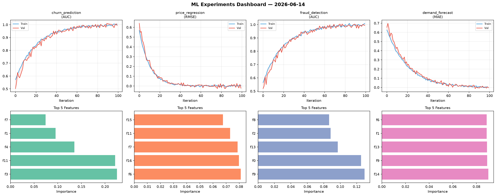
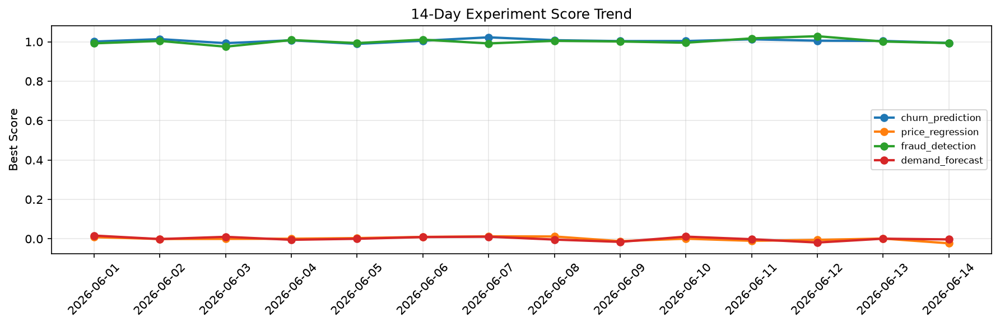

# ML Experiments Report — 2026-06-14

**Run ID:** `d03b50d5d4` | **Experiments:** 4 | **Trials:** 20

## Delta vs Yesterday

| Experiment | Today | Yesterday | Change |
|-----------|-------|-----------|--------|
| churn_prediction | 0.9941 | 1.0042 | 📉 -1.0% |
| price_regression | -0.0227 | 0.0014 | 📉 -1721.4% |
| fraud_detection | 0.9933 | 1.0011 | 📉 -0.8% |
| demand_forecast | -0.0031 | 0.0007 | 📉 -380.0% |

## churn_prediction (AUC)

**Best Score:** 0.9941 (Trial 1)

| Trial | Score | Overfit Gap | Time | LR | Trees | Leaves |
|-------|-------|-------------|------|-----|-------|--------|
| 1 ⭐ | 0.9941 | 0.0109 | 1.93s | 0.1 | 100 | 31 |
| 2 | 0.9639 | 0.0098 | 38.56s | 0.05 | 200 | 31 |
| 3 | 0.9497 | 0.0049 | 278.82s | 0.05 | 1000 | 63 |
| 4 | 0.9571 | 0.0073 | 0.74s | 0.05 | 100 | 15 |

## price_regression (RMSE)

**Best Score:** -0.0227 (Trial 4)

| Trial | Score | Overfit Gap | Time | LR | Trees | Leaves |
|-------|-------|-------------|------|-----|-------|--------|
| 1 | 0.3825 | 0.0249 | 90.57s | 0.01 | 500 | 63 |
| 2 | 0.003 | 0.0014 | 298.32s | 0.2 | 1000 | 127 |
| 3 | 0.4614 | 0.0623 | 53.1s | 0.01 | 200 | 127 |
| 4 ⭐ | -0.0227 | 0.0293 | 133.23s | 0.2 | 1000 | 15 |
| 5 | 0.6469 | 0.0832 | 28.43s | 0.01 | 500 | 31 |

## fraud_detection (AUC)

**Best Score:** 0.9933 (Trial 1)

| Trial | Score | Overfit Gap | Time | LR | Trees | Leaves |
|-------|-------|-------------|------|-----|-------|--------|
| 1 ⭐ | 0.9933 | 0.0151 | 25.31s | 0.1 | 200 | 127 |
| 2 | 0.6128 | 0.0549 | 239.41s | 0.01 | 1000 | 15 |
| 3 | 0.7958 | 0.001 | 49.91s | 0.01 | 1000 | 127 |
| 4 | 0.9919 | 0.0093 | 45.41s | 0.1 | 200 | 31 |
| 5 | 0.9787 | 0.0145 | 27.4s | 0.05 | 100 | 63 |

## demand_forecast (MAE)

**Best Score:** -0.0031 (Trial 4)

| Trial | Score | Overfit Gap | Time | LR | Trees | Leaves |
|-------|-------|-------------|------|-----|-------|--------|
| 1 | 0.0191 | 0.0146 | 51.45s | 0.2 | 200 | 31 |
| 2 | 0.0021 | 0.0061 | 24.22s | 0.2 | 100 | 127 |
| 3 | 0.0173 | 0.0125 | 161.57s | 0.2 | 1000 | 63 |
| 4 ⭐ | -0.0031 | 0.0009 | 9.05s | 0.1 | 200 | 127 |
| 5 | 0.0154 | 0.0204 | 6.3s | 0.2 | 100 | 63 |
| 6 | 0.0024 | 0.0026 | 5.45s | 0.2 | 100 | 127 |
