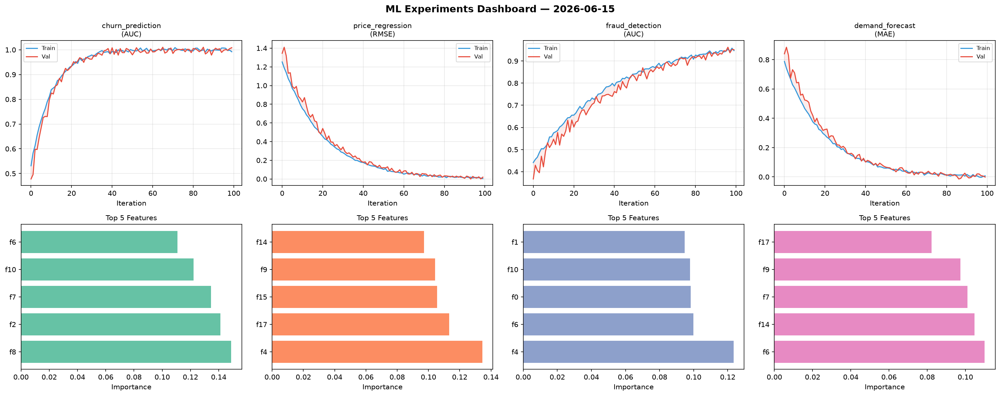
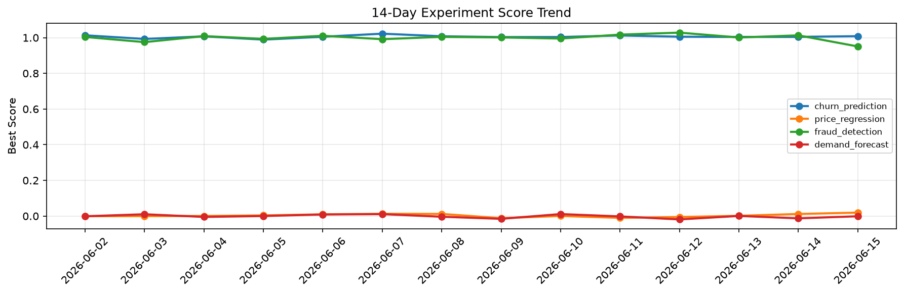

# ML Experiments Report — 2026-06-15

**Run ID:** `30398f3358` | **Experiments:** 4 | **Trials:** 18

## Delta vs Yesterday

| Experiment | Today | Yesterday | Change |
|-----------|-------|-----------|--------|
| churn_prediction | 1.0084 | 1.0045 | 📈 0.4% |
| price_regression | 0.0193 | 0.0116 | 📈 66.4% |
| fraud_detection | 0.9508 | 1.0129 | 📉 -6.1% |
| demand_forecast | -0.0012 | -0.0127 | 📈 90.6% |

## churn_prediction (AUC)

**Best Score:** 1.0084 (Trial 4)

| Trial | Score | Overfit Gap | Time | LR | Trees | Leaves |
|-------|-------|-------------|------|-----|-------|--------|
| 1 | 0.7873 | 0.0012 | 100.0s | 0.01 | 1000 | 63 |
| 2 | 0.6451 | 0.049 | 27.77s | 0.01 | 500 | 63 |
| 3 | 0.9334 | 0.0182 | 28.28s | 0.05 | 200 | 15 |
| 4 ⭐ | 1.0084 | 0.0163 | 44.37s | 0.2 | 200 | 31 |
| 5 | 0.9975 | 0.0014 | 81.49s | 0.2 | 500 | 63 |

## price_regression (RMSE)

**Best Score:** 0.0193 (Trial 3)

| Trial | Score | Overfit Gap | Time | LR | Trees | Leaves |
|-------|-------|-------------|------|-----|-------|--------|
| 1 | 0.0789 | 0.0013 | 14.97s | 0.05 | 1000 | 127 |
| 2 | 0.0212 | 0.0166 | 5.07s | 0.2 | 100 | 127 |
| 3 ⭐ | 0.0193 | 0.0162 | 124.48s | 0.1 | 500 | 63 |
| 4 | 1.3393 | 0.2049 | 1.42s | 0.01 | 200 | 15 |

## fraud_detection (AUC)

**Best Score:** 0.9508 (Trial 2)

| Trial | Score | Overfit Gap | Time | LR | Trees | Leaves |
|-------|-------|-------------|------|-----|-------|--------|
| 1 | 0.5918 | 0.072 | 44.12s | 0.01 | 200 | 63 |
| 2 ⭐ | 0.9508 | 0.004 | 200.37s | 0.05 | 1000 | 15 |
| 3 | 0.6639 | 0.0672 | 242.9s | 0.01 | 1000 | 15 |
| 4 | 0.9298 | 0.0365 | 13.03s | 0.05 | 1000 | 15 |

## demand_forecast (MAE)

**Best Score:** -0.0012 (Trial 5)

| Trial | Score | Overfit Gap | Time | LR | Trees | Leaves |
|-------|-------|-------------|------|-----|-------|--------|
| 1 | 0.0078 | 0.0011 | 155.89s | 0.1 | 1000 | 15 |
| 2 | 0.0002 | 0.0012 | 25.7s | 0.2 | 100 | 31 |
| 3 | 1.0286 | 0.1001 | 273.57s | 0.01 | 1000 | 15 |
| 4 | 0.0088 | 0.0023 | 80.23s | 0.1 | 1000 | 15 |
| 5 ⭐ | -0.0012 | 0.0083 | 292.92s | 0.1 | 1000 | 63 |
