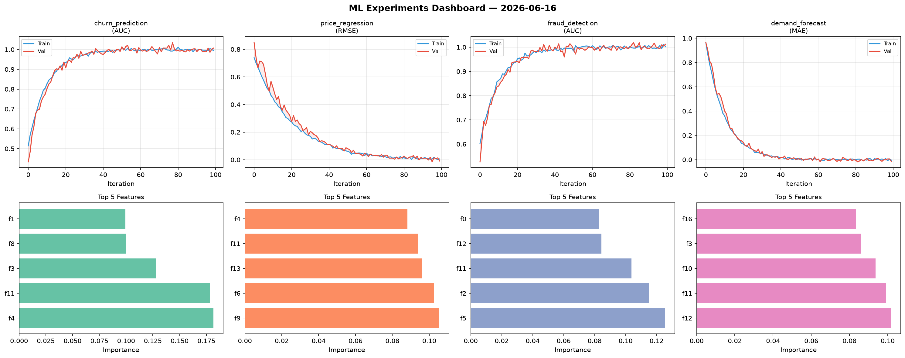
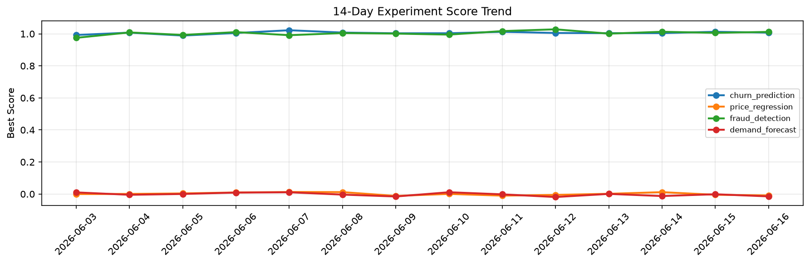

# ML Experiments Report — 2026-06-16

**Run ID:** `4e17d6927e` | **Experiments:** 4 | **Trials:** 18

## Delta vs Yesterday

| Experiment | Today | Yesterday | Change |
|-----------|-------|-----------|--------|
| churn_prediction | 1.0075 | 1.0127 | 📉 -0.5% |
| price_regression | -0.0088 | -0.0048 | 📉 -83.3% |
| fraud_detection | 1.0121 | 1.0061 | 📈 0.6% |
| demand_forecast | -0.0149 | -0.0014 | 📉 -964.3% |

## churn_prediction (AUC)

**Best Score:** 1.0075 (Trial 4)

| Trial | Score | Overfit Gap | Time | LR | Trees | Leaves |
|-------|-------|-------------|------|-----|-------|--------|
| 1 | 1.0025 | 0.0057 | 135.36s | 0.1 | 500 | 127 |
| 2 | 0.995 | 0.0049 | 20.28s | 0.1 | 100 | 31 |
| 3 | 0.7374 | 0.034 | 99.37s | 0.01 | 500 | 15 |
| 4 ⭐ | 1.0075 | 0.0135 | 49.1s | 0.2 | 1000 | 127 |
| 5 | 0.9849 | 0.017 | 291.24s | 0.1 | 1000 | 63 |

## price_regression (RMSE)

**Best Score:** -0.0088 (Trial 2)

| Trial | Score | Overfit Gap | Time | LR | Trees | Leaves |
|-------|-------|-------------|------|-----|-------|--------|
| 1 | 0.1855 | 0.0297 | 98.31s | 0.05 | 500 | 127 |
| 2 ⭐ | -0.0088 | 0.0145 | 117.6s | 0.1 | 500 | 31 |
| 3 | -0.0072 | 0.0011 | 179.31s | 0.2 | 1000 | 127 |
| 4 | 0.064 | 0.0146 | 69.9s | 0.05 | 500 | 63 |
| 5 | 0.9074 | 0.0205 | 284.54s | 0.01 | 1000 | 15 |

## fraud_detection (AUC)

**Best Score:** 1.0121 (Trial 3)

| Trial | Score | Overfit Gap | Time | LR | Trees | Leaves |
|-------|-------|-------------|------|-----|-------|--------|
| 1 | 0.953 | 0.0077 | 10.11s | 0.05 | 100 | 15 |
| 2 | 0.9953 | 0.0016 | 13.54s | 0.1 | 200 | 15 |
| 3 ⭐ | 1.0121 | 0.01 | 143.82s | 0.2 | 500 | 15 |
| 4 | 0.994 | 0.0031 | 266.1s | 0.1 | 1000 | 63 |
| 5 | 0.9584 | 0.0105 | 9.91s | 0.05 | 100 | 15 |

## demand_forecast (MAE)

**Best Score:** -0.0149 (Trial 2)

| Trial | Score | Overfit Gap | Time | LR | Trees | Leaves |
|-------|-------|-------------|------|-----|-------|--------|
| 1 | 0.5503 | 0.0688 | 271.79s | 0.01 | 1000 | 63 |
| 2 ⭐ | -0.0149 | 0.0111 | 39.35s | 0.2 | 500 | 15 |
| 3 | -0.0033 | 0.0041 | 11.57s | 0.1 | 200 | 15 |
