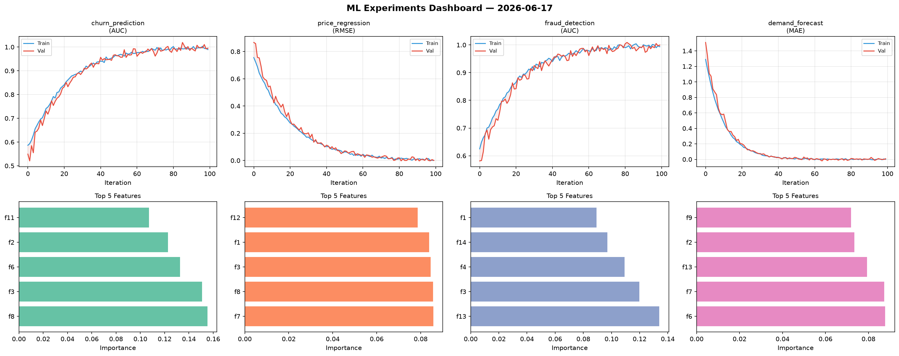
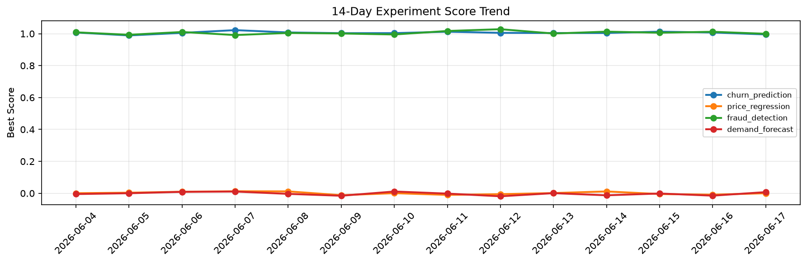

# ML Experiments Report — 2026-06-17

**Run ID:** `66cdf31545` | **Experiments:** 4 | **Trials:** 21

## Delta vs Yesterday

| Experiment | Today | Yesterday | Change |
|-----------|-------|-----------|--------|
| churn_prediction | 0.9954 | 1.0075 | 📉 -1.2% |
| price_regression | 0.0002 | -0.0088 | 📈 102.3% |
| fraud_detection | 0.9995 | 1.0121 | 📉 -1.2% |
| demand_forecast | 0.0073 | -0.0149 | 📈 149.0% |

## churn_prediction (AUC)

**Best Score:** 0.9954 (Trial 3)

| Trial | Score | Overfit Gap | Time | LR | Trees | Leaves |
|-------|-------|-------------|------|-----|-------|--------|
| 1 | 0.9944 | 0.005 | 122.55s | 0.2 | 1000 | 127 |
| 2 | 0.9484 | 0.0045 | 180.48s | 0.05 | 1000 | 127 |
| 3 ⭐ | 0.9954 | 0.0062 | 28.56s | 0.1 | 100 | 15 |
| 4 | 0.9656 | 0.0011 | 226.95s | 0.05 | 1000 | 63 |
| 5 | 0.6786 | 0.0135 | 72.67s | 0.01 | 500 | 127 |
| 6 | 0.9876 | 0.017 | 84.71s | 0.1 | 500 | 127 |

## price_regression (RMSE)

**Best Score:** 0.0002 (Trial 5)

| Trial | Score | Overfit Gap | Time | LR | Trees | Leaves |
|-------|-------|-------------|------|-----|-------|--------|
| 1 | 0.0183 | 0.0157 | 33.77s | 0.2 | 200 | 15 |
| 2 | 1.1613 | 0.1872 | 102.15s | 0.01 | 1000 | 15 |
| 3 | 0.0076 | 0.0015 | 41.2s | 0.1 | 500 | 63 |
| 4 | 0.7812 | 0.0887 | 24.63s | 0.01 | 100 | 127 |
| 5 ⭐ | 0.0002 | 0.0011 | 109.92s | 0.1 | 500 | 15 |
| 6 | 0.1002 | 0.014 | 26.78s | 0.05 | 100 | 127 |

## fraud_detection (AUC)

**Best Score:** 0.9995 (Trial 3)

| Trial | Score | Overfit Gap | Time | LR | Trees | Leaves |
|-------|-------|-------------|------|-----|-------|--------|
| 1 | 0.9941 | 0.0041 | 99.04s | 0.1 | 500 | 63 |
| 2 | 0.9936 | 0.0024 | 40.48s | 0.1 | 500 | 31 |
| 3 ⭐ | 0.9995 | 0.0059 | 43.76s | 0.1 | 200 | 63 |
| 4 | 0.9944 | 0.0129 | 48.91s | 0.2 | 200 | 63 |
| 5 | 0.9872 | 0.0062 | 16.94s | 0.1 | 200 | 127 |

## demand_forecast (MAE)

**Best Score:** 0.0073 (Trial 2)

| Trial | Score | Overfit Gap | Time | LR | Trees | Leaves |
|-------|-------|-------------|------|-----|-------|--------|
| 1 | 0.7683 | 0.1167 | 112.34s | 0.01 | 1000 | 127 |
| 2 ⭐ | 0.0073 | 0.0071 | 40.74s | 0.2 | 200 | 31 |
| 3 | 0.0112 | 0.0097 | 20.63s | 0.2 | 100 | 127 |
| 4 | 0.1348 | 0.0162 | 27.47s | 0.05 | 100 | 63 |
