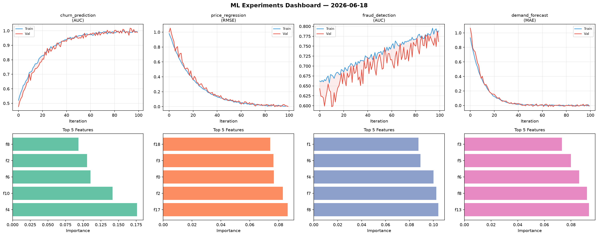
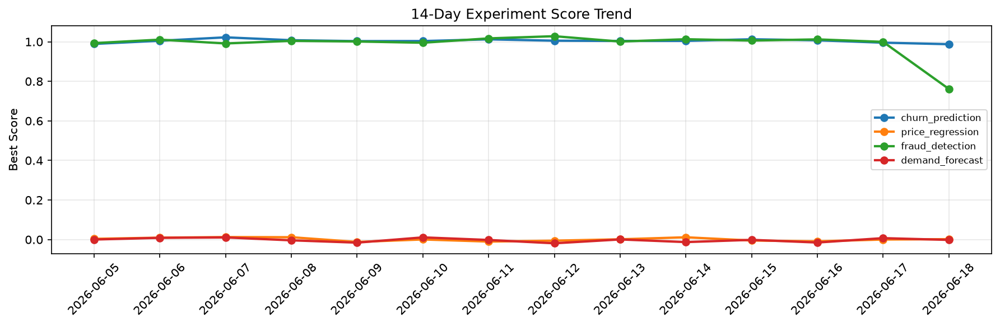

# ML Experiments Report — 2026-06-18

**Run ID:** `02db3f1321` | **Experiments:** 4 | **Trials:** 16

## Delta vs Yesterday

| Experiment | Today | Yesterday | Change |
|-----------|-------|-----------|--------|
| churn_prediction | 0.9877 | 0.9954 | 📉 -0.8% |
| price_regression | 0.0021 | 0.0002 | 📈 190.0% |
| fraud_detection | 0.7615 | 0.9995 | 📉 -23.8% |
| demand_forecast | -0.0017 | 0.0073 | 📉 -123.3% |

## churn_prediction (AUC)

**Best Score:** 0.9877 (Trial 2)

| Trial | Score | Overfit Gap | Time | LR | Trees | Leaves |
|-------|-------|-------------|------|-----|-------|--------|
| 1 | 0.9803 | 0.0033 | 231.78s | 0.05 | 1000 | 31 |
| 2 ⭐ | 0.9877 | 0.0065 | 64.42s | 0.1 | 500 | 31 |
| 3 | 0.9875 | 0.0269 | 282.64s | 0.05 | 1000 | 31 |
| 4 | 0.9784 | 0.004 | 128.16s | 0.05 | 500 | 31 |

## price_regression (RMSE)

**Best Score:** 0.0021 (Trial 4)

| Trial | Score | Overfit Gap | Time | LR | Trees | Leaves |
|-------|-------|-------------|------|-----|-------|--------|
| 1 | 0.01 | 0.0071 | 24.25s | 0.1 | 200 | 63 |
| 2 | 0.5295 | 0.0733 | 2.22s | 0.01 | 100 | 15 |
| 3 | 0.1248 | 0.0264 | 222.73s | 0.05 | 1000 | 15 |
| 4 ⭐ | 0.0021 | 0.0006 | 11.16s | 0.1 | 200 | 127 |

## fraud_detection (AUC)

**Best Score:** 0.7615 (Trial 4)

| Trial | Score | Overfit Gap | Time | LR | Trees | Leaves |
|-------|-------|-------------|------|-----|-------|--------|
| 1 | 0.7585 | 0.0333 | 144.69s | 0.01 | 1000 | 63 |
| 2 | 0.727 | 0.0147 | 16.46s | 0.01 | 200 | 127 |
| 3 | 0.754 | 0.0002 | 129.6s | 0.01 | 500 | 15 |
| 4 ⭐ | 0.7615 | 0.0271 | 47.09s | 0.01 | 500 | 63 |

## demand_forecast (MAE)

**Best Score:** -0.0017 (Trial 2)

| Trial | Score | Overfit Gap | Time | LR | Trees | Leaves |
|-------|-------|-------------|------|-----|-------|--------|
| 1 | 0.8318 | 0.1257 | 26.25s | 0.01 | 100 | 63 |
| 2 ⭐ | -0.0017 | 0.0075 | 43.49s | 0.2 | 500 | 63 |
| 3 | 0.0053 | 0.0027 | 19.35s | 0.1 | 1000 | 15 |
| 4 | 0.6421 | 0.0306 | 273.32s | 0.01 | 1000 | 15 |
