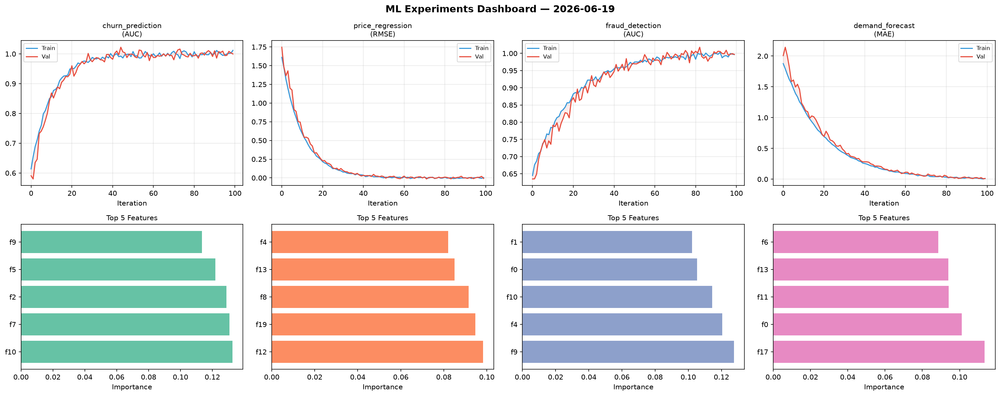
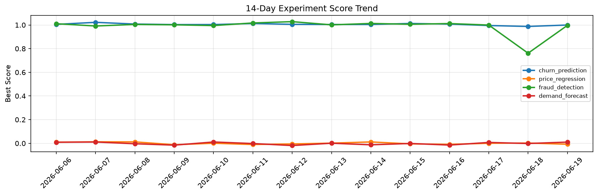

# ML Experiments Report — 2026-06-19

**Run ID:** `55730aa8cb` | **Experiments:** 4 | **Trials:** 18

## Delta vs Yesterday

| Experiment | Today | Yesterday | Change |
|-----------|-------|-----------|--------|
| churn_prediction | 0.9997 | 0.9877 | 📈 1.2% |
| price_regression | -0.0078 | 0.0021 | 📉 -471.4% |
| fraud_detection | 0.9968 | 0.7615 | 📈 30.9% |
| demand_forecast | 0.0102 | -0.0017 | 📈 700.0% |

## churn_prediction (AUC)

**Best Score:** 0.9997 (Trial 1)

| Trial | Score | Overfit Gap | Time | LR | Trees | Leaves |
|-------|-------|-------------|------|-----|-------|--------|
| 1 ⭐ | 0.9997 | 0.0122 | 137.88s | 0.2 | 500 | 127 |
| 2 | 0.9555 | 0.0138 | 25.46s | 0.05 | 100 | 15 |
| 3 | 0.9996 | 0.0039 | 51.38s | 0.1 | 500 | 31 |
| 4 | 0.9987 | 0.0018 | 74.93s | 0.1 | 500 | 31 |
| 5 | 0.7487 | 0.0165 | 49.7s | 0.01 | 200 | 15 |
| 6 | 0.9422 | 0.0137 | 208.43s | 0.05 | 1000 | 63 |

## price_regression (RMSE)

**Best Score:** -0.0078 (Trial 3)

| Trial | Score | Overfit Gap | Time | LR | Trees | Leaves |
|-------|-------|-------------|------|-----|-------|--------|
| 1 | -0.004 | 0.004 | 273.25s | 0.2 | 1000 | 15 |
| 2 | 0.5421 | 0.0907 | 183.5s | 0.01 | 1000 | 15 |
| 3 ⭐ | -0.0078 | 0.012 | 23.11s | 0.2 | 200 | 127 |
| 4 | 0.0073 | 0.004 | 27.65s | 0.2 | 100 | 63 |
| 5 | 0.1102 | 0.0073 | 27.02s | 0.05 | 200 | 15 |

## fraud_detection (AUC)

**Best Score:** 0.9968 (Trial 2)

| Trial | Score | Overfit Gap | Time | LR | Trees | Leaves |
|-------|-------|-------------|------|-----|-------|--------|
| 1 | 0.9837 | 0.0114 | 71.74s | 0.2 | 500 | 15 |
| 2 ⭐ | 0.9968 | 0.0002 | 1.22s | 0.1 | 100 | 15 |
| 3 | 0.9467 | 0.0168 | 102.15s | 0.05 | 1000 | 15 |

## demand_forecast (MAE)

**Best Score:** 0.0102 (Trial 3)

| Trial | Score | Overfit Gap | Time | LR | Trees | Leaves |
|-------|-------|-------------|------|-----|-------|--------|
| 1 | 0.0218 | 0.0197 | 29.3s | 0.1 | 100 | 63 |
| 2 | 0.0767 | 0.0161 | 66.39s | 0.05 | 500 | 127 |
| 3 ⭐ | 0.0102 | 0.0024 | 130.65s | 0.1 | 500 | 15 |
| 4 | 0.0105 | 0.0059 | 116.85s | 0.1 | 500 | 63 |
