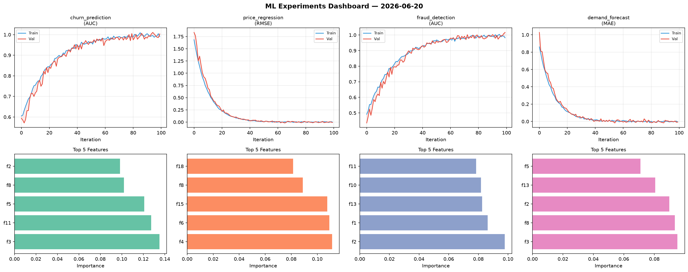
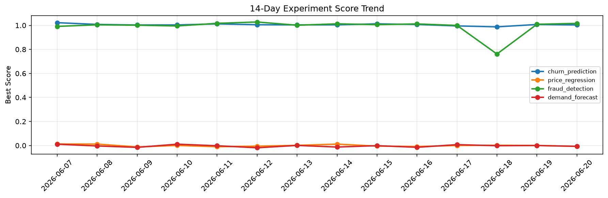

# ML Experiments Report — 2026-06-20

**Run ID:** `c4e2cd2160` | **Experiments:** 4 | **Trials:** 19

## Delta vs Yesterday

| Experiment | Today | Yesterday | Change |
|-----------|-------|-----------|--------|
| churn_prediction | 1.0034 | 1.0074 | 📉 -0.4% |
| price_regression | -0.0075 | -0.0001 | 📉 -740.0% |
| fraud_detection | 1.0164 | 1.0091 | 📈 0.7% |
| demand_forecast | -0.0066 | -0.0 | 📉 -660.0% |

## churn_prediction (AUC)

**Best Score:** 1.0034 (Trial 6)

| Trial | Score | Overfit Gap | Time | LR | Trees | Leaves |
|-------|-------|-------------|------|-----|-------|--------|
| 1 | 0.9565 | 0.0012 | 9.11s | 0.05 | 100 | 127 |
| 2 | 0.9773 | 0.0192 | 3.73s | 0.1 | 200 | 63 |
| 3 | 0.7905 | 0.0215 | 119.46s | 0.01 | 500 | 63 |
| 4 | 0.6177 | 0.0481 | 214.64s | 0.01 | 1000 | 31 |
| 5 | 0.9418 | 0.0217 | 12.27s | 0.05 | 100 | 31 |
| 6 ⭐ | 1.0034 | 0.0125 | 86.82s | 0.1 | 500 | 31 |

## price_regression (RMSE)

**Best Score:** -0.0075 (Trial 4)

| Trial | Score | Overfit Gap | Time | LR | Trees | Leaves |
|-------|-------|-------------|------|-----|-------|--------|
| 1 | 0.0145 | 0.013 | 53.43s | 0.1 | 200 | 15 |
| 2 | 0.1067 | 0.01 | 15.61s | 0.05 | 100 | 127 |
| 3 | 0.0528 | 0.0017 | 95.13s | 0.05 | 500 | 31 |
| 4 ⭐ | -0.0075 | 0.0083 | 64.32s | 0.2 | 500 | 31 |
| 5 | 0.4172 | 0.0411 | 53.71s | 0.01 | 200 | 63 |

## fraud_detection (AUC)

**Best Score:** 1.0164 (Trial 3)

| Trial | Score | Overfit Gap | Time | LR | Trees | Leaves |
|-------|-------|-------------|------|-----|-------|--------|
| 1 | 0.7637 | 0.0431 | 126.82s | 0.01 | 1000 | 31 |
| 2 | 0.958 | 0.0021 | 44.84s | 0.05 | 200 | 127 |
| 3 ⭐ | 1.0164 | 0.0342 | 124.46s | 0.1 | 1000 | 63 |

## demand_forecast (MAE)

**Best Score:** -0.0066 (Trial 3)

| Trial | Score | Overfit Gap | Time | LR | Trees | Leaves |
|-------|-------|-------------|------|-----|-------|--------|
| 1 | 0.0024 | 0.0041 | 11.34s | 0.2 | 100 | 15 |
| 2 | 0.0829 | 0.001 | 173.37s | 0.05 | 1000 | 127 |
| 3 ⭐ | -0.0066 | 0.0003 | 4.63s | 0.2 | 200 | 15 |
| 4 | 0.0988 | 0.0236 | 7.73s | 0.05 | 100 | 31 |
| 5 | 0.0109 | 0.0027 | 208.54s | 0.1 | 1000 | 15 |
