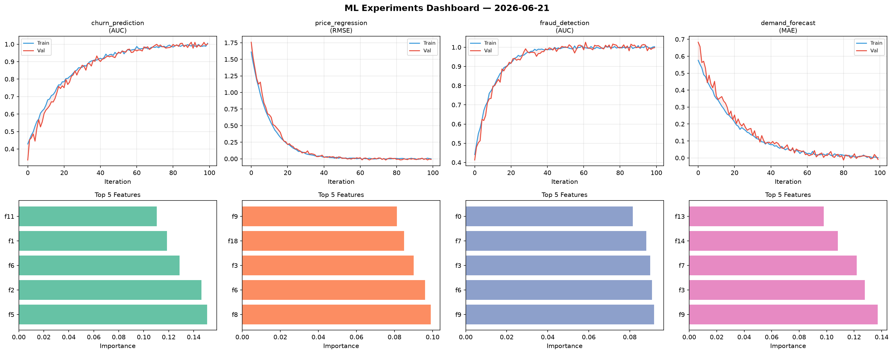
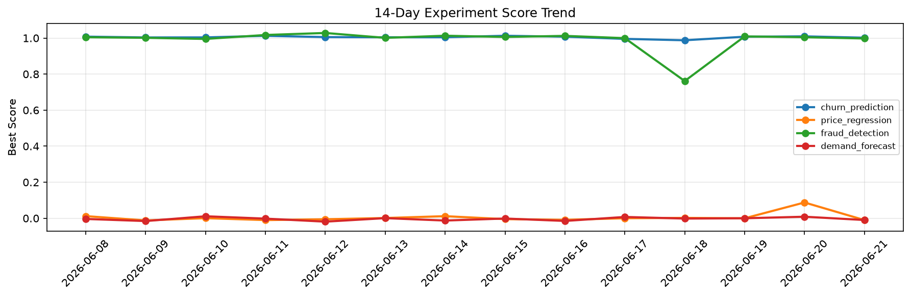

# ML Experiments Report — 2026-06-21

**Run ID:** `4635c96067` | **Experiments:** 4 | **Trials:** 20

## Delta vs Yesterday

| Experiment | Today | Yesterday | Change |
|-----------|-------|-----------|--------|
| churn_prediction | 1.0019 | 1.0095 | 📉 -0.8% |
| price_regression | -0.01 | 0.0876 | 📉 -111.4% |
| fraud_detection | 0.9976 | 1.0046 | 📉 -0.7% |
| demand_forecast | -0.0097 | 0.0086 | 📉 -212.8% |

## churn_prediction (AUC)

**Best Score:** 1.0019 (Trial 4)

| Trial | Score | Overfit Gap | Time | LR | Trees | Leaves |
|-------|-------|-------------|------|-----|-------|--------|
| 1 | 0.9475 | 0.0091 | 196.21s | 0.05 | 1000 | 15 |
| 2 | 0.7099 | 0.0501 | 106.3s | 0.01 | 1000 | 63 |
| 3 | 0.9626 | 0.0081 | 12.37s | 0.05 | 100 | 15 |
| 4 ⭐ | 1.0019 | 0.0031 | 187.63s | 0.1 | 1000 | 31 |
| 5 | 0.7293 | 0.0351 | 14.47s | 0.01 | 100 | 127 |
| 6 | 0.9901 | 0.0081 | 2.86s | 0.1 | 100 | 31 |

## price_regression (RMSE)

**Best Score:** -0.01 (Trial 3)

| Trial | Score | Overfit Gap | Time | LR | Trees | Leaves |
|-------|-------|-------------|------|-----|-------|--------|
| 1 | 0.1522 | 0.0001 | 285.41s | 0.05 | 1000 | 15 |
| 2 | 0.1634 | 0.0235 | 110.33s | 0.05 | 500 | 127 |
| 3 ⭐ | -0.01 | 0.0101 | 2.13s | 0.2 | 100 | 31 |
| 4 | 0.1479 | 0.0086 | 29.56s | 0.05 | 500 | 63 |
| 5 | -0.0016 | 0.0016 | 43.12s | 0.2 | 200 | 127 |

## fraud_detection (AUC)

**Best Score:** 0.9976 (Trial 2)

| Trial | Score | Overfit Gap | Time | LR | Trees | Leaves |
|-------|-------|-------------|------|-----|-------|--------|
| 1 | 0.7343 | 0.0352 | 46.19s | 0.01 | 500 | 127 |
| 2 ⭐ | 0.9976 | 0.0051 | 57.51s | 0.2 | 200 | 31 |
| 3 | 0.9659 | 0.0112 | 47.24s | 0.05 | 200 | 15 |
| 4 | 0.9809 | 0.0231 | 28.95s | 0.1 | 100 | 63 |
| 5 | 0.6747 | 0.0226 | 112.61s | 0.01 | 500 | 31 |

## demand_forecast (MAE)

**Best Score:** -0.0097 (Trial 2)

| Trial | Score | Overfit Gap | Time | LR | Trees | Leaves |
|-------|-------|-------------|------|-----|-------|--------|
| 1 | 0.0078 | 0.0063 | 11.11s | 0.1 | 200 | 31 |
| 2 ⭐ | -0.0097 | 0.0107 | 9.96s | 0.1 | 200 | 127 |
| 3 | -0.0035 | 0.0127 | 99.78s | 0.2 | 1000 | 127 |
| 4 | 0.0128 | 0.0125 | 18.37s | 0.1 | 100 | 127 |
