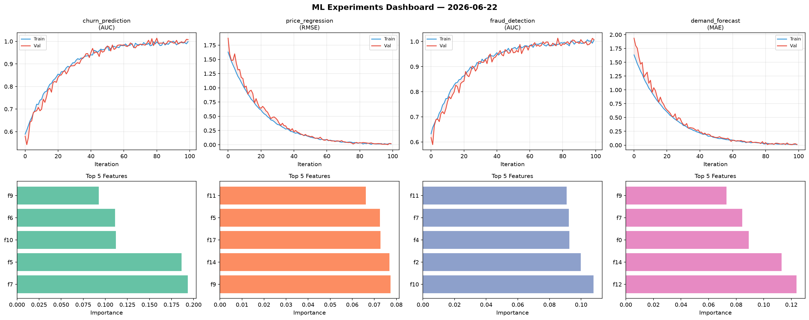
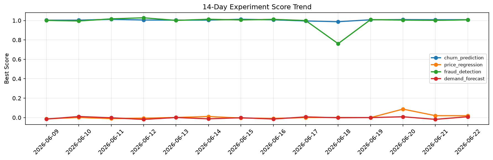

# ML Experiments Report — 2026-06-22

**Run ID:** `7db00e992d` | **Experiments:** 4 | **Trials:** 20

## Delta vs Yesterday

| Experiment | Today | Yesterday | Change |
|-----------|-------|-----------|--------|
| churn_prediction | 1.0083 | 1.0082 | 📉 0.0% |
| price_regression | 0.0198 | 0.02 | 📉 -1.0% |
| fraud_detection | 1.0073 | 1.0014 | 📈 0.6% |
| demand_forecast | 0.0089 | -0.0181 | 📈 149.2% |

## churn_prediction (AUC)

**Best Score:** 1.0083 (Trial 4)

| Trial | Score | Overfit Gap | Time | LR | Trees | Leaves |
|-------|-------|-------------|------|-----|-------|--------|
| 1 | 1.0066 | 0.012 | 42.18s | 0.1 | 200 | 63 |
| 2 | 1.0037 | 0.0042 | 186.71s | 0.2 | 1000 | 127 |
| 3 | 0.9473 | 0.0122 | 4.78s | 0.05 | 200 | 127 |
| 4 ⭐ | 1.0083 | 0.0098 | 19.4s | 0.1 | 100 | 31 |
| 5 | 0.7126 | 0.0323 | 62.0s | 0.01 | 500 | 15 |

## price_regression (RMSE)

**Best Score:** 0.0198 (Trial 2)

| Trial | Score | Overfit Gap | Time | LR | Trees | Leaves |
|-------|-------|-------------|------|-----|-------|--------|
| 1 | 0.6694 | 0.0852 | 53.19s | 0.01 | 200 | 15 |
| 2 ⭐ | 0.0198 | 0.0059 | 185.55s | 0.1 | 1000 | 31 |
| 3 | 0.9521 | 0.1419 | 51.72s | 0.01 | 1000 | 63 |
| 4 | 1.2004 | 0.1252 | 45.49s | 0.01 | 200 | 63 |
| 5 | 0.092 | 0.0114 | 84.18s | 0.05 | 1000 | 15 |
| 6 | 0.5391 | 0.0343 | 244.47s | 0.01 | 1000 | 15 |

## fraud_detection (AUC)

**Best Score:** 1.0073 (Trial 3)

| Trial | Score | Overfit Gap | Time | LR | Trees | Leaves |
|-------|-------|-------------|------|-----|-------|--------|
| 1 | 0.7697 | 0.0291 | 16.68s | 0.01 | 100 | 127 |
| 2 | 0.6395 | 0.0419 | 27.79s | 0.01 | 100 | 63 |
| 3 ⭐ | 1.0073 | 0.0015 | 71.48s | 0.1 | 1000 | 15 |

## demand_forecast (MAE)

**Best Score:** 0.0089 (Trial 5)

| Trial | Score | Overfit Gap | Time | LR | Trees | Leaves |
|-------|-------|-------------|------|-----|-------|--------|
| 1 | 0.0183 | 0.0186 | 16.51s | 0.2 | 1000 | 15 |
| 2 | 0.0166 | 0.0026 | 61.08s | 0.1 | 1000 | 15 |
| 3 | 0.1369 | 0.0049 | 6.44s | 0.05 | 100 | 15 |
| 4 | 0.0284 | 0.0236 | 279.37s | 0.1 | 1000 | 15 |
| 5 ⭐ | 0.0089 | 0.0067 | 21.02s | 0.1 | 100 | 15 |
| 6 | 0.0206 | 0.017 | 1.24s | 0.1 | 200 | 15 |
