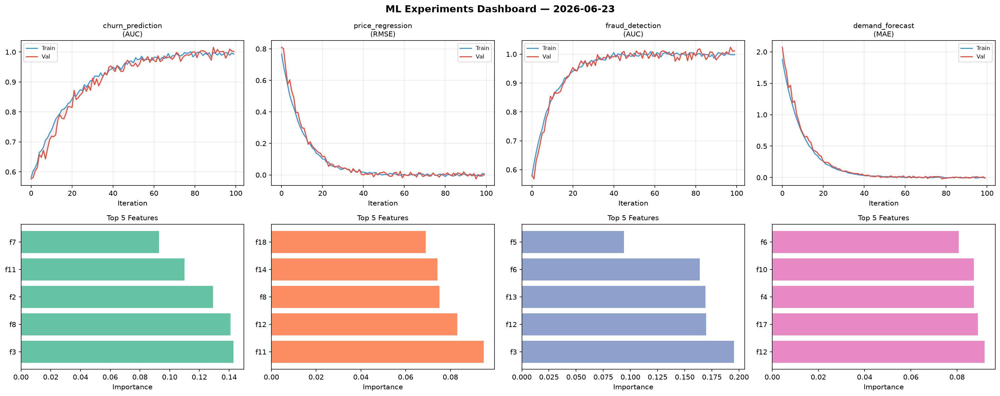
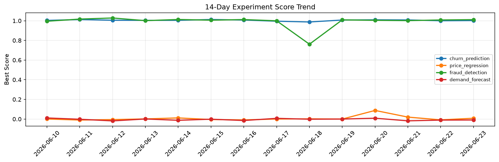

# ML Experiments Report — 2026-06-23

**Run ID:** `96a8bd79c1` | **Experiments:** 4 | **Trials:** 21

## Delta vs Yesterday

| Experiment | Today | Yesterday | Change |
|-----------|-------|-----------|--------|
| churn_prediction | 1.0019 | 1.0001 | 📈 0.2% |
| price_regression | 0.0083 | -0.0083 | 📈 200.0% |
| fraud_detection | 1.0113 | 1.008 | 📈 0.3% |
| demand_forecast | -0.0095 | -0.0106 | 📈 10.4% |

## churn_prediction (AUC)

**Best Score:** 1.0019 (Trial 2)

| Trial | Score | Overfit Gap | Time | LR | Trees | Leaves |
|-------|-------|-------------|------|-----|-------|--------|
| 1 | 0.9892 | 0.0106 | 1.73s | 0.1 | 200 | 31 |
| 2 ⭐ | 1.0019 | 0.0087 | 111.14s | 0.1 | 500 | 63 |
| 3 | 0.9862 | 0.0003 | 32.2s | 0.1 | 200 | 15 |
| 4 | 0.6951 | 0.0586 | 224.64s | 0.01 | 1000 | 31 |
| 5 | 0.9954 | 0.002 | 75.48s | 0.2 | 500 | 15 |
| 6 | 0.9931 | 0.005 | 43.03s | 0.1 | 500 | 127 |

## price_regression (RMSE)

**Best Score:** 0.0083 (Trial 5)

| Trial | Score | Overfit Gap | Time | LR | Trees | Leaves |
|-------|-------|-------------|------|-----|-------|--------|
| 1 | 0.8808 | 0.1362 | 81.29s | 0.01 | 500 | 31 |
| 2 | 0.0204 | 0.0159 | 113.34s | 0.1 | 1000 | 127 |
| 3 | 0.0126 | 0.0005 | 123.71s | 0.1 | 500 | 31 |
| 4 | 1.184 | 0.0195 | 86.23s | 0.01 | 1000 | 31 |
| 5 ⭐ | 0.0083 | 0.0091 | 7.01s | 0.2 | 100 | 15 |
| 6 | 0.0746 | 0.0089 | 81.6s | 0.05 | 1000 | 15 |

## fraud_detection (AUC)

**Best Score:** 1.0113 (Trial 2)

| Trial | Score | Overfit Gap | Time | LR | Trees | Leaves |
|-------|-------|-------------|------|-----|-------|--------|
| 1 | 0.6794 | 0.0157 | 42.42s | 0.01 | 200 | 63 |
| 2 ⭐ | 1.0113 | 0.0133 | 22.17s | 0.2 | 200 | 63 |
| 3 | 0.7563 | 0.0073 | 47.32s | 0.01 | 200 | 63 |

## demand_forecast (MAE)

**Best Score:** -0.0095 (Trial 4)

| Trial | Score | Overfit Gap | Time | LR | Trees | Leaves |
|-------|-------|-------------|------|-----|-------|--------|
| 1 | 0.2027 | 0.0367 | 72.64s | 0.05 | 500 | 15 |
| 2 | 1.3005 | 0.0972 | 128.0s | 0.01 | 500 | 127 |
| 3 | 0.376 | 0.0338 | 281.55s | 0.01 | 1000 | 15 |
| 4 ⭐ | -0.0095 | 0.0043 | 130.26s | 0.2 | 500 | 127 |
| 5 | 1.3473 | 0.1918 | 126.21s | 0.01 | 1000 | 63 |
| 6 | 1.0338 | 0.0686 | 16.16s | 0.01 | 1000 | 63 |
