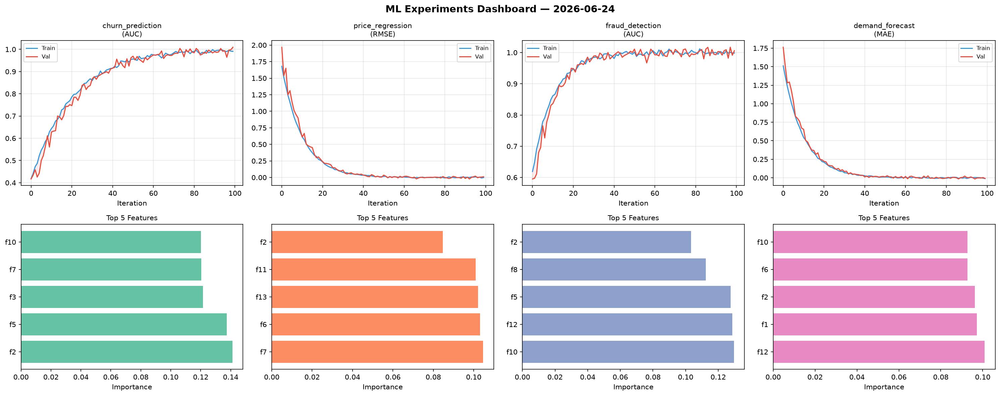
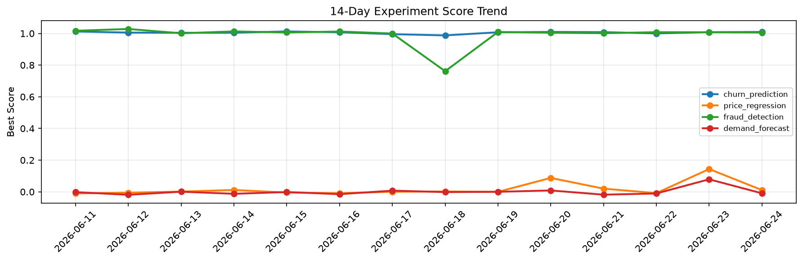

# ML Experiments Report — 2026-06-24

**Run ID:** `f75259abd5` | **Experiments:** 4 | **Trials:** 17

## Delta vs Yesterday

| Experiment | Today | Yesterday | Change |
|-----------|-------|-----------|--------|
| churn_prediction | 1.0094 | 1.0081 | 📈 0.1% |
| price_regression | 0.0108 | 0.1438 | 📉 -92.5% |
| fraud_detection | 1.0058 | 1.0075 | 📉 -0.2% |
| demand_forecast | -0.0094 | 0.0789 | 📉 -111.9% |

## churn_prediction (AUC)

**Best Score:** 1.0094 (Trial 2)

| Trial | Score | Overfit Gap | Time | LR | Trees | Leaves |
|-------|-------|-------------|------|-----|-------|--------|
| 1 | 0.9886 | 0.0146 | 73.47s | 0.2 | 1000 | 15 |
| 2 ⭐ | 1.0094 | 0.0187 | 19.72s | 0.1 | 200 | 127 |
| 3 | 0.9924 | 0.0036 | 2.48s | 0.2 | 100 | 15 |

## price_regression (RMSE)

**Best Score:** 0.0108 (Trial 1)

| Trial | Score | Overfit Gap | Time | LR | Trees | Leaves |
|-------|-------|-------------|------|-----|-------|--------|
| 1 ⭐ | 0.0108 | 0.0114 | 22.82s | 0.2 | 200 | 31 |
| 2 | 0.0241 | 0.0096 | 115.09s | 0.1 | 1000 | 15 |
| 3 | 0.6075 | 0.0611 | 9.54s | 0.01 | 200 | 63 |
| 4 | 0.0313 | 0.0203 | 8.12s | 0.1 | 200 | 31 |

## fraud_detection (AUC)

**Best Score:** 1.0058 (Trial 4)

| Trial | Score | Overfit Gap | Time | LR | Trees | Leaves |
|-------|-------|-------------|------|-----|-------|--------|
| 1 | 0.9366 | 0.0295 | 26.8s | 0.05 | 100 | 15 |
| 2 | 0.9925 | 0.0133 | 15.51s | 0.1 | 500 | 127 |
| 3 | 1.0047 | 0.004 | 16.52s | 0.2 | 100 | 31 |
| 4 ⭐ | 1.0058 | 0.0074 | 262.45s | 0.2 | 1000 | 15 |

## demand_forecast (MAE)

**Best Score:** -0.0094 (Trial 3)

| Trial | Score | Overfit Gap | Time | LR | Trees | Leaves |
|-------|-------|-------------|------|-----|-------|--------|
| 1 | 0.0008 | 0.0004 | 1.09s | 0.1 | 100 | 63 |
| 2 | 0.1665 | 0.0153 | 14.4s | 0.05 | 100 | 31 |
| 3 ⭐ | -0.0094 | 0.001 | 34.62s | 0.2 | 200 | 15 |
| 4 | 0.0152 | 0.003 | 1.72s | 0.1 | 100 | 127 |
| 5 | 0.0055 | 0.0039 | 17.31s | 0.1 | 200 | 15 |
| 6 | -0.0083 | 0.0061 | 117.73s | 0.2 | 500 | 31 |
