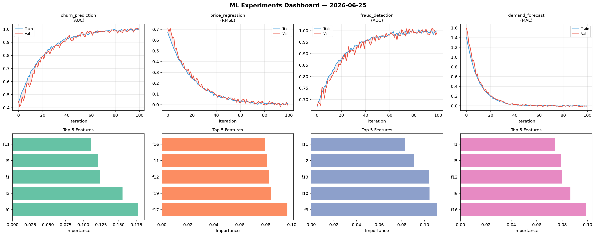
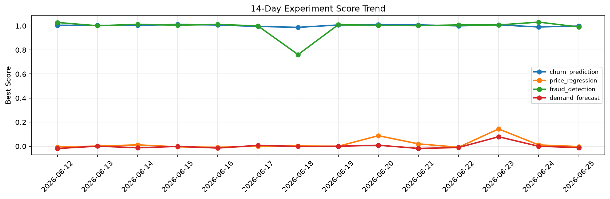

# ML Experiments Report — 2026-06-25

**Run ID:** `9b4f1dd390` | **Experiments:** 4 | **Trials:** 18

## Delta vs Yesterday

| Experiment | Today | Yesterday | Change |
|-----------|-------|-----------|--------|
| churn_prediction | 0.9985 | 0.9909 | 📈 0.8% |
| price_regression | -0.0025 | 0.0111 | 📉 -122.5% |
| fraud_detection | 0.9908 | 1.0314 | 📉 -3.9% |
| demand_forecast | -0.011 | -0.0002 | 📉 -1080.0% |

## churn_prediction (AUC)

**Best Score:** 0.9985 (Trial 6)

| Trial | Score | Overfit Gap | Time | LR | Trees | Leaves |
|-------|-------|-------------|------|-----|-------|--------|
| 1 | 0.9595 | 0.0049 | 12.77s | 0.05 | 200 | 127 |
| 2 | 0.9423 | 0.019 | 27.14s | 0.05 | 100 | 31 |
| 3 | 0.6164 | 0.0196 | 29.64s | 0.01 | 100 | 127 |
| 4 | 0.9956 | 0.0087 | 14.21s | 0.1 | 100 | 63 |
| 5 | 0.6966 | 0.0211 | 56.72s | 0.01 | 500 | 15 |
| 6 ⭐ | 0.9985 | 0.006 | 48.65s | 0.1 | 200 | 63 |

## price_regression (RMSE)

**Best Score:** -0.0025 (Trial 3)

| Trial | Score | Overfit Gap | Time | LR | Trees | Leaves |
|-------|-------|-------------|------|-----|-------|--------|
| 1 | 0.0054 | 0.0092 | 21.77s | 0.2 | 100 | 127 |
| 2 | 0.0108 | 0.0045 | 10.77s | 0.2 | 100 | 63 |
| 3 ⭐ | -0.0025 | 0.015 | 10.33s | 0.1 | 1000 | 15 |
| 4 | 0.0138 | 0.0065 | 33.93s | 0.1 | 500 | 31 |

## fraud_detection (AUC)

**Best Score:** 0.9908 (Trial 3)

| Trial | Score | Overfit Gap | Time | LR | Trees | Leaves |
|-------|-------|-------------|------|-----|-------|--------|
| 1 | 0.6225 | 0.0703 | 27.99s | 0.01 | 1000 | 31 |
| 2 | 0.6628 | 0.0214 | 169.28s | 0.01 | 1000 | 15 |
| 3 ⭐ | 0.9908 | 0.0078 | 10.79s | 0.1 | 500 | 31 |

## demand_forecast (MAE)

**Best Score:** -0.011 (Trial 2)

| Trial | Score | Overfit Gap | Time | LR | Trees | Leaves |
|-------|-------|-------------|------|-----|-------|--------|
| 1 | -0.0015 | 0.0036 | 49.9s | 0.2 | 500 | 31 |
| 2 ⭐ | -0.011 | 0.013 | 0.59s | 0.2 | 100 | 31 |
| 3 | 0.0229 | 0.0121 | 26.47s | 0.1 | 1000 | 31 |
| 4 | -0.0049 | 0.0081 | 39.98s | 0.2 | 500 | 15 |
| 5 | 0.0058 | 0.0091 | 113.14s | 0.2 | 500 | 31 |
