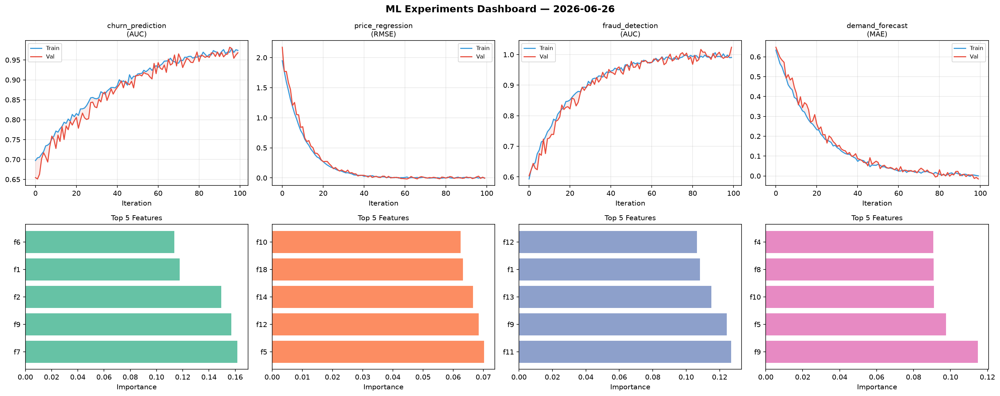
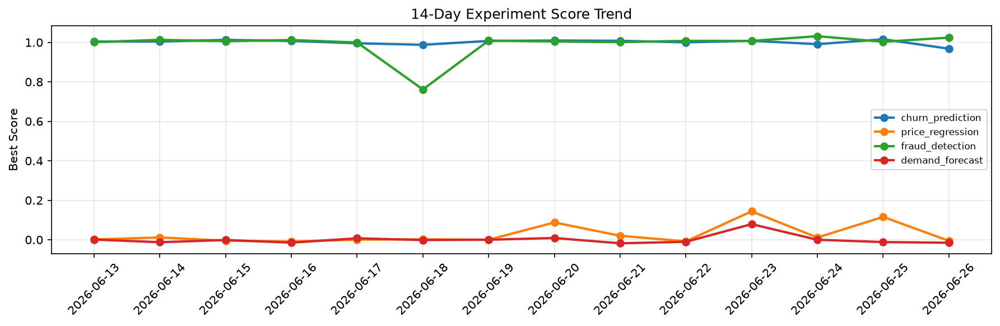

# ML Experiments Report — 2026-06-26

**Run ID:** `3b359a4198` | **Experiments:** 4 | **Trials:** 13

## Delta vs Yesterday

| Experiment | Today | Yesterday | Change |
|-----------|-------|-----------|--------|
| churn_prediction | 0.968 | 1.0159 | 📉 -4.7% |
| price_regression | -0.0058 | 0.1156 | 📉 -105.0% |
| fraud_detection | 1.024 | 1.0032 | 📈 2.1% |
| demand_forecast | -0.0154 | -0.0119 | 📉 -29.4% |

## churn_prediction (AUC)

**Best Score:** 0.968 (Trial 2)

| Trial | Score | Overfit Gap | Time | LR | Trees | Leaves |
|-------|-------|-------------|------|-----|-------|--------|
| 1 | 0.7613 | 0.014 | 8.29s | 0.01 | 200 | 127 |
| 2 ⭐ | 0.968 | 0.0062 | 106.75s | 0.05 | 500 | 63 |
| 3 | 0.7615 | 0.0369 | 51.21s | 0.01 | 1000 | 15 |

## price_regression (RMSE)

**Best Score:** -0.0058 (Trial 1)

| Trial | Score | Overfit Gap | Time | LR | Trees | Leaves |
|-------|-------|-------------|------|-----|-------|--------|
| 1 ⭐ | -0.0058 | 0.0041 | 34.76s | 0.2 | 200 | 127 |
| 2 | 0.0021 | 0.0117 | 15.46s | 0.1 | 100 | 127 |
| 3 | -0.0008 | 0.0068 | 37.86s | 0.2 | 1000 | 63 |

## fraud_detection (AUC)

**Best Score:** 1.024 (Trial 2)

| Trial | Score | Overfit Gap | Time | LR | Trees | Leaves |
|-------|-------|-------------|------|-----|-------|--------|
| 1 | 0.6825 | 0.0673 | 49.8s | 0.01 | 200 | 15 |
| 2 ⭐ | 1.024 | 0.0336 | 2.68s | 0.1 | 200 | 31 |
| 3 | 0.9927 | 0.0126 | 82.06s | 0.2 | 500 | 127 |

## demand_forecast (MAE)

**Best Score:** -0.0154 (Trial 4)

| Trial | Score | Overfit Gap | Time | LR | Trees | Leaves |
|-------|-------|-------------|------|-----|-------|--------|
| 1 | 0.0505 | 0.0071 | 163.85s | 0.05 | 1000 | 15 |
| 2 | 0.0019 | 0.0106 | 63.72s | 0.1 | 1000 | 63 |
| 3 | 0.7501 | 0.0322 | 52.02s | 0.01 | 200 | 15 |
| 4 ⭐ | -0.0154 | 0.016 | 10.96s | 0.1 | 1000 | 31 |
