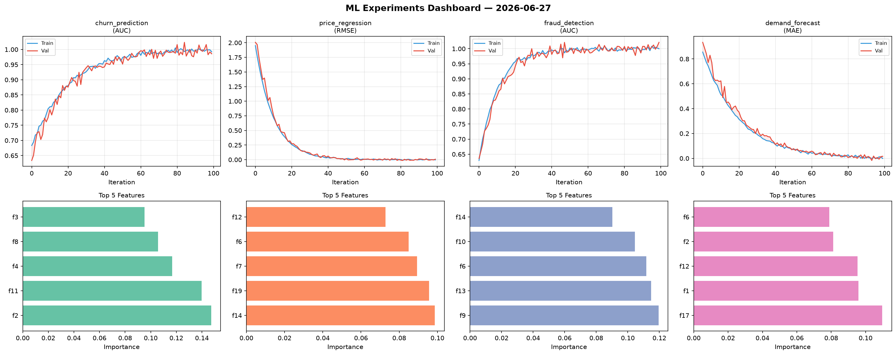
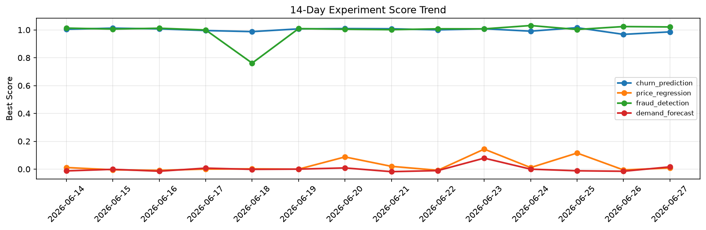

# ML Experiments Report — 2026-06-27

**Run ID:** `233d591faf` | **Experiments:** 4 | **Trials:** 18

## Delta vs Yesterday

| Experiment | Today | Yesterday | Change |
|-----------|-------|-----------|--------|
| churn_prediction | 0.9858 | 0.968 | 📈 1.8% |
| price_regression | 0.0081 | -0.0058 | 📈 239.7% |
| fraud_detection | 1.0212 | 1.024 | 📉 -0.3% |
| demand_forecast | 0.0164 | -0.0154 | 📈 206.5% |

## churn_prediction (AUC)

**Best Score:** 0.9858 (Trial 3)

| Trial | Score | Overfit Gap | Time | LR | Trees | Leaves |
|-------|-------|-------------|------|-----|-------|--------|
| 1 | 0.6591 | 0.0422 | 88.08s | 0.01 | 1000 | 15 |
| 2 | 0.9816 | 0.0143 | 154.45s | 0.1 | 1000 | 31 |
| 3 ⭐ | 0.9858 | 0.0068 | 25.72s | 0.1 | 200 | 63 |

## price_regression (RMSE)

**Best Score:** 0.0081 (Trial 3)

| Trial | Score | Overfit Gap | Time | LR | Trees | Leaves |
|-------|-------|-------------|------|-----|-------|--------|
| 1 | 0.1418 | 0.017 | 132.92s | 0.05 | 500 | 63 |
| 2 | 0.055 | 0.0173 | 28.08s | 0.05 | 200 | 15 |
| 3 ⭐ | 0.0081 | 0.0118 | 90.35s | 0.2 | 1000 | 127 |
| 4 | 1.0112 | 0.15 | 11.16s | 0.01 | 100 | 127 |

## fraud_detection (AUC)

**Best Score:** 1.0212 (Trial 5)

| Trial | Score | Overfit Gap | Time | LR | Trees | Leaves |
|-------|-------|-------------|------|-----|-------|--------|
| 1 | 1.0023 | 0.0016 | 25.04s | 0.1 | 100 | 15 |
| 2 | 0.9624 | 0.0056 | 276.77s | 0.05 | 1000 | 15 |
| 3 | 1.0031 | 0.0068 | 57.59s | 0.2 | 1000 | 127 |
| 4 | 0.9948 | 0.0124 | 25.35s | 0.2 | 200 | 63 |
| 5 ⭐ | 1.0212 | 0.0213 | 87.94s | 0.2 | 500 | 15 |
| 6 | 0.9713 | 0.004 | 5.45s | 0.05 | 100 | 15 |

## demand_forecast (MAE)

**Best Score:** 0.0164 (Trial 3)

| Trial | Score | Overfit Gap | Time | LR | Trees | Leaves |
|-------|-------|-------------|------|-----|-------|--------|
| 1 | 1.2641 | 0.077 | 2.33s | 0.01 | 100 | 31 |
| 2 | 1.1605 | 0.0745 | 53.66s | 0.01 | 200 | 63 |
| 3 ⭐ | 0.0164 | 0.0174 | 127.54s | 0.1 | 500 | 15 |
| 4 | 0.0192 | 0.0174 | 77.9s | 0.2 | 500 | 63 |
| 5 | 0.0169 | 0.0143 | 5.77s | 0.2 | 500 | 63 |
