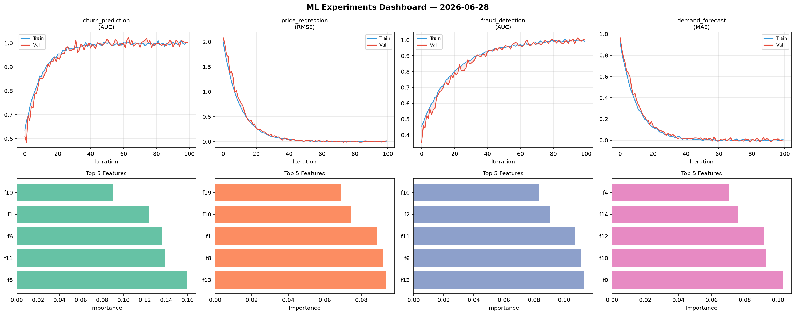
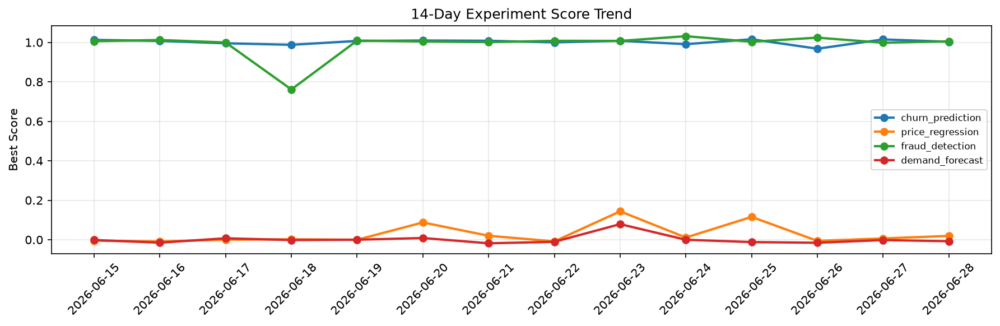

# ML Experiments Report — 2026-06-28

**Run ID:** `292ce5f740` | **Experiments:** 4 | **Trials:** 22

## Delta vs Yesterday

| Experiment | Today | Yesterday | Change |
|-----------|-------|-----------|--------|
| churn_prediction | 1.0031 | 1.015 | 📉 -1.2% |
| price_regression | 0.0193 | 0.0065 | 📈 196.9% |
| fraud_detection | 1.0053 | 0.9981 | 📈 0.7% |
| demand_forecast | -0.0076 | -0.0017 | 📉 -347.1% |

## churn_prediction (AUC)

**Best Score:** 1.0031 (Trial 2)

| Trial | Score | Overfit Gap | Time | LR | Trees | Leaves |
|-------|-------|-------------|------|-----|-------|--------|
| 1 | 0.9881 | 0.0084 | 61.29s | 0.1 | 500 | 15 |
| 2 ⭐ | 1.0031 | 0.0012 | 100.9s | 0.2 | 1000 | 63 |
| 3 | 0.5893 | 0.0628 | 23.13s | 0.01 | 200 | 15 |
| 4 | 0.9976 | 0.0037 | 218.03s | 0.1 | 1000 | 127 |
| 5 | 0.999 | 0.0019 | 2.96s | 0.2 | 100 | 63 |
| 6 | 0.7588 | 0.0061 | 124.83s | 0.01 | 1000 | 63 |

## price_regression (RMSE)

**Best Score:** 0.0193 (Trial 2)

| Trial | Score | Overfit Gap | Time | LR | Trees | Leaves |
|-------|-------|-------------|------|-----|-------|--------|
| 1 | 0.1474 | 0.0243 | 275.16s | 0.05 | 1000 | 127 |
| 2 ⭐ | 0.0193 | 0.0158 | 55.35s | 0.2 | 200 | 15 |
| 3 | 0.1426 | 0.0096 | 9.89s | 0.05 | 100 | 31 |
| 4 | 0.1371 | 0.0088 | 35.41s | 0.05 | 200 | 63 |
| 5 | 0.9745 | 0.0124 | 17.05s | 0.01 | 100 | 15 |

## fraud_detection (AUC)

**Best Score:** 1.0053 (Trial 2)

| Trial | Score | Overfit Gap | Time | LR | Trees | Leaves |
|-------|-------|-------------|------|-----|-------|--------|
| 1 | 0.7961 | 0.0177 | 10.15s | 0.01 | 1000 | 15 |
| 2 ⭐ | 1.0053 | 0.0165 | 48.31s | 0.1 | 200 | 63 |
| 3 | 0.9619 | 0.0104 | 69.8s | 0.05 | 500 | 127 |
| 4 | 0.9995 | 0.0011 | 100.71s | 0.1 | 1000 | 127 |
| 5 | 0.9615 | 0.0029 | 22.07s | 0.05 | 100 | 31 |
| 6 | 1.0015 | 0.0015 | 76.77s | 0.1 | 500 | 15 |

## demand_forecast (MAE)

**Best Score:** -0.0076 (Trial 5)

| Trial | Score | Overfit Gap | Time | LR | Trees | Leaves |
|-------|-------|-------------|------|-----|-------|--------|
| 1 | 0.5886 | 0.0177 | 15.9s | 0.01 | 100 | 63 |
| 2 | 0.0191 | 0.023 | 23.28s | 0.2 | 100 | 127 |
| 3 | 0.1766 | 0.034 | 38.48s | 0.05 | 200 | 15 |
| 4 | 0.0166 | 0.0194 | 156.43s | 0.2 | 1000 | 127 |
| 5 ⭐ | -0.0076 | 0.0123 | 297.1s | 0.2 | 1000 | 15 |
