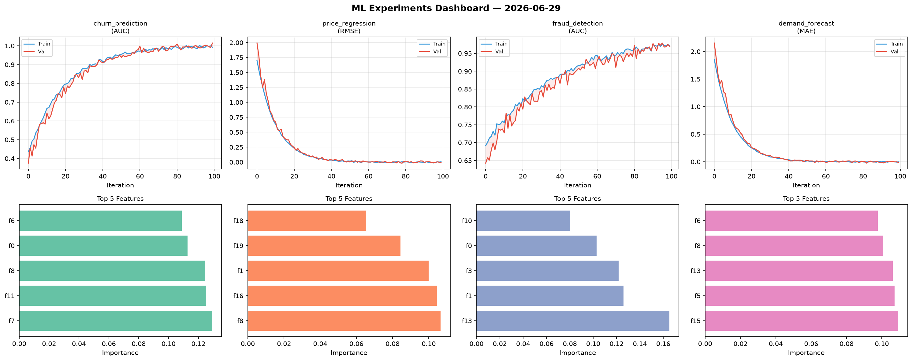
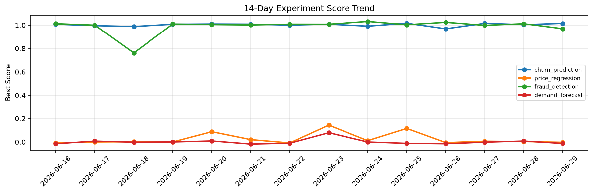

# ML Experiments Report — 2026-06-29

**Run ID:** `a79b5c897f` | **Experiments:** 4 | **Trials:** 17

## Delta vs Yesterday

| Experiment | Today | Yesterday | Change |
|-----------|-------|-----------|--------|
| churn_prediction | 1.0146 | 1.004 | 📈 1.1% |
| price_regression | -0.0028 | 0.0036 | 📉 -177.8% |
| fraud_detection | 0.9691 | 1.0117 | 📉 -4.2% |
| demand_forecast | -0.0126 | 0.0078 | 📉 -261.5% |

## churn_prediction (AUC)

**Best Score:** 1.0146 (Trial 1)

| Trial | Score | Overfit Gap | Time | LR | Trees | Leaves |
|-------|-------|-------------|------|-----|-------|--------|
| 1 ⭐ | 1.0146 | 0.0229 | 48.49s | 0.1 | 500 | 127 |
| 2 | 0.9531 | 0.0006 | 64.59s | 0.05 | 1000 | 63 |
| 3 | 1.0035 | 0.0049 | 2.15s | 0.1 | 100 | 127 |
| 4 | 0.9979 | 0.0016 | 77.53s | 0.2 | 500 | 31 |
| 5 | 0.9496 | 0.0071 | 6.38s | 0.05 | 100 | 63 |

## price_regression (RMSE)

**Best Score:** -0.0028 (Trial 4)

| Trial | Score | Overfit Gap | Time | LR | Trees | Leaves |
|-------|-------|-------------|------|-----|-------|--------|
| 1 | 0.592 | 0.0732 | 23.63s | 0.01 | 100 | 31 |
| 2 | 1.1678 | 0.1333 | 51.14s | 0.01 | 500 | 127 |
| 3 | 0.0058 | 0.0049 | 83.36s | 0.2 | 1000 | 31 |
| 4 ⭐ | -0.0028 | 0.0092 | 22.74s | 0.2 | 100 | 63 |

## fraud_detection (AUC)

**Best Score:** 0.9691 (Trial 2)

| Trial | Score | Overfit Gap | Time | LR | Trees | Leaves |
|-------|-------|-------------|------|-----|-------|--------|
| 1 | 0.9662 | 0.008 | 49.36s | 0.05 | 1000 | 15 |
| 2 ⭐ | 0.9691 | 0.0015 | 138.36s | 0.05 | 1000 | 15 |
| 3 | 0.6425 | 0.0411 | 8.08s | 0.01 | 100 | 15 |

## demand_forecast (MAE)

**Best Score:** -0.0126 (Trial 3)

| Trial | Score | Overfit Gap | Time | LR | Trees | Leaves |
|-------|-------|-------------|------|-----|-------|--------|
| 1 | 0.0248 | 0.0235 | 11.1s | 0.1 | 200 | 31 |
| 2 | 0.1209 | 0.0117 | 59.4s | 0.05 | 500 | 63 |
| 3 ⭐ | -0.0126 | 0.0104 | 273.64s | 0.2 | 1000 | 31 |
| 4 | 0.4344 | 0.0676 | 108.08s | 0.01 | 500 | 63 |
| 5 | 0.3789 | 0.0508 | 8.49s | 0.01 | 100 | 31 |
