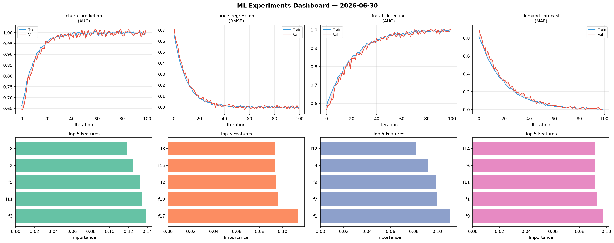
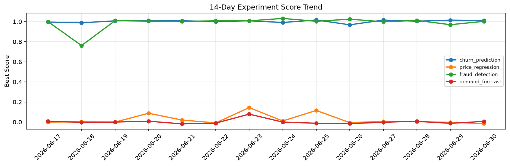

# ML Experiments Report — 2026-06-30

**Run ID:** `cf8e051edf` | **Experiments:** 4 | **Trials:** 22

## Delta vs Yesterday

| Experiment | Today | Yesterday | Change |
|-----------|-------|-----------|--------|
| churn_prediction | 1.0106 | 1.0146 | 📉 -0.4% |
| price_regression | -0.0145 | -0.0028 | 📉 -417.9% |
| fraud_detection | 1.0025 | 0.9691 | 📈 3.4% |
| demand_forecast | 0.0067 | -0.0126 | 📈 153.2% |

## churn_prediction (AUC)

**Best Score:** 1.0106 (Trial 6)

| Trial | Score | Overfit Gap | Time | LR | Trees | Leaves |
|-------|-------|-------------|------|-----|-------|--------|
| 1 | 0.9985 | 0.0049 | 27.17s | 0.2 | 200 | 63 |
| 2 | 1.0089 | 0.0122 | 90.29s | 0.1 | 500 | 15 |
| 3 | 0.9926 | 0.0003 | 8.59s | 0.2 | 100 | 63 |
| 4 | 0.9858 | 0.0218 | 19.29s | 0.05 | 100 | 127 |
| 5 | 1.0022 | 0.0076 | 12.28s | 0.2 | 100 | 15 |
| 6 ⭐ | 1.0106 | 0.0119 | 5.32s | 0.2 | 200 | 127 |

## price_regression (RMSE)

**Best Score:** -0.0145 (Trial 6)

| Trial | Score | Overfit Gap | Time | LR | Trees | Leaves |
|-------|-------|-------------|------|-----|-------|--------|
| 1 | 0.9245 | 0.1525 | 5.15s | 0.01 | 100 | 15 |
| 2 | 0.021 | 0.0178 | 25.48s | 0.2 | 500 | 63 |
| 3 | -0.0079 | 0.0125 | 290.51s | 0.1 | 1000 | 31 |
| 4 | 0.0125 | 0.0038 | 23.85s | 0.1 | 100 | 127 |
| 5 | 0.0458 | 0.0326 | 41.35s | 0.1 | 200 | 63 |
| 6 ⭐ | -0.0145 | 0.0133 | 15.02s | 0.2 | 200 | 15 |

## fraud_detection (AUC)

**Best Score:** 1.0025 (Trial 4)

| Trial | Score | Overfit Gap | Time | LR | Trees | Leaves |
|-------|-------|-------------|------|-----|-------|--------|
| 1 | 0.9483 | 0.0252 | 61.84s | 0.05 | 500 | 31 |
| 2 | 0.6624 | 0.0269 | 229.8s | 0.01 | 1000 | 127 |
| 3 | 0.7794 | 0.0379 | 30.5s | 0.01 | 200 | 15 |
| 4 ⭐ | 1.0025 | 0.0006 | 95.82s | 0.1 | 500 | 15 |
| 5 | 0.6732 | 0.0287 | 117.67s | 0.01 | 500 | 63 |

## demand_forecast (MAE)

**Best Score:** 0.0067 (Trial 4)

| Trial | Score | Overfit Gap | Time | LR | Trees | Leaves |
|-------|-------|-------------|------|-----|-------|--------|
| 1 | 0.1841 | 0.008 | 71.77s | 0.05 | 500 | 63 |
| 2 | 0.0072 | 0.0042 | 82.18s | 0.1 | 500 | 15 |
| 3 | 0.026 | 0.0221 | 8.73s | 0.1 | 100 | 15 |
| 4 ⭐ | 0.0067 | 0.004 | 102.71s | 0.1 | 500 | 15 |
| 5 | 0.8714 | 0.0669 | 150.15s | 0.01 | 1000 | 63 |
