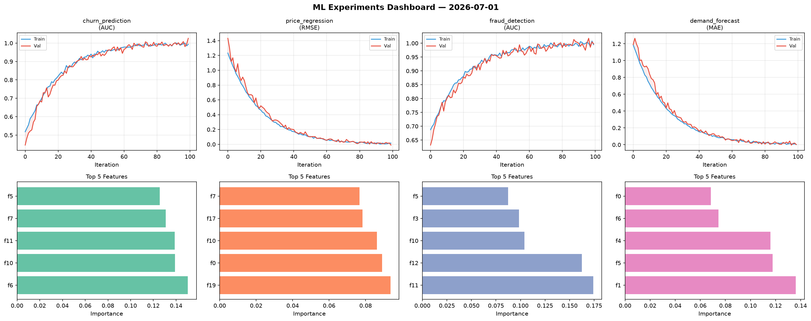
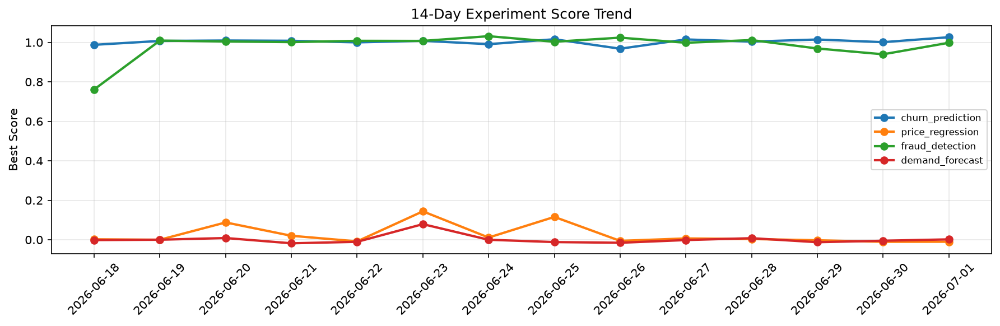

# ML Experiments Report — 2026-07-01

**Run ID:** `e2eaed6611` | **Experiments:** 4 | **Trials:** 20

## Delta vs Yesterday

| Experiment | Today | Yesterday | Change |
|-----------|-------|-----------|--------|
| churn_prediction | 1.0262 | 1.0011 | 📈 2.5% |
| price_regression | -0.0103 | -0.0106 | 📈 2.8% |
| fraud_detection | 0.998 | 0.9397 | 📈 6.2% |
| demand_forecast | 0.0018 | -0.0051 | 📈 135.3% |

## churn_prediction (AUC)

**Best Score:** 1.0262 (Trial 1)

| Trial | Score | Overfit Gap | Time | LR | Trees | Leaves |
|-------|-------|-------------|------|-----|-------|--------|
| 1 ⭐ | 1.0262 | 0.0327 | 189.84s | 0.1 | 1000 | 127 |
| 2 | 0.9509 | 0.0091 | 149.55s | 0.05 | 1000 | 31 |
| 3 | 0.9974 | 0.0029 | 165.14s | 0.1 | 1000 | 127 |
| 4 | 0.7885 | 0.0201 | 10.3s | 0.01 | 200 | 127 |
| 5 | 0.9961 | 0.0054 | 25.69s | 0.2 | 200 | 31 |
| 6 | 0.784 | 0.0364 | 36.12s | 0.01 | 1000 | 127 |

## price_regression (RMSE)

**Best Score:** -0.0103 (Trial 1)

| Trial | Score | Overfit Gap | Time | LR | Trees | Leaves |
|-------|-------|-------------|------|-----|-------|--------|
| 1 ⭐ | -0.0103 | 0.0265 | 132.34s | 0.1 | 500 | 31 |
| 2 | -0.0078 | 0.0106 | 65.07s | 0.1 | 500 | 127 |
| 3 | -0.0023 | 0.0056 | 17.19s | 0.2 | 200 | 31 |
| 4 | 0.1032 | 0.0044 | 93.27s | 0.05 | 500 | 15 |
| 5 | 0.0192 | 0.0167 | 52.05s | 0.1 | 200 | 63 |

## fraud_detection (AUC)

**Best Score:** 0.998 (Trial 4)

| Trial | Score | Overfit Gap | Time | LR | Trees | Leaves |
|-------|-------|-------------|------|-----|-------|--------|
| 1 | 0.9365 | 0.0222 | 9.91s | 0.05 | 100 | 63 |
| 2 | 0.995 | 0.004 | 39.67s | 0.1 | 500 | 15 |
| 3 | 0.9636 | 0.0113 | 28.21s | 0.05 | 500 | 63 |
| 4 ⭐ | 0.998 | 0.0032 | 36.83s | 0.1 | 500 | 63 |
| 5 | 0.9712 | 0.0033 | 4.3s | 0.05 | 100 | 127 |

## demand_forecast (MAE)

**Best Score:** 0.0018 (Trial 3)

| Trial | Score | Overfit Gap | Time | LR | Trees | Leaves |
|-------|-------|-------------|------|-----|-------|--------|
| 1 | 0.0799 | 0.0148 | 23.72s | 0.05 | 100 | 63 |
| 2 | 0.0149 | 0.0189 | 39.26s | 0.1 | 500 | 63 |
| 3 ⭐ | 0.0018 | 0.0023 | 195.29s | 0.1 | 1000 | 15 |
| 4 | 0.0091 | 0.002 | 4.55s | 0.1 | 100 | 15 |
