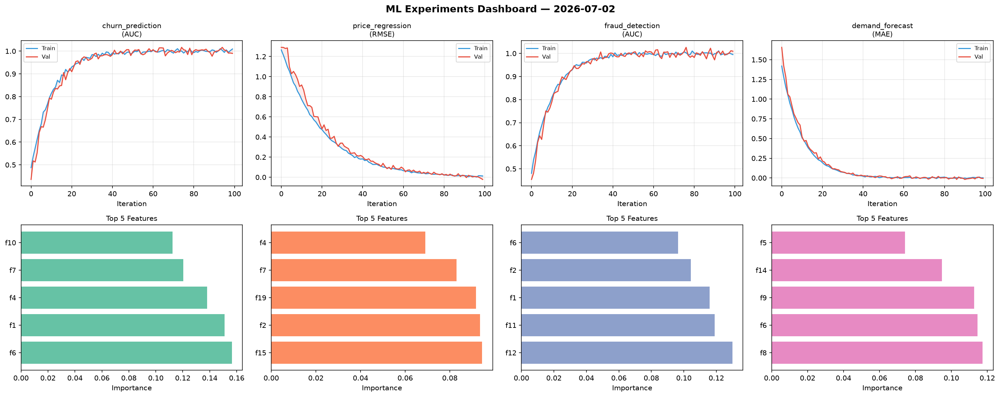
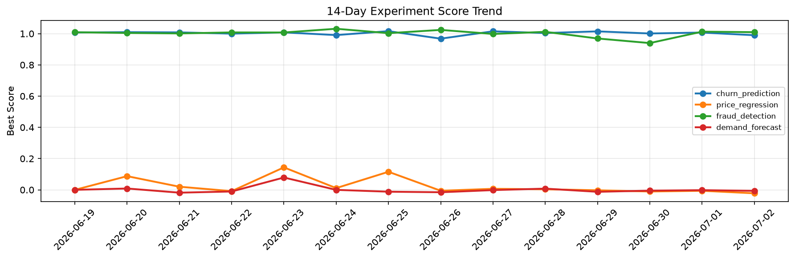

# ML Experiments Report — 2026-07-02

**Run ID:** `c4d7662f6b` | **Experiments:** 4 | **Trials:** 18

## Delta vs Yesterday

| Experiment | Today | Yesterday | Change |
|-----------|-------|-----------|--------|
| churn_prediction | 0.99 | 1.0071 | 📉 -1.7% |
| price_regression | -0.0221 | -0.006 | 📉 -268.3% |
| fraud_detection | 1.0095 | 1.0128 | 📉 -0.3% |
| demand_forecast | -0.0063 | -0.002 | 📉 -215.0% |

## churn_prediction (AUC)

**Best Score:** 0.99 (Trial 3)

| Trial | Score | Overfit Gap | Time | LR | Trees | Leaves |
|-------|-------|-------------|------|-----|-------|--------|
| 1 | 0.9464 | 0.0099 | 47.13s | 0.05 | 500 | 31 |
| 2 | 0.9458 | 0.0158 | 29.4s | 0.05 | 100 | 15 |
| 3 ⭐ | 0.99 | 0.0193 | 59.15s | 0.2 | 200 | 127 |
| 4 | 0.9497 | 0.016 | 66.06s | 0.05 | 500 | 31 |

## price_regression (RMSE)

**Best Score:** -0.0221 (Trial 2)

| Trial | Score | Overfit Gap | Time | LR | Trees | Leaves |
|-------|-------|-------------|------|-----|-------|--------|
| 1 | 0.0051 | 0.0012 | 97.45s | 0.2 | 1000 | 127 |
| 2 ⭐ | -0.0221 | 0.0342 | 16.28s | 0.1 | 100 | 31 |
| 3 | 0.0119 | 0.0042 | 248.03s | 0.1 | 1000 | 15 |
| 4 | 0.0186 | 0.027 | 128.29s | 0.1 | 1000 | 31 |
| 5 | 0.1604 | 0.0085 | 213.32s | 0.05 | 1000 | 127 |

## fraud_detection (AUC)

**Best Score:** 1.0095 (Trial 1)

| Trial | Score | Overfit Gap | Time | LR | Trees | Leaves |
|-------|-------|-------------|------|-----|-------|--------|
| 1 ⭐ | 1.0095 | 0.0146 | 129.03s | 0.2 | 1000 | 31 |
| 2 | 1.0094 | 0.0067 | 41.2s | 0.2 | 200 | 127 |
| 3 | 0.9456 | 0.0113 | 4.66s | 0.05 | 200 | 15 |

## demand_forecast (MAE)

**Best Score:** -0.0063 (Trial 4)

| Trial | Score | Overfit Gap | Time | LR | Trees | Leaves |
|-------|-------|-------------|------|-----|-------|--------|
| 1 | 0.1311 | 0.0143 | 19.43s | 0.05 | 100 | 31 |
| 2 | 0.8511 | 0.064 | 124.39s | 0.01 | 500 | 31 |
| 3 | 0.0119 | 0.0084 | 9.87s | 0.1 | 1000 | 63 |
| 4 ⭐ | -0.0063 | 0.0083 | 91.5s | 0.2 | 500 | 127 |
| 5 | 0.0884 | 0.0004 | 279.84s | 0.05 | 1000 | 63 |
| 6 | 0.1571 | 0.006 | 59.73s | 0.05 | 1000 | 15 |
