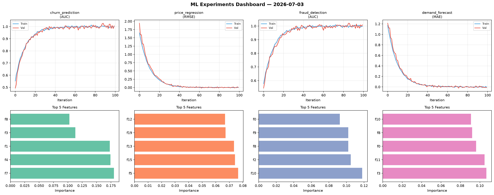
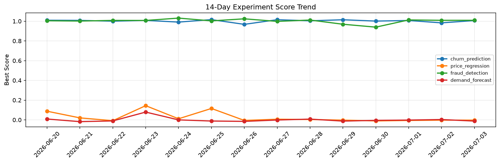

# ML Experiments Report — 2026-07-03

**Run ID:** `245239d7ac` | **Experiments:** 4 | **Trials:** 19

## Delta vs Yesterday

| Experiment | Today | Yesterday | Change |
|-----------|-------|-----------|--------|
| churn_prediction | 1.0065 | 0.9831 | 📈 2.4% |
| price_regression | -0.0027 | -0.003 | 📈 10.0% |
| fraud_detection | 1.009 | 1.0089 | 📉 0.0% |
| demand_forecast | -0.0124 | 0.0034 | 📉 -464.7% |

## churn_prediction (AUC)

**Best Score:** 1.0065 (Trial 2)

| Trial | Score | Overfit Gap | Time | LR | Trees | Leaves |
|-------|-------|-------------|------|-----|-------|--------|
| 1 | 0.7317 | 0.0232 | 54.24s | 0.01 | 200 | 31 |
| 2 ⭐ | 1.0065 | 0.0091 | 148.92s | 0.2 | 500 | 15 |
| 3 | 0.9897 | 0.0062 | 2.54s | 0.1 | 100 | 15 |
| 4 | 0.9922 | 0.0046 | 55.96s | 0.1 | 200 | 15 |
| 5 | 0.709 | 0.0291 | 118.92s | 0.01 | 1000 | 127 |

## price_regression (RMSE)

**Best Score:** -0.0027 (Trial 3)

| Trial | Score | Overfit Gap | Time | LR | Trees | Leaves |
|-------|-------|-------------|------|-----|-------|--------|
| 1 | 0.1669 | 0.0143 | 54.5s | 0.05 | 1000 | 127 |
| 2 | -0.0019 | 0.0014 | 29.93s | 0.2 | 200 | 15 |
| 3 ⭐ | -0.0027 | 0.0113 | 147.3s | 0.2 | 1000 | 63 |
| 4 | 0.0028 | 0.0022 | 16.96s | 0.2 | 200 | 63 |
| 5 | 0.1902 | 0.0203 | 16.09s | 0.05 | 200 | 127 |

## fraud_detection (AUC)

**Best Score:** 1.009 (Trial 5)

| Trial | Score | Overfit Gap | Time | LR | Trees | Leaves |
|-------|-------|-------------|------|-----|-------|--------|
| 1 | 0.952 | 0.0027 | 90.61s | 0.05 | 500 | 127 |
| 2 | 0.637 | 0.0712 | 121.1s | 0.01 | 500 | 15 |
| 3 | 0.9995 | 0.0017 | 32.88s | 0.2 | 200 | 15 |
| 4 | 0.957 | 0.0025 | 123.09s | 0.05 | 500 | 127 |
| 5 ⭐ | 1.009 | 0.0116 | 18.47s | 0.2 | 500 | 31 |

## demand_forecast (MAE)

**Best Score:** -0.0124 (Trial 3)

| Trial | Score | Overfit Gap | Time | LR | Trees | Leaves |
|-------|-------|-------------|------|-----|-------|--------|
| 1 | -0.001 | 0.0012 | 108.7s | 0.1 | 500 | 127 |
| 2 | 0.0054 | 0.0119 | 53.4s | 0.2 | 200 | 15 |
| 3 ⭐ | -0.0124 | 0.0097 | 5.78s | 0.2 | 200 | 127 |
| 4 | 0.0049 | 0.0057 | 217.9s | 0.1 | 1000 | 127 |
