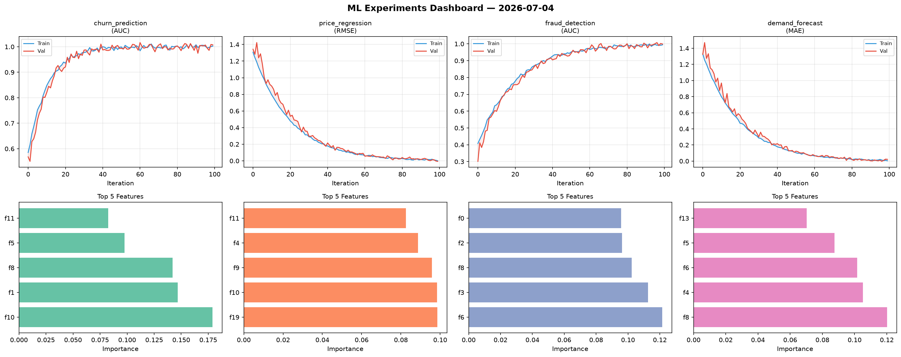
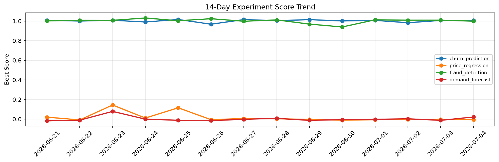

# ML Experiments Report — 2026-07-04

**Run ID:** `8c7926cdeb` | **Experiments:** 4 | **Trials:** 17

## Delta vs Yesterday

| Experiment | Today | Yesterday | Change |
|-----------|-------|-----------|--------|
| churn_prediction | 1.0074 | 1.0065 | 📈 0.1% |
| price_regression | -0.0064 | -0.0027 | 📉 -137.0% |
| fraud_detection | 0.9989 | 1.009 | 📉 -1.0% |
| demand_forecast | 0.0216 | -0.0124 | 📈 274.2% |

## churn_prediction (AUC)

**Best Score:** 1.0074 (Trial 2)

| Trial | Score | Overfit Gap | Time | LR | Trees | Leaves |
|-------|-------|-------------|------|-----|-------|--------|
| 1 | 1.0056 | 0.0143 | 203.71s | 0.2 | 1000 | 31 |
| 2 ⭐ | 1.0074 | 0.0046 | 21.18s | 0.2 | 200 | 31 |
| 3 | 0.9967 | 0.0044 | 27.95s | 0.1 | 200 | 63 |

## price_regression (RMSE)

**Best Score:** -0.0064 (Trial 6)

| Trial | Score | Overfit Gap | Time | LR | Trees | Leaves |
|-------|-------|-------------|------|-----|-------|--------|
| 1 | 0.009 | 0.0086 | 1.81s | 0.1 | 100 | 127 |
| 2 | 0.1202 | 0.0308 | 4.4s | 0.05 | 100 | 15 |
| 3 | 0.021 | 0.0128 | 39.15s | 0.1 | 500 | 63 |
| 4 | 0.1413 | 0.014 | 22.23s | 0.05 | 100 | 31 |
| 5 | 1.1028 | 0.1136 | 45.19s | 0.01 | 200 | 127 |
| 6 ⭐ | -0.0064 | 0.0071 | 205.69s | 0.1 | 1000 | 63 |

## fraud_detection (AUC)

**Best Score:** 0.9989 (Trial 1)

| Trial | Score | Overfit Gap | Time | LR | Trees | Leaves |
|-------|-------|-------------|------|-----|-------|--------|
| 1 ⭐ | 0.9989 | 0.0044 | 3.98s | 0.1 | 100 | 31 |
| 2 | 0.9696 | 0.003 | 9.76s | 0.05 | 100 | 31 |
| 3 | 0.9903 | 0.0107 | 24.89s | 0.1 | 200 | 15 |
| 4 | 0.7004 | 0.0483 | 55.31s | 0.01 | 200 | 63 |
| 5 | 0.9268 | 0.0191 | 137.16s | 0.05 | 500 | 63 |

## demand_forecast (MAE)

**Best Score:** 0.0216 (Trial 3)

| Trial | Score | Overfit Gap | Time | LR | Trees | Leaves |
|-------|-------|-------------|------|-----|-------|--------|
| 1 | 1.0169 | 0.1039 | 196.5s | 0.01 | 1000 | 15 |
| 2 | 0.0876 | 0.0001 | 28.42s | 0.05 | 500 | 15 |
| 3 ⭐ | 0.0216 | 0.018 | 9.74s | 0.1 | 200 | 127 |
