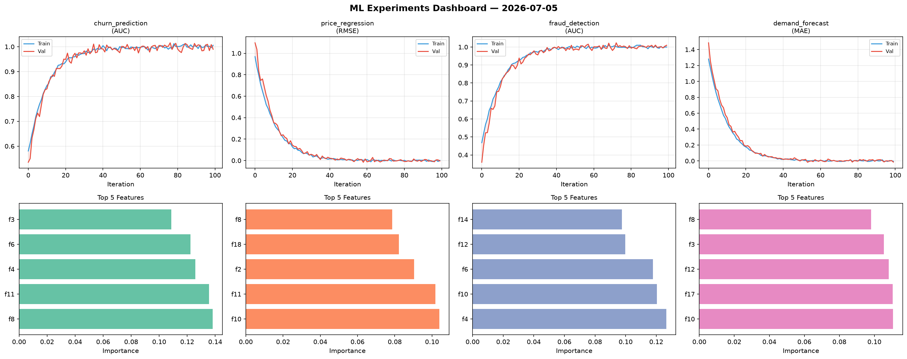
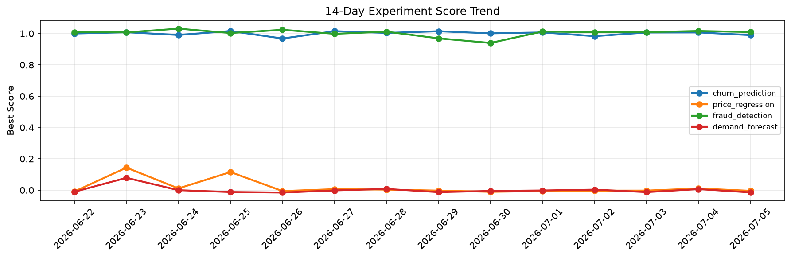

# ML Experiments Report — 2026-07-05

**Run ID:** `0ee9e77ff5` | **Experiments:** 4 | **Trials:** 17

## Delta vs Yesterday

| Experiment | Today | Yesterday | Change |
|-----------|-------|-----------|--------|
| churn_prediction | 0.9898 | 1.0069 | 📉 -1.7% |
| price_regression | -0.0042 | 0.0107 | 📉 -139.3% |
| fraud_detection | 1.0097 | 1.0162 | 📉 -0.6% |
| demand_forecast | -0.0143 | 0.0066 | 📉 -316.7% |

## churn_prediction (AUC)

**Best Score:** 0.9898 (Trial 3)

| Trial | Score | Overfit Gap | Time | LR | Trees | Leaves |
|-------|-------|-------------|------|-----|-------|--------|
| 1 | 0.7963 | 0.0059 | 296.37s | 0.01 | 1000 | 31 |
| 2 | 0.9523 | 0.0141 | 42.35s | 0.05 | 200 | 127 |
| 3 ⭐ | 0.9898 | 0.016 | 119.58s | 0.2 | 500 | 31 |

## price_regression (RMSE)

**Best Score:** -0.0042 (Trial 1)

| Trial | Score | Overfit Gap | Time | LR | Trees | Leaves |
|-------|-------|-------------|------|-----|-------|--------|
| 1 ⭐ | -0.0042 | 0.006 | 22.05s | 0.2 | 100 | 15 |
| 2 | 0.0019 | 0.0008 | 31.16s | 0.1 | 200 | 15 |
| 3 | 0.0612 | 0.0002 | 208.13s | 0.05 | 1000 | 15 |
| 4 | 0.0506 | 0.0022 | 207.12s | 0.05 | 1000 | 15 |

## fraud_detection (AUC)

**Best Score:** 1.0097 (Trial 1)

| Trial | Score | Overfit Gap | Time | LR | Trees | Leaves |
|-------|-------|-------------|------|-----|-------|--------|
| 1 ⭐ | 1.0097 | 0.0099 | 23.73s | 0.2 | 100 | 127 |
| 2 | 0.9941 | 0.001 | 10.33s | 0.2 | 200 | 15 |
| 3 | 0.9903 | 0.0001 | 86.34s | 0.1 | 500 | 31 |
| 4 | 0.937 | 0.007 | 48.75s | 0.05 | 200 | 63 |
| 5 | 0.9976 | 0.0037 | 5.59s | 0.2 | 100 | 127 |
| 6 | 0.9531 | 0.0154 | 134.23s | 0.05 | 500 | 127 |

## demand_forecast (MAE)

**Best Score:** -0.0143 (Trial 4)

| Trial | Score | Overfit Gap | Time | LR | Trees | Leaves |
|-------|-------|-------------|------|-----|-------|--------|
| 1 | 0.1573 | 0.0102 | 77.54s | 0.05 | 1000 | 63 |
| 2 | 1.1943 | 0.1903 | 48.82s | 0.01 | 200 | 15 |
| 3 | 0.1125 | 0.0073 | 137.03s | 0.05 | 500 | 15 |
| 4 ⭐ | -0.0143 | 0.0108 | 24.12s | 0.2 | 100 | 31 |
