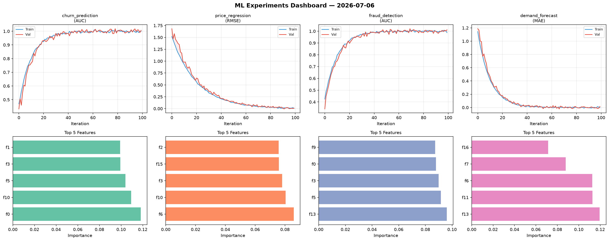
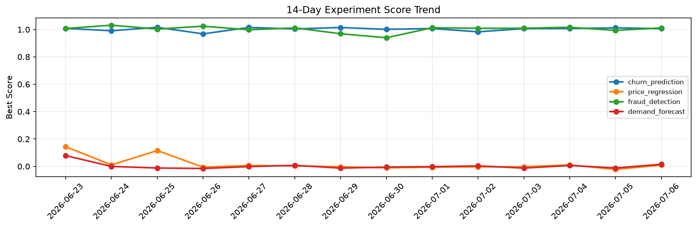

# ML Experiments Report — 2026-07-06

**Run ID:** `7d08998af6` | **Experiments:** 4 | **Trials:** 15

## Delta vs Yesterday

| Experiment | Today | Yesterday | Change |
|-----------|-------|-----------|--------|
| churn_prediction | 1.0062 | 1.012 | 📉 -0.6% |
| price_regression | 0.0099 | -0.0221 | 📈 144.8% |
| fraud_detection | 1.0115 | 0.9935 | 📈 1.8% |
| demand_forecast | 0.0153 | -0.0115 | 📈 233.0% |

## churn_prediction (AUC)

**Best Score:** 1.0062 (Trial 1)

| Trial | Score | Overfit Gap | Time | LR | Trees | Leaves |
|-------|-------|-------------|------|-----|-------|--------|
| 1 ⭐ | 1.0062 | 0.0068 | 145.83s | 0.2 | 1000 | 127 |
| 2 | 1.0042 | 0.0113 | 100.16s | 0.1 | 500 | 63 |
| 3 | 0.9997 | 0.0011 | 55.42s | 0.1 | 1000 | 127 |

## price_regression (RMSE)

**Best Score:** 0.0099 (Trial 4)

| Trial | Score | Overfit Gap | Time | LR | Trees | Leaves |
|-------|-------|-------------|------|-----|-------|--------|
| 1 | 0.4681 | 0.0535 | 26.18s | 0.01 | 1000 | 31 |
| 2 | 0.6493 | 0.0864 | 4.5s | 0.01 | 100 | 31 |
| 3 | 0.5651 | 0.034 | 14.26s | 0.01 | 1000 | 15 |
| 4 ⭐ | 0.0099 | 0.0033 | 144.5s | 0.1 | 500 | 15 |

## fraud_detection (AUC)

**Best Score:** 1.0115 (Trial 2)

| Trial | Score | Overfit Gap | Time | LR | Trees | Leaves |
|-------|-------|-------------|------|-----|-------|--------|
| 1 | 0.9873 | 0.01 | 23.76s | 0.1 | 100 | 127 |
| 2 ⭐ | 1.0115 | 0.0233 | 125.66s | 0.2 | 1000 | 31 |
| 3 | 0.9749 | 0.0047 | 8.81s | 0.05 | 100 | 63 |
| 4 | 0.9664 | 0.0017 | 175.9s | 0.05 | 1000 | 127 |
| 5 | 0.6959 | 0.0376 | 23.48s | 0.01 | 200 | 127 |

## demand_forecast (MAE)

**Best Score:** 0.0153 (Trial 3)

| Trial | Score | Overfit Gap | Time | LR | Trees | Leaves |
|-------|-------|-------------|------|-----|-------|--------|
| 1 | 0.8327 | 0.0443 | 223.44s | 0.01 | 1000 | 127 |
| 2 | 0.1629 | 0.0035 | 171.36s | 0.05 | 1000 | 31 |
| 3 ⭐ | 0.0153 | 0.0158 | 4.71s | 0.2 | 100 | 31 |
