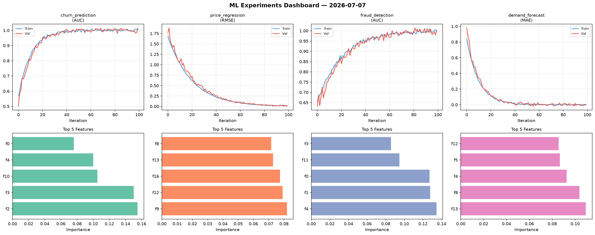
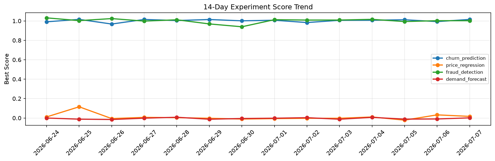

# ML Experiments Report — 2026-07-07

**Run ID:** `30060435c7` | **Experiments:** 4 | **Trials:** 17

## Delta vs Yesterday

| Experiment | Today | Yesterday | Change |
|-----------|-------|-----------|--------|
| churn_prediction | 1.0154 | 0.993 | 📈 2.3% |
| price_regression | 0.0167 | 0.0324 | 📉 -48.5% |
| fraud_detection | 1.0021 | 1.0024 | 📉 -0.0% |
| demand_forecast | 0.0016 | -0.0099 | 📈 116.2% |

## churn_prediction (AUC)

**Best Score:** 1.0154 (Trial 3)

| Trial | Score | Overfit Gap | Time | LR | Trees | Leaves |
|-------|-------|-------------|------|-----|-------|--------|
| 1 | 0.9932 | 0.0026 | 77.88s | 0.2 | 500 | 15 |
| 2 | 0.9907 | 0.0106 | 6.19s | 0.1 | 200 | 31 |
| 3 ⭐ | 1.0154 | 0.0128 | 81.56s | 0.2 | 500 | 15 |

## price_regression (RMSE)

**Best Score:** 0.0167 (Trial 4)

| Trial | Score | Overfit Gap | Time | LR | Trees | Leaves |
|-------|-------|-------------|------|-----|-------|--------|
| 1 | 0.1685 | 0.0331 | 38.11s | 0.05 | 200 | 127 |
| 2 | 0.3552 | 0.0171 | 82.58s | 0.01 | 500 | 127 |
| 3 | 0.122 | 0.0074 | 54.89s | 0.05 | 200 | 63 |
| 4 ⭐ | 0.0167 | 0.0073 | 43.37s | 0.1 | 200 | 127 |

## fraud_detection (AUC)

**Best Score:** 1.0021 (Trial 5)

| Trial | Score | Overfit Gap | Time | LR | Trees | Leaves |
|-------|-------|-------------|------|-----|-------|--------|
| 1 | 0.7842 | 0.0349 | 75.32s | 0.01 | 500 | 63 |
| 2 | 0.9462 | 0.0163 | 56.65s | 0.05 | 200 | 31 |
| 3 | 0.93 | 0.0195 | 16.29s | 0.05 | 500 | 15 |
| 4 | 0.6213 | 0.0309 | 122.39s | 0.01 | 1000 | 63 |
| 5 ⭐ | 1.0021 | 0.0049 | 18.97s | 0.1 | 500 | 127 |

## demand_forecast (MAE)

**Best Score:** 0.0016 (Trial 3)

| Trial | Score | Overfit Gap | Time | LR | Trees | Leaves |
|-------|-------|-------------|------|-----|-------|--------|
| 1 | 0.1187 | 0.0019 | 53.8s | 0.05 | 200 | 127 |
| 2 | 0.108 | 0.0181 | 299.33s | 0.05 | 1000 | 31 |
| 3 ⭐ | 0.0016 | 0.0049 | 24.16s | 0.2 | 100 | 63 |
| 4 | 0.0116 | 0.0058 | 26.52s | 0.1 | 100 | 63 |
| 5 | 0.6535 | 0.1055 | 22.91s | 0.01 | 500 | 63 |
