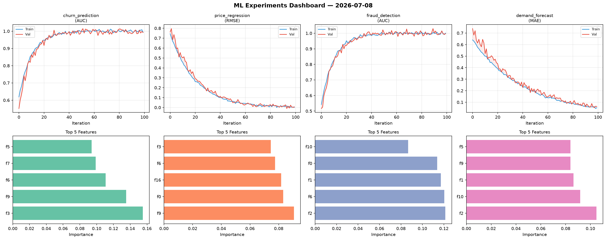
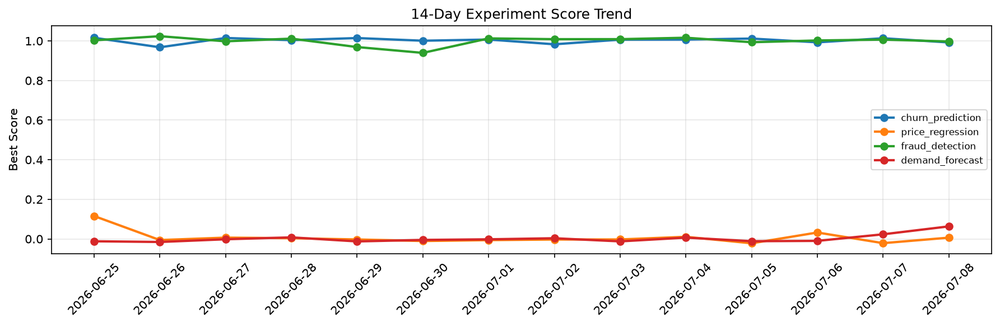

# ML Experiments Report — 2026-07-08

**Run ID:** `bc68a757f7` | **Experiments:** 4 | **Trials:** 15

## Delta vs Yesterday

| Experiment | Today | Yesterday | Change |
|-----------|-------|-----------|--------|
| churn_prediction | 0.9924 | 1.0136 | 📉 -2.1% |
| price_regression | 0.0064 | -0.0214 | 📈 129.9% |
| fraud_detection | 0.9974 | 1.0067 | 📉 -0.9% |
| demand_forecast | 0.0633 | 0.0233 | 📈 171.7% |

## churn_prediction (AUC)

**Best Score:** 0.9924 (Trial 1)

| Trial | Score | Overfit Gap | Time | LR | Trees | Leaves |
|-------|-------|-------------|------|-----|-------|--------|
| 1 ⭐ | 0.9924 | 0.0008 | 19.73s | 0.2 | 100 | 63 |
| 2 | 0.9438 | 0.0168 | 18.9s | 0.05 | 100 | 127 |
| 3 | 0.5824 | 0.0512 | 6.96s | 0.01 | 100 | 31 |

## price_regression (RMSE)

**Best Score:** 0.0064 (Trial 2)

| Trial | Score | Overfit Gap | Time | LR | Trees | Leaves |
|-------|-------|-------------|------|-----|-------|--------|
| 1 | 0.0748 | 0.0005 | 8.03s | 0.05 | 500 | 15 |
| 2 ⭐ | 0.0064 | 0.0056 | 151.1s | 0.1 | 1000 | 31 |
| 3 | 0.1333 | 0.0122 | 3.28s | 0.05 | 100 | 63 |

## fraud_detection (AUC)

**Best Score:** 0.9974 (Trial 1)

| Trial | Score | Overfit Gap | Time | LR | Trees | Leaves |
|-------|-------|-------------|------|-----|-------|--------|
| 1 ⭐ | 0.9974 | 0.0034 | 21.64s | 0.2 | 500 | 63 |
| 2 | 0.9965 | 0.0015 | 10.6s | 0.1 | 100 | 63 |
| 3 | 0.9478 | 0.0236 | 1.98s | 0.05 | 200 | 31 |
| 4 | 0.7536 | 0.0144 | 5.54s | 0.01 | 100 | 63 |
| 5 | 0.9648 | 0.0047 | 21.5s | 0.05 | 200 | 15 |
| 6 | 0.9525 | 0.0034 | 83.58s | 0.05 | 1000 | 15 |

## demand_forecast (MAE)

**Best Score:** 0.0633 (Trial 2)

| Trial | Score | Overfit Gap | Time | LR | Trees | Leaves |
|-------|-------|-------------|------|-----|-------|--------|
| 1 | 0.3403 | 0.0184 | 7.54s | 0.01 | 200 | 31 |
| 2 ⭐ | 0.0633 | 0.0111 | 129.58s | 0.05 | 500 | 15 |
| 3 | 0.7044 | 0.0832 | 37.13s | 0.01 | 500 | 63 |
