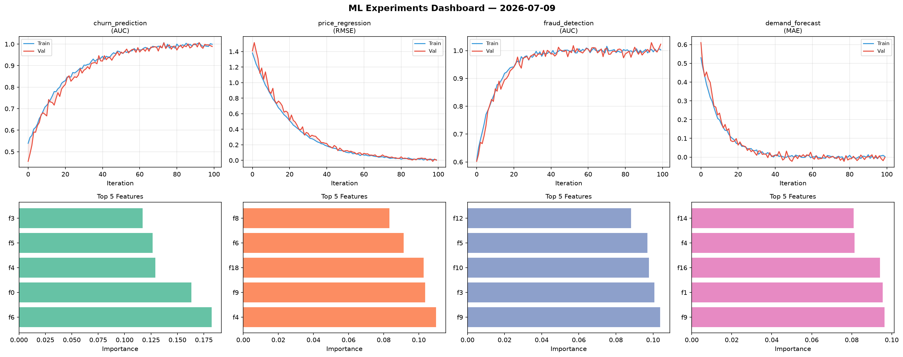
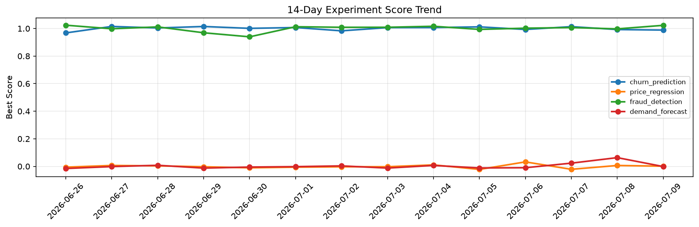

# ML Experiments Report — 2026-07-09

**Run ID:** `dde56f74d8` | **Experiments:** 4 | **Trials:** 18

## Delta vs Yesterday

| Experiment | Today | Yesterday | Change |
|-----------|-------|-----------|--------|
| churn_prediction | 0.9887 | 0.9924 | 📉 -0.4% |
| price_regression | 0.0012 | 0.0064 | 📉 -81.3% |
| fraud_detection | 1.023 | 0.9974 | 📈 2.6% |
| demand_forecast | -0.0014 | 0.0633 | 📉 -102.2% |

## churn_prediction (AUC)

**Best Score:** 0.9887 (Trial 5)

| Trial | Score | Overfit Gap | Time | LR | Trees | Leaves |
|-------|-------|-------------|------|-----|-------|--------|
| 1 | 0.7117 | 0.0116 | 8.42s | 0.01 | 100 | 31 |
| 2 | 0.7108 | 0.0427 | 46.87s | 0.01 | 200 | 127 |
| 3 | 0.6402 | 0.0396 | 40.33s | 0.01 | 200 | 127 |
| 4 | 0.9478 | 0.0018 | 141.06s | 0.05 | 1000 | 15 |
| 5 ⭐ | 0.9887 | 0.0106 | 3.42s | 0.1 | 200 | 127 |

## price_regression (RMSE)

**Best Score:** 0.0012 (Trial 3)

| Trial | Score | Overfit Gap | Time | LR | Trees | Leaves |
|-------|-------|-------------|------|-----|-------|--------|
| 1 | 0.0251 | 0.0145 | 18.2s | 0.1 | 500 | 31 |
| 2 | 0.6308 | 0.0198 | 47.7s | 0.01 | 500 | 15 |
| 3 ⭐ | 0.0012 | 0.0066 | 33.7s | 0.1 | 200 | 127 |

## fraud_detection (AUC)

**Best Score:** 1.023 (Trial 4)

| Trial | Score | Overfit Gap | Time | LR | Trees | Leaves |
|-------|-------|-------------|------|-----|-------|--------|
| 1 | 0.9988 | 0.0068 | 105.95s | 0.1 | 1000 | 15 |
| 2 | 0.9953 | 0.0093 | 1.28s | 0.2 | 200 | 127 |
| 3 | 0.5941 | 0.075 | 58.56s | 0.01 | 200 | 31 |
| 4 ⭐ | 1.023 | 0.0205 | 6.98s | 0.2 | 200 | 63 |

## demand_forecast (MAE)

**Best Score:** -0.0014 (Trial 4)

| Trial | Score | Overfit Gap | Time | LR | Trees | Leaves |
|-------|-------|-------------|------|-----|-------|--------|
| 1 | 0.0501 | 0.0138 | 124.54s | 0.05 | 500 | 63 |
| 2 | 0.7808 | 0.0708 | 17.91s | 0.01 | 200 | 15 |
| 3 | 0.0031 | 0.0025 | 9.55s | 0.2 | 1000 | 31 |
| 4 ⭐ | -0.0014 | 0.0039 | 32.73s | 0.2 | 200 | 127 |
| 5 | 0.3873 | 0.0474 | 19.31s | 0.01 | 200 | 15 |
| 6 | 0.0028 | 0.0008 | 231.65s | 0.1 | 1000 | 127 |
