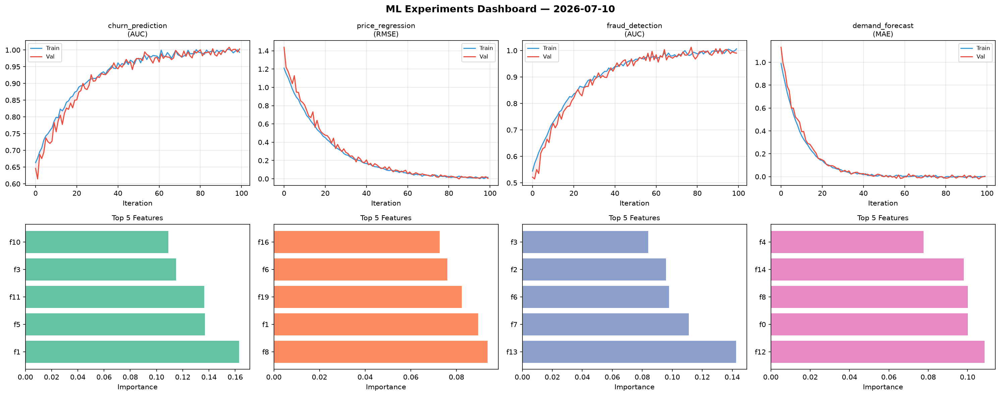
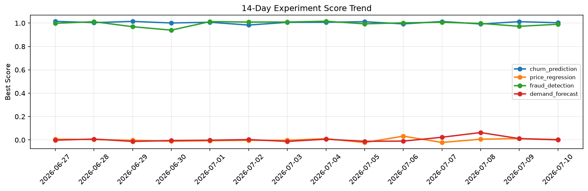

# ML Experiments Report — 2026-07-10

**Run ID:** `7409ce78a2` | **Experiments:** 4 | **Trials:** 13

## Delta vs Yesterday

| Experiment | Today | Yesterday | Change |
|-----------|-------|-----------|--------|
| churn_prediction | 1.003 | 1.0123 | 📉 -0.9% |
| price_regression | 0.0038 | 0.0122 | 📉 -68.9% |
| fraud_detection | 0.99 | 0.9726 | 📈 1.8% |
| demand_forecast | 0.0007 | 0.0116 | 📉 -94.0% |

## churn_prediction (AUC)

**Best Score:** 1.003 (Trial 1)

| Trial | Score | Overfit Gap | Time | LR | Trees | Leaves |
|-------|-------|-------------|------|-----|-------|--------|
| 1 ⭐ | 1.003 | 0.0101 | 26.87s | 0.1 | 200 | 127 |
| 2 | 0.9674 | 0.0025 | 238.26s | 0.05 | 1000 | 31 |
| 3 | 0.9692 | 0.0181 | 13.91s | 0.05 | 100 | 31 |

## price_regression (RMSE)

**Best Score:** 0.0038 (Trial 3)

| Trial | Score | Overfit Gap | Time | LR | Trees | Leaves |
|-------|-------|-------------|------|-----|-------|--------|
| 1 | 0.0074 | 0.0006 | 94.43s | 0.2 | 1000 | 31 |
| 2 | 0.0346 | 0.0123 | 16.35s | 0.1 | 200 | 63 |
| 3 ⭐ | 0.0038 | 0.0125 | 23.06s | 0.1 | 100 | 31 |

## fraud_detection (AUC)

**Best Score:** 0.99 (Trial 3)

| Trial | Score | Overfit Gap | Time | LR | Trees | Leaves |
|-------|-------|-------------|------|-----|-------|--------|
| 1 | 0.9494 | 0.0168 | 24.87s | 0.05 | 1000 | 127 |
| 2 | 0.7085 | 0.057 | 3.28s | 0.01 | 100 | 31 |
| 3 ⭐ | 0.99 | 0.0162 | 24.04s | 0.1 | 200 | 127 |

## demand_forecast (MAE)

**Best Score:** 0.0007 (Trial 2)

| Trial | Score | Overfit Gap | Time | LR | Trees | Leaves |
|-------|-------|-------------|------|-----|-------|--------|
| 1 | 0.0064 | 0.0021 | 5.95s | 0.2 | 200 | 127 |
| 2 ⭐ | 0.0007 | 0.0039 | 18.82s | 0.2 | 100 | 15 |
| 3 | 0.0593 | 0.0057 | 277.08s | 0.05 | 1000 | 63 |
| 4 | 0.1082 | 0.0098 | 121.37s | 0.05 | 1000 | 63 |
