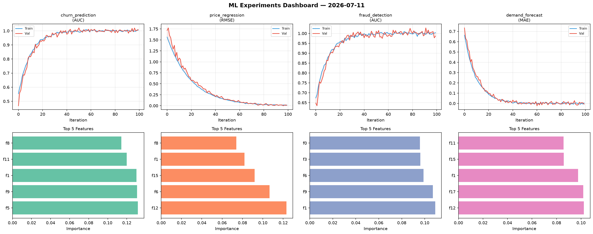
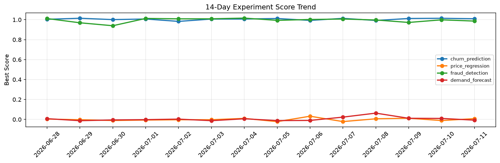

# ML Experiments Report — 2026-07-11

**Run ID:** `eee45a2b56` | **Experiments:** 4 | **Trials:** 19

## Delta vs Yesterday

| Experiment | Today | Yesterday | Change |
|-----------|-------|-----------|--------|
| churn_prediction | 1.0096 | 1.0143 | 📉 -0.5% |
| price_regression | 0.0081 | -0.0111 | 📈 173.0% |
| fraud_detection | 0.9863 | 0.9988 | 📉 -1.3% |
| demand_forecast | -0.0071 | 0.0102 | 📉 -169.6% |

## churn_prediction (AUC)

**Best Score:** 1.0096 (Trial 6)

| Trial | Score | Overfit Gap | Time | LR | Trees | Leaves |
|-------|-------|-------------|------|-----|-------|--------|
| 1 | 0.7369 | 0.0199 | 12.36s | 0.01 | 1000 | 63 |
| 2 | 1.0021 | 0.0058 | 43.2s | 0.2 | 500 | 127 |
| 3 | 0.9666 | 0.0178 | 7.93s | 0.05 | 100 | 31 |
| 4 | 0.9588 | 0.0171 | 2.77s | 0.05 | 100 | 63 |
| 5 | 0.9634 | 0.0011 | 76.59s | 0.05 | 1000 | 31 |
| 6 ⭐ | 1.0096 | 0.0054 | 12.57s | 0.2 | 100 | 127 |

## price_regression (RMSE)

**Best Score:** 0.0081 (Trial 3)

| Trial | Score | Overfit Gap | Time | LR | Trees | Leaves |
|-------|-------|-------------|------|-----|-------|--------|
| 1 | 0.1411 | 0.0046 | 131.27s | 0.05 | 1000 | 127 |
| 2 | 0.13 | 0.0004 | 73.81s | 0.05 | 1000 | 63 |
| 3 ⭐ | 0.0081 | 0.0082 | 58.27s | 0.1 | 500 | 31 |

## fraud_detection (AUC)

**Best Score:** 0.9863 (Trial 2)

| Trial | Score | Overfit Gap | Time | LR | Trees | Leaves |
|-------|-------|-------------|------|-----|-------|--------|
| 1 | 0.8039 | 0.0009 | 22.32s | 0.01 | 500 | 127 |
| 2 ⭐ | 0.9863 | 0.0176 | 22.02s | 0.2 | 100 | 15 |
| 3 | 0.9849 | 0.0005 | 18.76s | 0.1 | 100 | 15 |
| 4 | 0.9317 | 0.0201 | 146.95s | 0.05 | 500 | 127 |
| 5 | 0.6705 | 0.0179 | 25.17s | 0.01 | 200 | 15 |

## demand_forecast (MAE)

**Best Score:** -0.0071 (Trial 5)

| Trial | Score | Overfit Gap | Time | LR | Trees | Leaves |
|-------|-------|-------------|------|-----|-------|--------|
| 1 | 0.0316 | 0.0069 | 35.4s | 0.1 | 200 | 63 |
| 2 | 0.0118 | 0.0209 | 26.88s | 0.2 | 200 | 15 |
| 3 | 0.0108 | 0.0095 | 8.09s | 0.2 | 100 | 127 |
| 4 | 0.0073 | 0.0135 | 16.39s | 0.1 | 200 | 15 |
| 5 ⭐ | -0.0071 | 0.012 | 85.07s | 0.2 | 1000 | 15 |
