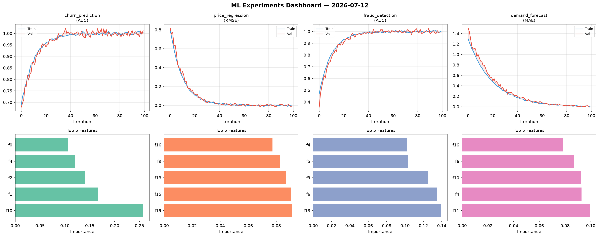
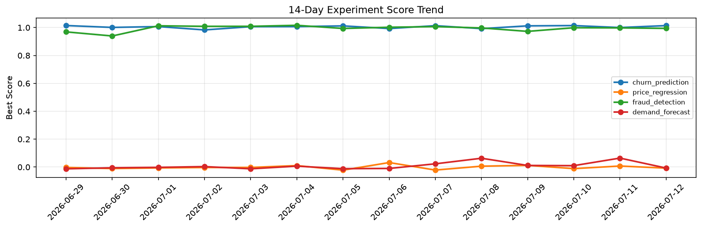

# ML Experiments Report — 2026-07-12

**Run ID:** `5054a6e295` | **Experiments:** 4 | **Trials:** 20

## Delta vs Yesterday

| Experiment | Today | Yesterday | Change |
|-----------|-------|-----------|--------|
| churn_prediction | 1.0141 | 1.0002 | 📈 1.4% |
| price_regression | -0.0076 | 0.0075 | 📉 -201.3% |
| fraud_detection | 0.9942 | 0.9977 | 📉 -0.4% |
| demand_forecast | -0.007 | 0.0644 | 📉 -110.9% |

## churn_prediction (AUC)

**Best Score:** 1.0141 (Trial 2)

| Trial | Score | Overfit Gap | Time | LR | Trees | Leaves |
|-------|-------|-------------|------|-----|-------|--------|
| 1 | 0.9964 | 0.0122 | 10.64s | 0.1 | 100 | 31 |
| 2 ⭐ | 1.0141 | 0.0092 | 17.22s | 0.2 | 100 | 15 |
| 3 | 0.7696 | 0.047 | 217.14s | 0.01 | 1000 | 63 |

## price_regression (RMSE)

**Best Score:** -0.0076 (Trial 5)

| Trial | Score | Overfit Gap | Time | LR | Trees | Leaves |
|-------|-------|-------------|------|-----|-------|--------|
| 1 | 0.0561 | 0.0028 | 93.32s | 0.05 | 500 | 15 |
| 2 | 0.0151 | 0.0135 | 16.01s | 0.2 | 100 | 127 |
| 3 | 0.088 | 0.0 | 27.97s | 0.05 | 100 | 127 |
| 4 | 0.0142 | 0.0035 | 4.69s | 0.1 | 100 | 63 |
| 5 ⭐ | -0.0076 | 0.012 | 156.45s | 0.2 | 1000 | 31 |

## fraud_detection (AUC)

**Best Score:** 0.9942 (Trial 4)

| Trial | Score | Overfit Gap | Time | LR | Trees | Leaves |
|-------|-------|-------------|------|-----|-------|--------|
| 1 | 0.8048 | 0.011 | 39.22s | 0.01 | 200 | 31 |
| 2 | 0.9672 | 0.0146 | 30.71s | 0.05 | 200 | 63 |
| 3 | 0.9395 | 0.0128 | 4.33s | 0.05 | 100 | 15 |
| 4 ⭐ | 0.9942 | 0.0081 | 26.09s | 0.2 | 100 | 15 |
| 5 | 0.9889 | 0.0112 | 4.57s | 0.2 | 100 | 127 |
| 6 | 0.9752 | 0.0275 | 298.12s | 0.2 | 1000 | 31 |

## demand_forecast (MAE)

**Best Score:** -0.007 (Trial 2)

| Trial | Score | Overfit Gap | Time | LR | Trees | Leaves |
|-------|-------|-------------|------|-----|-------|--------|
| 1 | 0.0927 | 0.0163 | 273.39s | 0.05 | 1000 | 15 |
| 2 ⭐ | -0.007 | 0.0126 | 44.31s | 0.1 | 200 | 63 |
| 3 | 0.0097 | 0.0004 | 8.94s | 0.1 | 100 | 15 |
| 4 | 0.9416 | 0.0774 | 7.81s | 0.01 | 100 | 15 |
| 5 | 0.8565 | 0.109 | 103.52s | 0.01 | 500 | 31 |
| 6 | 0.0076 | 0.0051 | 162.65s | 0.1 | 1000 | 127 |
