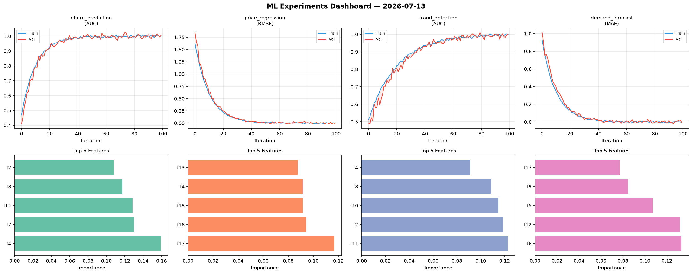
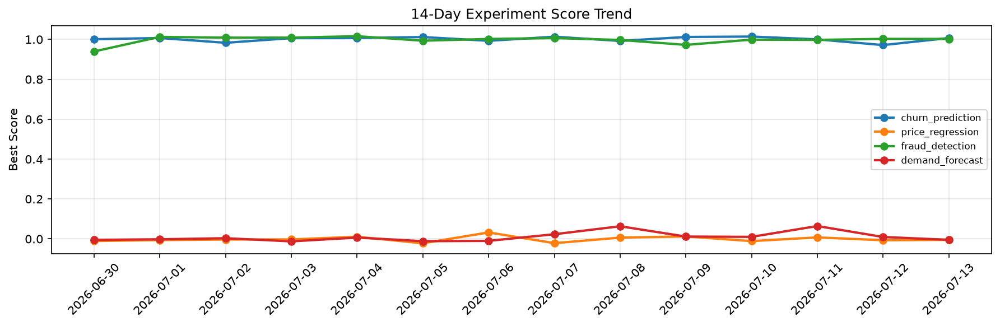

# ML Experiments Report — 2026-07-13

**Run ID:** `fd4276bf7b` | **Experiments:** 4 | **Trials:** 12

## Delta vs Yesterday

| Experiment | Today | Yesterday | Change |
|-----------|-------|-----------|--------|
| churn_prediction | 1.007 | 0.9717 | 📈 3.6% |
| price_regression | -0.0049 | -0.0068 | 📈 27.9% |
| fraud_detection | 1.0024 | 1.0027 | 📉 -0.0% |
| demand_forecast | -0.0046 | 0.0095 | 📉 -148.4% |

## churn_prediction (AUC)

**Best Score:** 1.007 (Trial 1)

| Trial | Score | Overfit Gap | Time | LR | Trees | Leaves |
|-------|-------|-------------|------|-----|-------|--------|
| 1 ⭐ | 1.007 | 0.0061 | 19.42s | 0.2 | 200 | 31 |
| 2 | 0.5917 | 0.0616 | 21.9s | 0.01 | 100 | 127 |
| 3 | 0.948 | 0.0015 | 123.84s | 0.05 | 500 | 31 |

## price_regression (RMSE)

**Best Score:** -0.0049 (Trial 3)

| Trial | Score | Overfit Gap | Time | LR | Trees | Leaves |
|-------|-------|-------------|------|-----|-------|--------|
| 1 | -0.0018 | 0.0 | 36.48s | 0.2 | 500 | 63 |
| 2 | 0.0047 | 0.0021 | 265.96s | 0.1 | 1000 | 31 |
| 3 ⭐ | -0.0049 | 0.0049 | 13.76s | 0.2 | 100 | 127 |

## fraud_detection (AUC)

**Best Score:** 1.0024 (Trial 3)

| Trial | Score | Overfit Gap | Time | LR | Trees | Leaves |
|-------|-------|-------------|------|-----|-------|--------|
| 1 | 0.9634 | 0.0019 | 166.95s | 0.05 | 1000 | 31 |
| 2 | 0.9426 | 0.0089 | 9.71s | 0.05 | 100 | 127 |
| 3 ⭐ | 1.0024 | 0.0017 | 14.59s | 0.1 | 200 | 31 |

## demand_forecast (MAE)

**Best Score:** -0.0046 (Trial 1)

| Trial | Score | Overfit Gap | Time | LR | Trees | Leaves |
|-------|-------|-------------|------|-----|-------|--------|
| 1 ⭐ | -0.0046 | 0.0086 | 40.86s | 0.2 | 500 | 31 |
| 2 | 0.0059 | 0.0018 | 12.08s | 0.2 | 100 | 31 |
| 3 | 1.0455 | 0.0226 | 16.45s | 0.01 | 200 | 63 |
