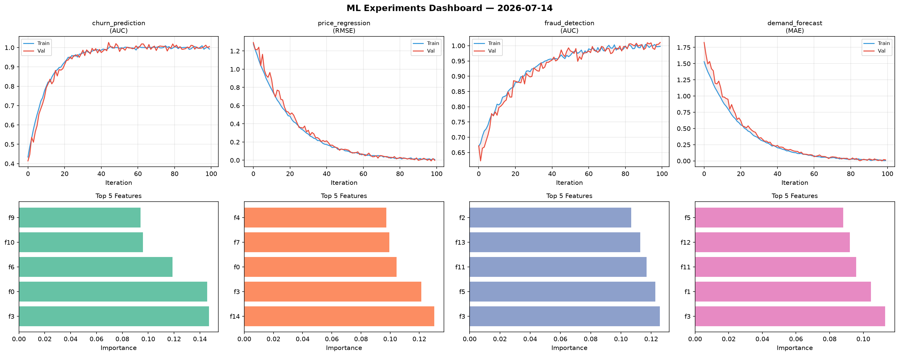
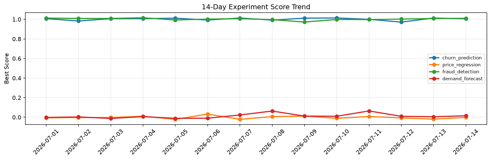

# ML Experiments Report — 2026-07-14

**Run ID:** `76c295e629` | **Experiments:** 4 | **Trials:** 20

## Delta vs Yesterday

| Experiment | Today | Yesterday | Change |
|-----------|-------|-----------|--------|
| churn_prediction | 1.0057 | 1.0133 | 📉 -0.8% |
| price_regression | -0.0016 | -0.0193 | 📈 91.7% |
| fraud_detection | 1.0106 | 1.0087 | 📈 0.2% |
| demand_forecast | 0.0152 | 0.0052 | 📈 192.3% |

## churn_prediction (AUC)

**Best Score:** 1.0057 (Trial 4)

| Trial | Score | Overfit Gap | Time | LR | Trees | Leaves |
|-------|-------|-------------|------|-----|-------|--------|
| 1 | 0.9958 | 0.0066 | 165.83s | 0.2 | 1000 | 63 |
| 2 | 1.0031 | 0.0011 | 89.23s | 0.2 | 500 | 63 |
| 3 | 0.6077 | 0.0603 | 258.75s | 0.01 | 1000 | 63 |
| 4 ⭐ | 1.0057 | 0.0138 | 127.34s | 0.2 | 500 | 15 |
| 5 | 0.5964 | 0.0459 | 254.22s | 0.01 | 1000 | 127 |
| 6 | 0.7151 | 0.0074 | 88.4s | 0.01 | 500 | 31 |

## price_regression (RMSE)

**Best Score:** -0.0016 (Trial 5)

| Trial | Score | Overfit Gap | Time | LR | Trees | Leaves |
|-------|-------|-------------|------|-----|-------|--------|
| 1 | 0.8711 | 0.0157 | 14.54s | 0.01 | 100 | 63 |
| 2 | 0.8643 | 0.1099 | 218.2s | 0.01 | 1000 | 127 |
| 3 | 0.1852 | 0.0147 | 44.73s | 0.05 | 500 | 15 |
| 4 | 0.0707 | 0.0133 | 5.93s | 0.05 | 100 | 15 |
| 5 ⭐ | -0.0016 | 0.0102 | 51.13s | 0.1 | 200 | 15 |
| 6 | 0.8524 | 0.0943 | 147.17s | 0.01 | 500 | 15 |

## fraud_detection (AUC)

**Best Score:** 1.0106 (Trial 3)

| Trial | Score | Overfit Gap | Time | LR | Trees | Leaves |
|-------|-------|-------------|------|-----|-------|--------|
| 1 | 0.6752 | 0.0316 | 22.28s | 0.01 | 100 | 15 |
| 2 | 0.9819 | 0.0209 | 120.56s | 0.2 | 500 | 31 |
| 3 ⭐ | 1.0106 | 0.013 | 14.63s | 0.1 | 200 | 63 |
| 4 | 0.6814 | 0.0343 | 22.41s | 0.01 | 200 | 31 |
| 5 | 0.9948 | 0.01 | 56.11s | 0.2 | 200 | 15 |

## demand_forecast (MAE)

**Best Score:** 0.0152 (Trial 1)

| Trial | Score | Overfit Gap | Time | LR | Trees | Leaves |
|-------|-------|-------------|------|-----|-------|--------|
| 1 ⭐ | 0.0152 | 0.0103 | 156.52s | 0.1 | 1000 | 31 |
| 2 | 0.0154 | 0.0183 | 29.7s | 0.2 | 100 | 15 |
| 3 | 1.0638 | 0.1384 | 21.25s | 0.01 | 200 | 63 |
