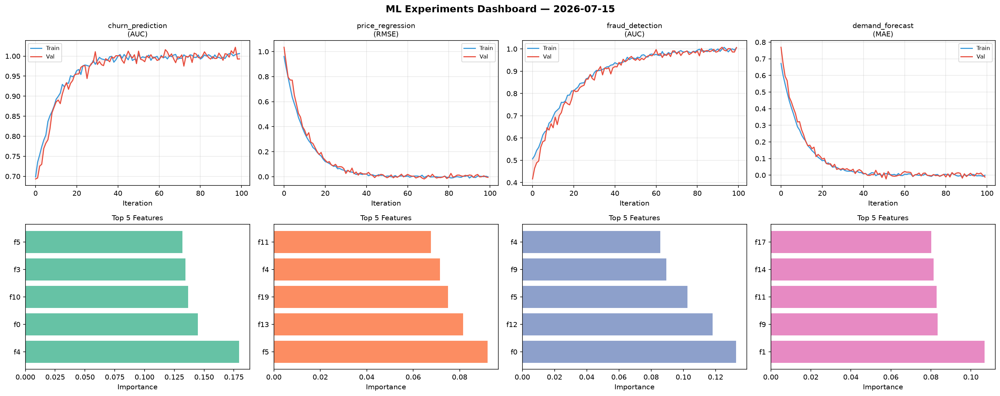
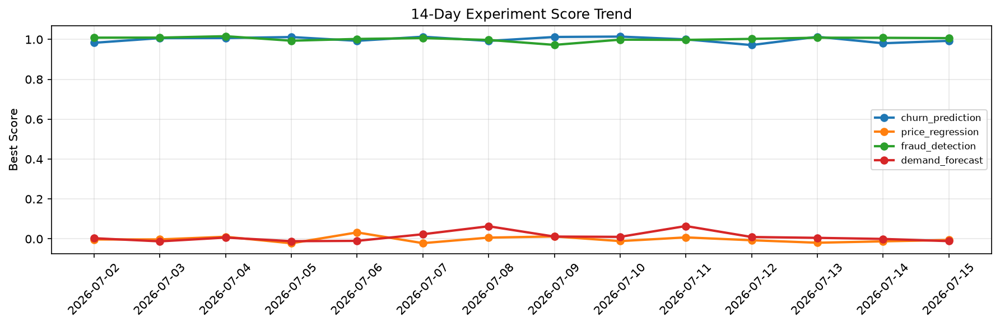

# ML Experiments Report — 2026-07-15

**Run ID:** `95193d04d4` | **Experiments:** 4 | **Trials:** 17

## Delta vs Yesterday

| Experiment | Today | Yesterday | Change |
|-----------|-------|-----------|--------|
| churn_prediction | 0.9929 | 0.9807 | 📈 1.2% |
| price_regression | -0.0056 | -0.0123 | 📈 54.5% |
| fraud_detection | 1.0065 | 1.0082 | 📉 -0.2% |
| demand_forecast | -0.0113 | -0.0002 | 📉 -1110.0% |

## churn_prediction (AUC)

**Best Score:** 0.9929 (Trial 3)

| Trial | Score | Overfit Gap | Time | LR | Trees | Leaves |
|-------|-------|-------------|------|-----|-------|--------|
| 1 | 0.9497 | 0.0205 | 40.82s | 0.05 | 1000 | 127 |
| 2 | 0.7364 | 0.0458 | 57.6s | 0.01 | 500 | 127 |
| 3 ⭐ | 0.9929 | 0.0136 | 21.69s | 0.2 | 200 | 31 |

## price_regression (RMSE)

**Best Score:** -0.0056 (Trial 1)

| Trial | Score | Overfit Gap | Time | LR | Trees | Leaves |
|-------|-------|-------------|------|-----|-------|--------|
| 1 ⭐ | -0.0056 | 0.005 | 28.43s | 0.2 | 100 | 63 |
| 2 | 0.0085 | 0.017 | 13.49s | 0.2 | 100 | 127 |
| 3 | 0.1479 | 0.0193 | 36.08s | 0.05 | 1000 | 31 |
| 4 | 0.0225 | 0.0136 | 20.57s | 0.1 | 200 | 31 |

## fraud_detection (AUC)

**Best Score:** 1.0065 (Trial 3)

| Trial | Score | Overfit Gap | Time | LR | Trees | Leaves |
|-------|-------|-------------|------|-----|-------|--------|
| 1 | 0.6591 | 0.0168 | 135.52s | 0.01 | 500 | 15 |
| 2 | 0.7772 | 0.0188 | 59.7s | 0.01 | 200 | 63 |
| 3 ⭐ | 1.0065 | 0.0011 | 11.61s | 0.1 | 200 | 127 |
| 4 | 0.6246 | 0.0398 | 11.89s | 0.01 | 200 | 127 |

## demand_forecast (MAE)

**Best Score:** -0.0113 (Trial 1)

| Trial | Score | Overfit Gap | Time | LR | Trees | Leaves |
|-------|-------|-------------|------|-----|-------|--------|
| 1 ⭐ | -0.0113 | 0.011 | 136.34s | 0.2 | 500 | 127 |
| 2 | 1.2448 | 0.0561 | 87.77s | 0.01 | 500 | 63 |
| 3 | 0.1417 | 0.0146 | 12.83s | 0.05 | 1000 | 63 |
| 4 | 0.0831 | 0.0058 | 47.68s | 0.05 | 200 | 31 |
| 5 | 0.0013 | 0.0066 | 38.36s | 0.1 | 200 | 63 |
| 6 | 0.0141 | 0.0139 | 172.64s | 0.2 | 1000 | 63 |
