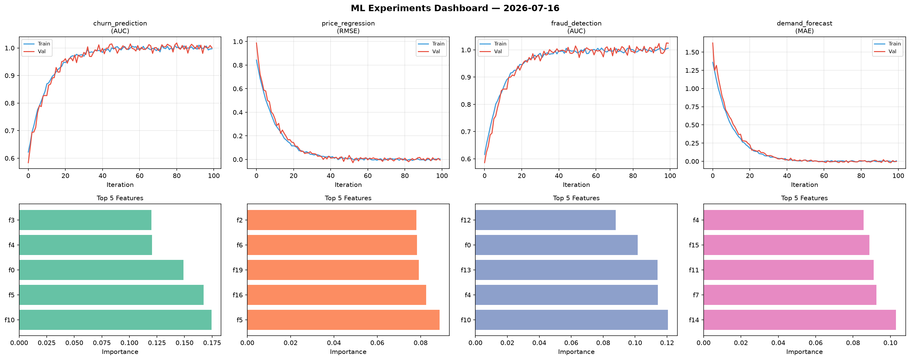
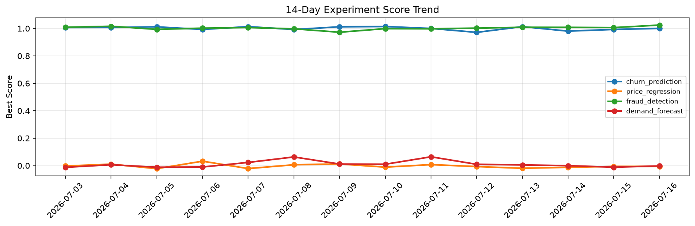

# ML Experiments Report — 2026-07-16

**Run ID:** `6ed851d31f` | **Experiments:** 4 | **Trials:** 19

## Delta vs Yesterday

| Experiment | Today | Yesterday | Change |
|-----------|-------|-----------|--------|
| churn_prediction | 1.0006 | 0.9929 | 📈 0.8% |
| price_regression | -0.0058 | -0.0056 | 📉 -3.6% |
| fraud_detection | 1.0247 | 1.0065 | 📈 1.8% |
| demand_forecast | -0.0023 | -0.0113 | 📈 79.6% |

## churn_prediction (AUC)

**Best Score:** 1.0006 (Trial 3)

| Trial | Score | Overfit Gap | Time | LR | Trees | Leaves |
|-------|-------|-------------|------|-----|-------|--------|
| 1 | 0.7435 | 0.0123 | 13.69s | 0.01 | 100 | 31 |
| 2 | 0.9987 | 0.0013 | 18.81s | 0.2 | 100 | 127 |
| 3 ⭐ | 1.0006 | 0.0037 | 37.17s | 0.2 | 200 | 63 |
| 4 | 0.9997 | 0.0004 | 45.74s | 0.2 | 200 | 31 |

## price_regression (RMSE)

**Best Score:** -0.0058 (Trial 1)

| Trial | Score | Overfit Gap | Time | LR | Trees | Leaves |
|-------|-------|-------------|------|-----|-------|--------|
| 1 ⭐ | -0.0058 | 0.0103 | 193.19s | 0.2 | 1000 | 127 |
| 2 | 0.5588 | 0.0768 | 144.49s | 0.01 | 1000 | 31 |
| 3 | 0.0485 | 0.0013 | 32.7s | 0.05 | 500 | 63 |
| 4 | 0.1011 | 0.0185 | 190.23s | 0.05 | 1000 | 15 |
| 5 | 0.5039 | 0.0411 | 112.23s | 0.01 | 500 | 15 |

## fraud_detection (AUC)

**Best Score:** 1.0247 (Trial 1)

| Trial | Score | Overfit Gap | Time | LR | Trees | Leaves |
|-------|-------|-------------|------|-----|-------|--------|
| 1 ⭐ | 1.0247 | 0.0188 | 31.97s | 0.2 | 200 | 127 |
| 2 | 0.9697 | 0.0118 | 17.74s | 0.05 | 1000 | 63 |
| 3 | 0.9709 | 0.0048 | 82.75s | 0.05 | 500 | 63 |
| 4 | 1.0037 | 0.0121 | 22.31s | 0.2 | 100 | 15 |
| 5 | 0.9916 | 0.0127 | 13.55s | 0.1 | 200 | 31 |

## demand_forecast (MAE)

**Best Score:** -0.0023 (Trial 2)

| Trial | Score | Overfit Gap | Time | LR | Trees | Leaves |
|-------|-------|-------------|------|-----|-------|--------|
| 1 | 0.0255 | 0.0048 | 33.18s | 0.1 | 200 | 31 |
| 2 ⭐ | -0.0023 | 0.0095 | 19.19s | 0.2 | 200 | 127 |
| 3 | 0.5884 | 0.0014 | 12.72s | 0.01 | 100 | 15 |
| 4 | 0.0285 | 0.0133 | 24.67s | 0.1 | 100 | 15 |
| 5 | 0.6406 | 0.0742 | 200.92s | 0.01 | 1000 | 15 |
