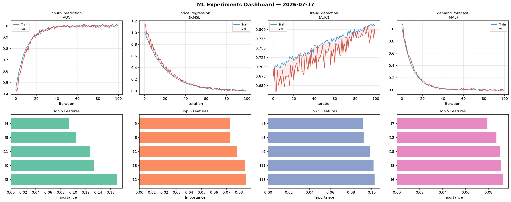
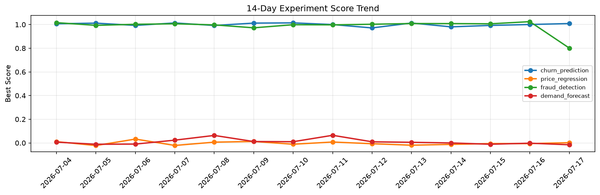

# ML Experiments Report — 2026-07-17

**Run ID:** `668d2e635a` | **Experiments:** 4 | **Trials:** 17

## Delta vs Yesterday

| Experiment | Today | Yesterday | Change |
|-----------|-------|-----------|--------|
| churn_prediction | 1.0085 | 1.0006 | 📈 0.8% |
| price_regression | 0.002 | -0.0058 | 📈 134.5% |
| fraud_detection | 0.8013 | 1.0247 | 📉 -21.8% |
| demand_forecast | -0.0156 | -0.0023 | 📉 -578.3% |

## churn_prediction (AUC)

**Best Score:** 1.0085 (Trial 2)

| Trial | Score | Overfit Gap | Time | LR | Trees | Leaves |
|-------|-------|-------------|------|-----|-------|--------|
| 1 | 0.9452 | 0.0103 | 38.41s | 0.05 | 200 | 31 |
| 2 ⭐ | 1.0085 | 0.004 | 45.53s | 0.2 | 200 | 15 |
| 3 | 0.6211 | 0.0451 | 129.46s | 0.01 | 500 | 127 |
| 4 | 0.9887 | 0.0027 | 47.68s | 0.1 | 500 | 15 |
| 5 | 0.949 | 0.0089 | 130.89s | 0.05 | 500 | 15 |

## price_regression (RMSE)

**Best Score:** 0.002 (Trial 2)

| Trial | Score | Overfit Gap | Time | LR | Trees | Leaves |
|-------|-------|-------------|------|-----|-------|--------|
| 1 | 0.3981 | 0.0059 | 275.26s | 0.01 | 1000 | 63 |
| 2 ⭐ | 0.002 | 0.0055 | 9.78s | 0.1 | 200 | 63 |
| 3 | 0.0289 | 0.0275 | 28.24s | 0.1 | 200 | 31 |
| 4 | 0.0121 | 0.002 | 63.88s | 0.1 | 1000 | 15 |
| 5 | 0.0245 | 0.0094 | 19.8s | 0.1 | 500 | 15 |
| 6 | 0.0067 | 0.014 | 22.44s | 0.1 | 100 | 127 |

## fraud_detection (AUC)

**Best Score:** 0.8013 (Trial 2)

| Trial | Score | Overfit Gap | Time | LR | Trees | Leaves |
|-------|-------|-------------|------|-----|-------|--------|
| 1 | 0.7199 | 0.0543 | 20.91s | 0.01 | 1000 | 63 |
| 2 ⭐ | 0.8013 | 0.0092 | 111.56s | 0.01 | 500 | 15 |
| 3 | 0.7492 | 0.0137 | 103.49s | 0.01 | 500 | 63 |

## demand_forecast (MAE)

**Best Score:** -0.0156 (Trial 3)

| Trial | Score | Overfit Gap | Time | LR | Trees | Leaves |
|-------|-------|-------------|------|-----|-------|--------|
| 1 | 0.9943 | 0.0538 | 10.06s | 0.01 | 200 | 31 |
| 2 | -0.0048 | 0.0077 | 6.38s | 0.2 | 200 | 15 |
| 3 ⭐ | -0.0156 | 0.0119 | 29.33s | 0.2 | 100 | 31 |
