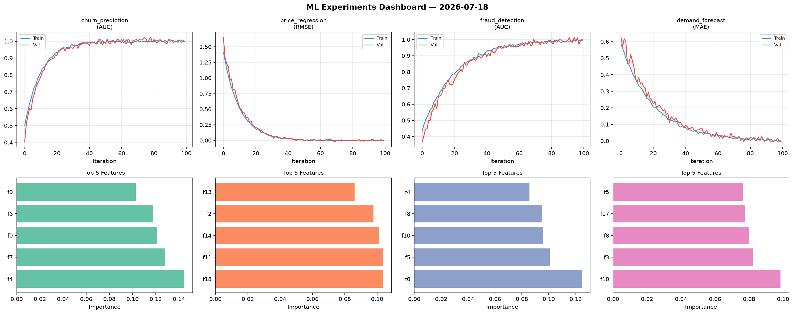
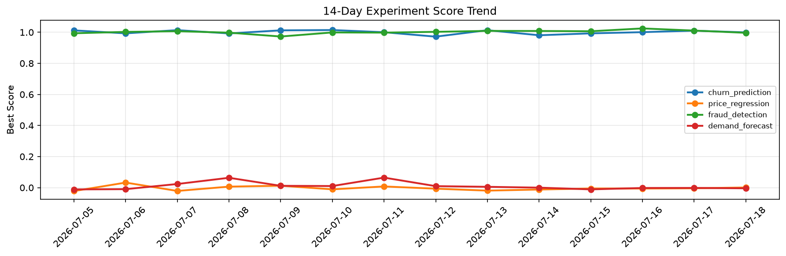

# ML Experiments Report — 2026-07-18

**Run ID:** `bc596a30a4` | **Experiments:** 4 | **Trials:** 18

## Delta vs Yesterday

| Experiment | Today | Yesterday | Change |
|-----------|-------|-----------|--------|
| churn_prediction | 0.9991 | 1.0102 | 📉 -1.1% |
| price_regression | 0.0008 | -0.0042 | 📈 119.0% |
| fraud_detection | 0.9964 | 1.0108 | 📉 -1.4% |
| demand_forecast | -0.0044 | -0.002 | 📉 -120.0% |

## churn_prediction (AUC)

**Best Score:** 0.9991 (Trial 1)

| Trial | Score | Overfit Gap | Time | LR | Trees | Leaves |
|-------|-------|-------------|------|-----|-------|--------|
| 1 ⭐ | 0.9991 | 0.0006 | 6.25s | 0.2 | 1000 | 63 |
| 2 | 0.9929 | 0.0001 | 50.78s | 0.1 | 1000 | 127 |
| 3 | 0.7205 | 0.0587 | 3.06s | 0.01 | 500 | 15 |
| 4 | 0.7454 | 0.0397 | 37.38s | 0.01 | 200 | 31 |
| 5 | 0.7368 | 0.0361 | 31.93s | 0.01 | 1000 | 127 |

## price_regression (RMSE)

**Best Score:** 0.0008 (Trial 4)

| Trial | Score | Overfit Gap | Time | LR | Trees | Leaves |
|-------|-------|-------------|------|-----|-------|--------|
| 1 | 0.0766 | 0.0151 | 70.25s | 0.05 | 500 | 127 |
| 2 | 0.9264 | 0.1561 | 261.29s | 0.01 | 1000 | 31 |
| 3 | 0.1316 | 0.0013 | 130.65s | 0.05 | 1000 | 127 |
| 4 ⭐ | 0.0008 | 0.0074 | 32.34s | 0.2 | 500 | 15 |

## fraud_detection (AUC)

**Best Score:** 0.9964 (Trial 2)

| Trial | Score | Overfit Gap | Time | LR | Trees | Leaves |
|-------|-------|-------------|------|-----|-------|--------|
| 1 | 0.9753 | 0.0022 | 88.92s | 0.05 | 1000 | 31 |
| 2 ⭐ | 0.9964 | 0.0038 | 158.35s | 0.1 | 1000 | 15 |
| 3 | 0.9841 | 0.0058 | 31.41s | 0.1 | 200 | 15 |
| 4 | 0.953 | 0.0033 | 231.16s | 0.05 | 1000 | 31 |
| 5 | 0.9281 | 0.0295 | 105.06s | 0.05 | 1000 | 127 |

## demand_forecast (MAE)

**Best Score:** -0.0044 (Trial 3)

| Trial | Score | Overfit Gap | Time | LR | Trees | Leaves |
|-------|-------|-------------|------|-----|-------|--------|
| 1 | 1.3012 | 0.168 | 23.49s | 0.01 | 100 | 127 |
| 2 | 0.1347 | 0.0004 | 17.15s | 0.05 | 200 | 63 |
| 3 ⭐ | -0.0044 | 0.0029 | 8.84s | 0.1 | 200 | 31 |
| 4 | 0.0046 | 0.003 | 3.89s | 0.2 | 100 | 31 |
