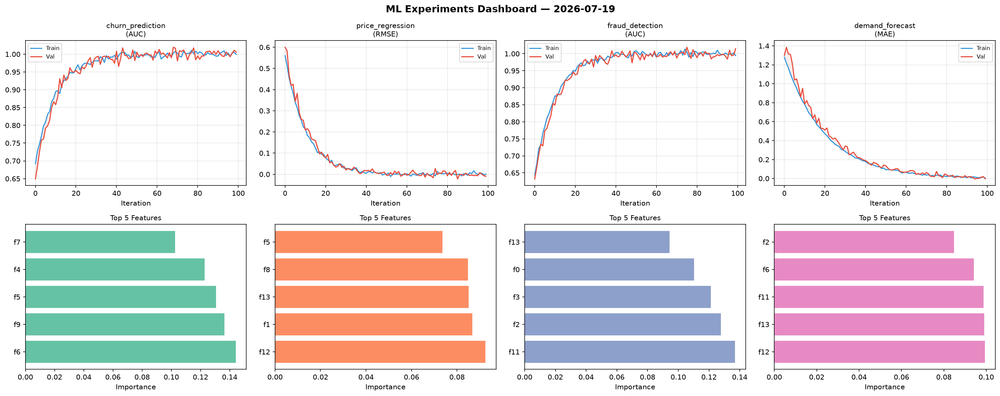
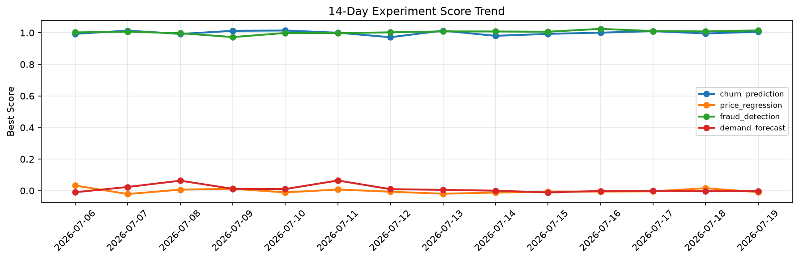

# ML Experiments Report — 2026-07-19

**Run ID:** `05d65dc3c1` | **Experiments:** 4 | **Trials:** 23

## Delta vs Yesterday

| Experiment | Today | Yesterday | Change |
|-----------|-------|-----------|--------|
| churn_prediction | 1.0059 | 0.9955 | 📈 1.0% |
| price_regression | -0.0093 | 0.0157 | 📉 -159.2% |
| fraud_detection | 1.015 | 1.0086 | 📈 0.6% |
| demand_forecast | -0.0029 | -0.0038 | 📈 23.7% |

## churn_prediction (AUC)

**Best Score:** 1.0059 (Trial 2)

| Trial | Score | Overfit Gap | Time | LR | Trees | Leaves |
|-------|-------|-------------|------|-----|-------|--------|
| 1 | 0.9776 | 0.0239 | 6.21s | 0.1 | 200 | 31 |
| 2 ⭐ | 1.0059 | 0.0064 | 259.31s | 0.2 | 1000 | 127 |
| 3 | 0.6902 | 0.059 | 24.29s | 0.01 | 200 | 15 |
| 4 | 0.9526 | 0.0205 | 33.82s | 0.05 | 500 | 127 |
| 5 | 1.0051 | 0.0064 | 22.34s | 0.2 | 100 | 127 |
| 6 | 0.9998 | 0.0007 | 25.88s | 0.2 | 200 | 15 |

## price_regression (RMSE)

**Best Score:** -0.0093 (Trial 2)

| Trial | Score | Overfit Gap | Time | LR | Trees | Leaves |
|-------|-------|-------------|------|-----|-------|--------|
| 1 | 0.0798 | 0.0064 | 41.16s | 0.05 | 200 | 63 |
| 2 ⭐ | -0.0093 | 0.0102 | 18.53s | 0.2 | 500 | 63 |
| 3 | 0.1236 | 0.0009 | 58.57s | 0.05 | 200 | 31 |
| 4 | 0.1488 | 0.0123 | 106.87s | 0.05 | 1000 | 63 |
| 5 | -0.0019 | 0.0092 | 39.33s | 0.1 | 200 | 127 |

## fraud_detection (AUC)

**Best Score:** 1.015 (Trial 6)

| Trial | Score | Overfit Gap | Time | LR | Trees | Leaves |
|-------|-------|-------------|------|-----|-------|--------|
| 1 | 0.6909 | 0.0085 | 10.55s | 0.01 | 200 | 127 |
| 2 | 0.6033 | 0.0389 | 56.15s | 0.01 | 200 | 15 |
| 3 | 0.9631 | 0.0047 | 34.17s | 0.05 | 200 | 127 |
| 4 | 1.0084 | 0.0023 | 13.14s | 0.2 | 200 | 31 |
| 5 | 0.9393 | 0.0176 | 12.28s | 0.05 | 100 | 127 |
| 6 ⭐ | 1.015 | 0.0205 | 56.78s | 0.2 | 1000 | 127 |

## demand_forecast (MAE)

**Best Score:** -0.0029 (Trial 1)

| Trial | Score | Overfit Gap | Time | LR | Trees | Leaves |
|-------|-------|-------------|------|-----|-------|--------|
| 1 ⭐ | -0.0029 | 0.0084 | 10.7s | 0.1 | 200 | 127 |
| 2 | 0.009 | 0.0001 | 25.34s | 0.2 | 200 | 31 |
| 3 | 0.1461 | 0.0101 | 11.04s | 0.05 | 100 | 31 |
| 4 | 0.3889 | 0.0321 | 4.34s | 0.01 | 500 | 31 |
| 5 | 0.048 | 0.0098 | 72.85s | 0.05 | 500 | 63 |
| 6 | 0.0067 | 0.0032 | 66.89s | 0.1 | 500 | 63 |
