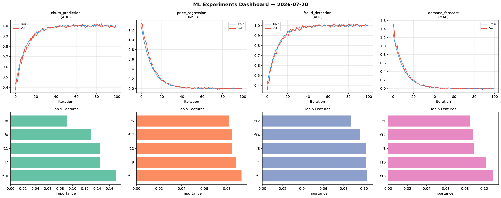
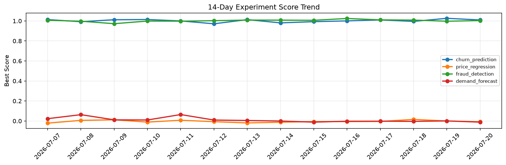

# ML Experiments Report — 2026-07-20

**Run ID:** `b5170a4a27` | **Experiments:** 4 | **Trials:** 14

## Delta vs Yesterday

| Experiment | Today | Yesterday | Change |
|-----------|-------|-----------|--------|
| churn_prediction | 1.01 | 1.0263 | 📉 -1.6% |
| price_regression | -0.0076 | 0.0001 | 📉 -770.0% |
| fraud_detection | 1.0036 | 0.9973 | 📈 0.6% |
| demand_forecast | -0.0114 | 0.0007 | 📉 -1210.0% |

## churn_prediction (AUC)

**Best Score:** 1.01 (Trial 1)

| Trial | Score | Overfit Gap | Time | LR | Trees | Leaves |
|-------|-------|-------------|------|-----|-------|--------|
| 1 ⭐ | 1.01 | 0.0118 | 21.76s | 0.2 | 1000 | 127 |
| 2 | 1.0096 | 0.013 | 70.48s | 0.1 | 500 | 63 |
| 3 | 0.9902 | 0.0083 | 9.11s | 0.2 | 100 | 15 |

## price_regression (RMSE)

**Best Score:** -0.0076 (Trial 1)

| Trial | Score | Overfit Gap | Time | LR | Trees | Leaves |
|-------|-------|-------------|------|-----|-------|--------|
| 1 ⭐ | -0.0076 | 0.0042 | 129.18s | 0.2 | 500 | 63 |
| 2 | 0.0058 | 0.0022 | 28.83s | 0.2 | 100 | 127 |
| 3 | 0.0025 | 0.0003 | 11.38s | 0.1 | 100 | 15 |

## fraud_detection (AUC)

**Best Score:** 1.0036 (Trial 2)

| Trial | Score | Overfit Gap | Time | LR | Trees | Leaves |
|-------|-------|-------------|------|-----|-------|--------|
| 1 | 0.9476 | 0.0163 | 29.66s | 0.05 | 1000 | 15 |
| 2 ⭐ | 1.0036 | 0.003 | 26.64s | 0.2 | 200 | 15 |
| 3 | 0.9616 | 0.0099 | 4.32s | 0.05 | 500 | 31 |

## demand_forecast (MAE)

**Best Score:** -0.0114 (Trial 4)

| Trial | Score | Overfit Gap | Time | LR | Trees | Leaves |
|-------|-------|-------------|------|-----|-------|--------|
| 1 | 0.0221 | 0.0161 | 27.07s | 0.1 | 100 | 63 |
| 2 | 0.0674 | 0.0156 | 59.5s | 0.05 | 500 | 63 |
| 3 | 0.0005 | 0.0026 | 10.72s | 0.1 | 100 | 31 |
| 4 ⭐ | -0.0114 | 0.0036 | 29.9s | 0.2 | 100 | 15 |
| 5 | 0.145 | 0.0038 | 20.45s | 0.05 | 200 | 15 |
