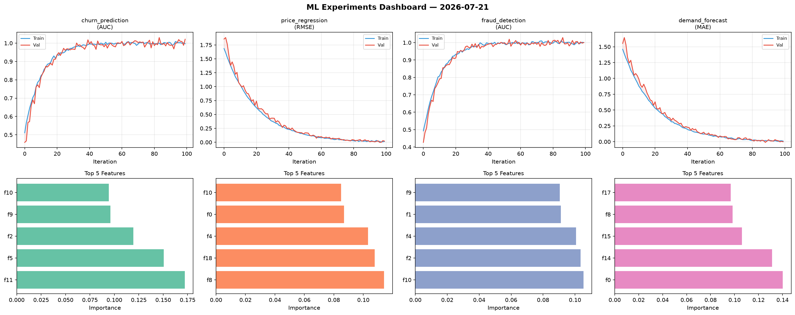
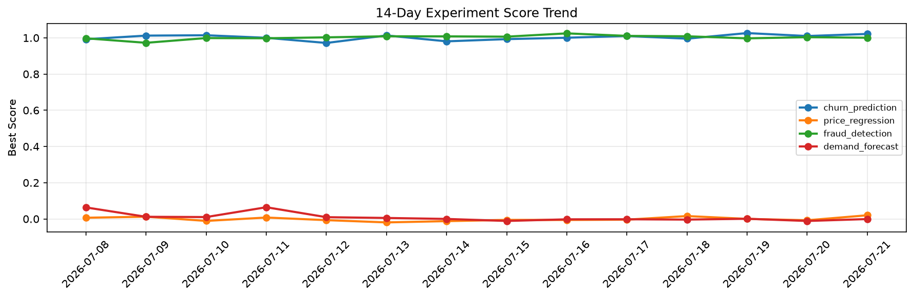

# ML Experiments Report — 2026-07-21

**Run ID:** `7f79b7a3cf` | **Experiments:** 4 | **Trials:** 15

## Delta vs Yesterday

| Experiment | Today | Yesterday | Change |
|-----------|-------|-----------|--------|
| churn_prediction | 1.0215 | 1.01 | 📈 1.1% |
| price_regression | 0.02 | -0.0076 | 📈 363.2% |
| fraud_detection | 1.0006 | 1.0036 | 📉 -0.3% |
| demand_forecast | -0.0009 | -0.0114 | 📈 92.1% |

## churn_prediction (AUC)

**Best Score:** 1.0215 (Trial 3)

| Trial | Score | Overfit Gap | Time | LR | Trees | Leaves |
|-------|-------|-------------|------|-----|-------|--------|
| 1 | 1.01 | 0.0175 | 0.88s | 0.2 | 100 | 31 |
| 2 | 0.776 | 0.0197 | 69.29s | 0.01 | 1000 | 31 |
| 3 ⭐ | 1.0215 | 0.0251 | 38.11s | 0.2 | 500 | 127 |

## price_regression (RMSE)

**Best Score:** 0.02 (Trial 1)

| Trial | Score | Overfit Gap | Time | LR | Trees | Leaves |
|-------|-------|-------------|------|-----|-------|--------|
| 1 ⭐ | 0.02 | 0.0043 | 25.64s | 0.1 | 100 | 31 |
| 2 | 0.6864 | 0.01 | 289.05s | 0.01 | 1000 | 15 |
| 3 | 0.1817 | 0.0301 | 21.36s | 0.05 | 100 | 15 |

## fraud_detection (AUC)

**Best Score:** 1.0006 (Trial 4)

| Trial | Score | Overfit Gap | Time | LR | Trees | Leaves |
|-------|-------|-------------|------|-----|-------|--------|
| 1 | 0.9789 | 0.0043 | 17.9s | 0.05 | 100 | 127 |
| 2 | 0.9583 | 0.0047 | 143.98s | 0.05 | 500 | 127 |
| 3 | 0.9636 | 0.0007 | 21.87s | 0.05 | 500 | 127 |
| 4 ⭐ | 1.0006 | 0.0002 | 29.23s | 0.2 | 200 | 63 |
| 5 | 0.9654 | 0.0013 | 96.96s | 0.05 | 500 | 31 |

## demand_forecast (MAE)

**Best Score:** -0.0009 (Trial 2)

| Trial | Score | Overfit Gap | Time | LR | Trees | Leaves |
|-------|-------|-------------|------|-----|-------|--------|
| 1 | 0.1034 | 0.002 | 10.34s | 0.05 | 100 | 31 |
| 2 ⭐ | -0.0009 | 0.0102 | 16.02s | 0.1 | 100 | 127 |
| 3 | 0.0053 | 0.0037 | 241.83s | 0.1 | 1000 | 127 |
| 4 | 0.4765 | 0.0682 | 1.82s | 0.01 | 200 | 63 |
