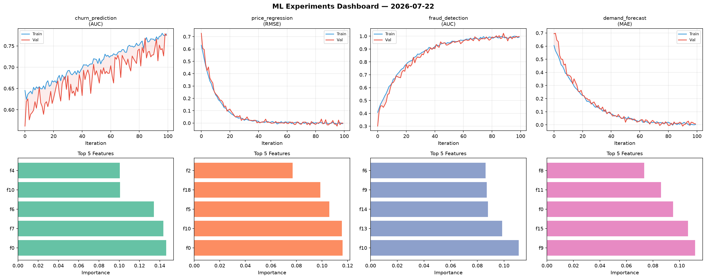
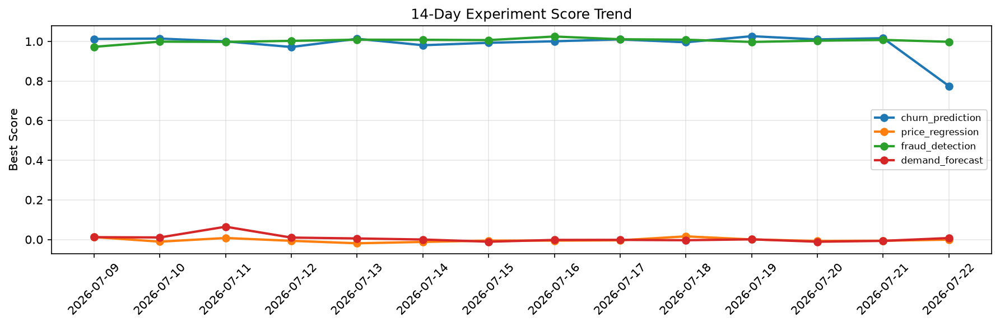

# ML Experiments Report — 2026-07-22

**Run ID:** `a60823c221` | **Experiments:** 4 | **Trials:** 13

## Delta vs Yesterday

| Experiment | Today | Yesterday | Change |
|-----------|-------|-----------|--------|
| churn_prediction | 0.7749 | 1.0163 | 📉 -23.8% |
| price_regression | -0.0008 | -0.0065 | 📈 87.7% |
| fraud_detection | 0.998 | 1.0075 | 📉 -0.9% |
| demand_forecast | 0.0073 | -0.0071 | 📈 202.8% |

## churn_prediction (AUC)

**Best Score:** 0.7749 (Trial 1)

| Trial | Score | Overfit Gap | Time | LR | Trees | Leaves |
|-------|-------|-------------|------|-----|-------|--------|
| 1 ⭐ | 0.7749 | 0.0032 | 11.2s | 0.01 | 200 | 15 |
| 2 | 0.6556 | 0.0703 | 146.72s | 0.01 | 500 | 15 |
| 3 | 0.6629 | 0.0359 | 9.85s | 0.01 | 100 | 127 |

## price_regression (RMSE)

**Best Score:** -0.0008 (Trial 2)

| Trial | Score | Overfit Gap | Time | LR | Trees | Leaves |
|-------|-------|-------------|------|-----|-------|--------|
| 1 | 0.0001 | 0.0013 | 126.03s | 0.2 | 500 | 31 |
| 2 ⭐ | -0.0008 | 0.0038 | 25.97s | 0.2 | 100 | 31 |
| 3 | 0.0938 | 0.0185 | 10.96s | 0.05 | 100 | 31 |
| 4 | 1.3433 | 0.2292 | 19.25s | 0.01 | 100 | 31 |

## fraud_detection (AUC)

**Best Score:** 0.998 (Trial 3)

| Trial | Score | Overfit Gap | Time | LR | Trees | Leaves |
|-------|-------|-------------|------|-----|-------|--------|
| 1 | 0.9835 | 0.004 | 22.81s | 0.05 | 200 | 63 |
| 2 | 0.9601 | 0.0007 | 244.28s | 0.05 | 1000 | 15 |
| 3 ⭐ | 0.998 | 0.0055 | 44.07s | 0.1 | 200 | 63 |

## demand_forecast (MAE)

**Best Score:** 0.0073 (Trial 3)

| Trial | Score | Overfit Gap | Time | LR | Trees | Leaves |
|-------|-------|-------------|------|-----|-------|--------|
| 1 | 0.0623 | 0.0018 | 116.5s | 0.05 | 500 | 31 |
| 2 | 0.1284 | 0.0182 | 1.6s | 0.05 | 100 | 127 |
| 3 ⭐ | 0.0073 | 0.0052 | 42.51s | 0.1 | 500 | 15 |
