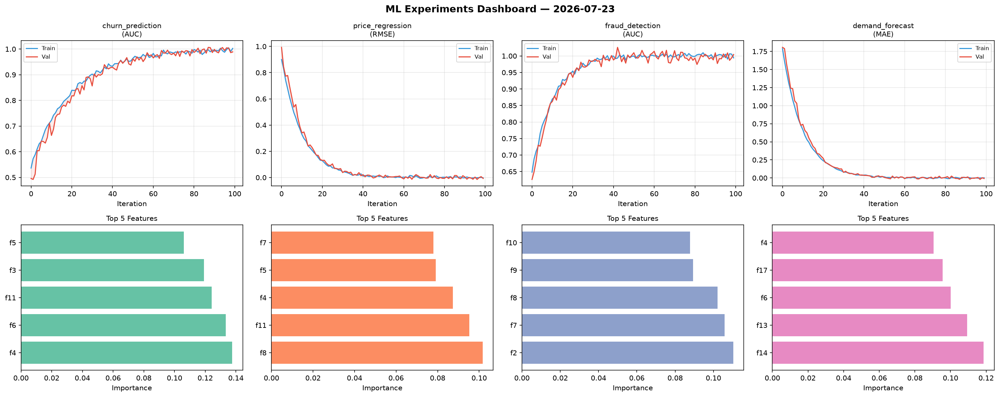
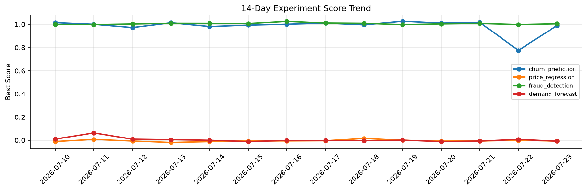

# ML Experiments Report — 2026-07-23

**Run ID:** `a1c60bc635` | **Experiments:** 4 | **Trials:** 20

## Delta vs Yesterday

| Experiment | Today | Yesterday | Change |
|-----------|-------|-----------|--------|
| churn_prediction | 0.9889 | 0.7749 | 📈 27.6% |
| price_regression | -0.0071 | -0.0008 | 📉 -630.0% |
| fraud_detection | 1.0044 | 0.998 | 📈 0.6% |
| demand_forecast | -0.008 | 0.0073 | 📉 -209.6% |

## churn_prediction (AUC)

**Best Score:** 0.9889 (Trial 4)

| Trial | Score | Overfit Gap | Time | LR | Trees | Leaves |
|-------|-------|-------------|------|-----|-------|--------|
| 1 | 0.6803 | 0.0034 | 10.93s | 0.01 | 200 | 63 |
| 2 | 0.9517 | 0.0132 | 42.29s | 0.05 | 200 | 63 |
| 3 | 0.6337 | 0.0474 | 39.18s | 0.01 | 500 | 63 |
| 4 ⭐ | 0.9889 | 0.0137 | 293.27s | 0.1 | 1000 | 127 |

## price_regression (RMSE)

**Best Score:** -0.0071 (Trial 2)

| Trial | Score | Overfit Gap | Time | LR | Trees | Leaves |
|-------|-------|-------------|------|-----|-------|--------|
| 1 | 0.005 | 0.0017 | 105.61s | 0.2 | 500 | 127 |
| 2 ⭐ | -0.0071 | 0.0048 | 37.46s | 0.2 | 200 | 31 |
| 3 | 0.0651 | 0.0092 | 11.7s | 0.05 | 200 | 63 |
| 4 | -0.0032 | 0.0014 | 3.01s | 0.2 | 100 | 31 |
| 5 | 0.0008 | 0.0023 | 26.12s | 0.2 | 100 | 63 |
| 6 | 0.6172 | 0.0466 | 41.32s | 0.01 | 500 | 31 |

## fraud_detection (AUC)

**Best Score:** 1.0044 (Trial 3)

| Trial | Score | Overfit Gap | Time | LR | Trees | Leaves |
|-------|-------|-------------|------|-----|-------|--------|
| 1 | 0.7976 | 0.0092 | 15.17s | 0.01 | 100 | 127 |
| 2 | 0.6967 | 0.021 | 13.94s | 0.01 | 500 | 15 |
| 3 ⭐ | 1.0044 | 0.0103 | 54.79s | 0.2 | 500 | 31 |
| 4 | 0.9996 | 0.0064 | 119.36s | 0.2 | 500 | 63 |

## demand_forecast (MAE)

**Best Score:** -0.008 (Trial 4)

| Trial | Score | Overfit Gap | Time | LR | Trees | Leaves |
|-------|-------|-------------|------|-----|-------|--------|
| 1 | 0.0079 | 0.004 | 18.46s | 0.1 | 100 | 63 |
| 2 | 0.4125 | 0.0534 | 83.34s | 0.01 | 500 | 127 |
| 3 | 0.0002 | 0.0112 | 229.89s | 0.1 | 1000 | 127 |
| 4 ⭐ | -0.008 | 0.0106 | 30.57s | 0.2 | 200 | 31 |
| 5 | 0.9926 | 0.0236 | 18.43s | 0.01 | 100 | 31 |
| 6 | 0.0578 | 0.0052 | 7.21s | 0.05 | 100 | 15 |
