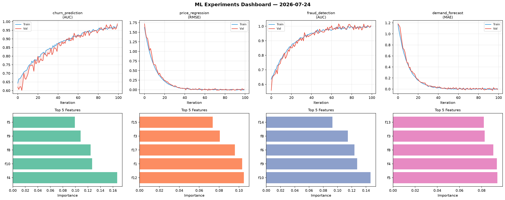
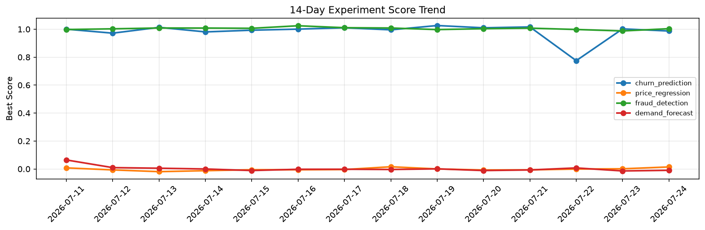

# ML Experiments Report — 2026-07-24

**Run ID:** `eb71134642` | **Experiments:** 4 | **Trials:** 18

## Delta vs Yesterday

| Experiment | Today | Yesterday | Change |
|-----------|-------|-----------|--------|
| churn_prediction | 0.9871 | 1.0024 | 📉 -1.5% |
| price_regression | 0.0143 | 0.0011 | 📈 1200.0% |
| fraud_detection | 1.0037 | 0.9876 | 📈 1.6% |
| demand_forecast | -0.0097 | -0.0142 | 📈 31.7% |

## churn_prediction (AUC)

**Best Score:** 0.9871 (Trial 3)

| Trial | Score | Overfit Gap | Time | LR | Trees | Leaves |
|-------|-------|-------------|------|-----|-------|--------|
| 1 | 0.9485 | 0.0028 | 191.73s | 0.05 | 1000 | 15 |
| 2 | 0.9816 | 0.0139 | 26.46s | 0.1 | 100 | 63 |
| 3 ⭐ | 0.9871 | 0.0094 | 11.01s | 0.05 | 1000 | 31 |

## price_regression (RMSE)

**Best Score:** 0.0143 (Trial 2)

| Trial | Score | Overfit Gap | Time | LR | Trees | Leaves |
|-------|-------|-------------|------|-----|-------|--------|
| 1 | 0.1715 | 0.0083 | 10.79s | 0.05 | 200 | 63 |
| 2 ⭐ | 0.0143 | 0.0195 | 37.57s | 0.2 | 200 | 15 |
| 3 | 0.5623 | 0.0911 | 33.51s | 0.01 | 1000 | 31 |
| 4 | 0.1618 | 0.0147 | 15.28s | 0.05 | 100 | 15 |

## fraud_detection (AUC)

**Best Score:** 1.0037 (Trial 4)

| Trial | Score | Overfit Gap | Time | LR | Trees | Leaves |
|-------|-------|-------------|------|-----|-------|--------|
| 1 | 0.9985 | 0.0035 | 21.74s | 0.1 | 200 | 63 |
| 2 | 0.9612 | 0.0066 | 163.1s | 0.05 | 1000 | 127 |
| 3 | 1.0013 | 0.0076 | 128.97s | 0.2 | 1000 | 63 |
| 4 ⭐ | 1.0037 | 0.0053 | 21.0s | 0.1 | 500 | 31 |
| 5 | 0.9882 | 0.0122 | 70.74s | 0.2 | 500 | 15 |
| 6 | 0.7259 | 0.0256 | 150.03s | 0.01 | 1000 | 127 |

## demand_forecast (MAE)

**Best Score:** -0.0097 (Trial 2)

| Trial | Score | Overfit Gap | Time | LR | Trees | Leaves |
|-------|-------|-------------|------|-----|-------|--------|
| 1 | 0.0182 | 0.0126 | 19.11s | 0.2 | 100 | 63 |
| 2 ⭐ | -0.0097 | 0.0167 | 119.08s | 0.2 | 1000 | 15 |
| 3 | -0.0051 | 0.0063 | 97.57s | 0.2 | 1000 | 63 |
| 4 | 1.1414 | 0.1704 | 14.83s | 0.01 | 200 | 127 |
| 5 | 0.1689 | 0.0021 | 36.26s | 0.05 | 200 | 31 |
