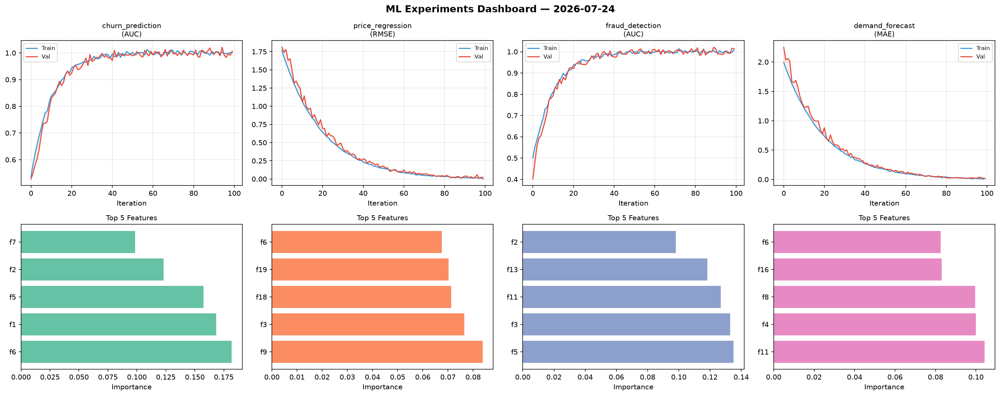
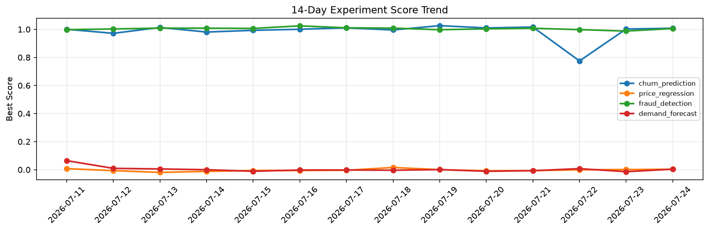

# ML Experiments Report — 2026-07-24

**Run ID:** `b4f0f3e97b` | **Experiments:** 4 | **Trials:** 15

## Delta vs Yesterday

| Experiment | Today | Yesterday | Change |
|-----------|-------|-----------|--------|
| churn_prediction | 1.0061 | 1.0024 | 📈 0.4% |
| price_regression | -0.0003 | 0.0011 | 📉 -127.3% |
| fraud_detection | 1.0141 | 0.9876 | 📈 2.7% |
| demand_forecast | 0.0169 | -0.0142 | 📈 219.0% |

## churn_prediction (AUC)

**Best Score:** 1.0061 (Trial 1)

| Trial | Score | Overfit Gap | Time | LR | Trees | Leaves |
|-------|-------|-------------|------|-----|-------|--------|
| 1 ⭐ | 1.0061 | 0.004 | 23.73s | 0.2 | 200 | 127 |
| 2 | 1.006 | 0.0148 | 120.88s | 0.1 | 1000 | 127 |
| 3 | 0.7926 | 0.017 | 107.97s | 0.01 | 1000 | 15 |
| 4 | 1.002 | 0.0101 | 9.56s | 0.1 | 500 | 31 |

## price_regression (RMSE)

**Best Score:** -0.0003 (Trial 3)

| Trial | Score | Overfit Gap | Time | LR | Trees | Leaves |
|-------|-------|-------------|------|-----|-------|--------|
| 1 | 0.0057 | 0.0013 | 37.23s | 0.2 | 200 | 127 |
| 2 | 0.4552 | 0.059 | 160.18s | 0.01 | 1000 | 63 |
| 3 ⭐ | -0.0003 | 0.0234 | 20.03s | 0.1 | 100 | 15 |
| 4 | 0.6863 | 0.0384 | 86.41s | 0.01 | 500 | 127 |

## fraud_detection (AUC)

**Best Score:** 1.0141 (Trial 2)

| Trial | Score | Overfit Gap | Time | LR | Trees | Leaves |
|-------|-------|-------------|------|-----|-------|--------|
| 1 | 1.0007 | 0.0004 | 29.84s | 0.2 | 200 | 127 |
| 2 ⭐ | 1.0141 | 0.006 | 20.27s | 0.2 | 100 | 127 |
| 3 | 0.9863 | 0.0116 | 23.69s | 0.1 | 500 | 63 |

## demand_forecast (MAE)

**Best Score:** 0.0169 (Trial 1)

| Trial | Score | Overfit Gap | Time | LR | Trees | Leaves |
|-------|-------|-------------|------|-----|-------|--------|
| 1 ⭐ | 0.0169 | 0.0023 | 56.34s | 0.1 | 200 | 63 |
| 2 | 0.3749 | 0.0447 | 24.45s | 0.01 | 100 | 127 |
| 3 | 0.1437 | 0.0146 | 287.87s | 0.05 | 1000 | 63 |
| 4 | 0.023 | 0.0119 | 34.23s | 0.1 | 200 | 31 |
