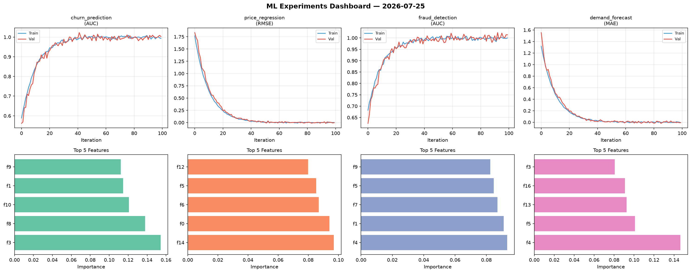
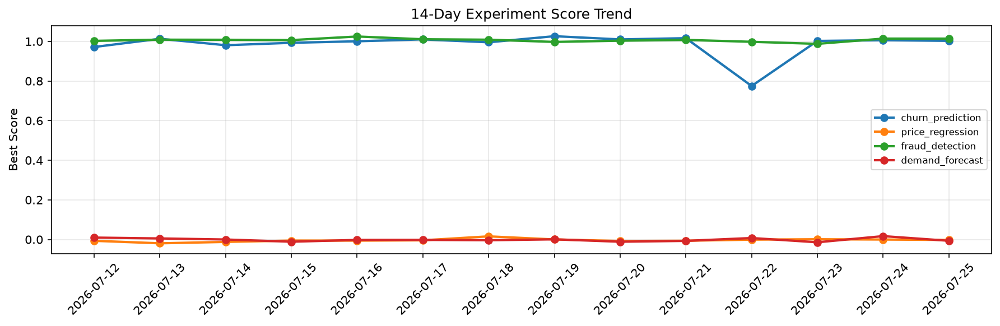

# ML Experiments Report — 2026-07-25

**Run ID:** `3924f49046` | **Experiments:** 4 | **Trials:** 16

## Delta vs Yesterday

| Experiment | Today | Yesterday | Change |
|-----------|-------|-----------|--------|
| churn_prediction | 1.0029 | 1.0061 | 📉 -0.3% |
| price_regression | -0.0024 | -0.0003 | 📉 -210.0% |
| fraud_detection | 1.014 | 1.0141 | 📉 -0.0% |
| demand_forecast | -0.0066 | 0.0169 | 📉 -139.1% |

## churn_prediction (AUC)

**Best Score:** 1.0029 (Trial 5)

| Trial | Score | Overfit Gap | Time | LR | Trees | Leaves |
|-------|-------|-------------|------|-----|-------|--------|
| 1 | 0.9492 | 0.0231 | 198.22s | 0.05 | 1000 | 63 |
| 2 | 0.7134 | 0.031 | 30.32s | 0.01 | 200 | 15 |
| 3 | 0.7844 | 0.0059 | 36.51s | 0.01 | 200 | 63 |
| 4 | 0.997 | 0.001 | 42.45s | 0.2 | 500 | 63 |
| 5 ⭐ | 1.0029 | 0.0099 | 28.71s | 0.2 | 100 | 127 |
| 6 | 0.6175 | 0.0316 | 14.07s | 0.01 | 200 | 15 |

## price_regression (RMSE)

**Best Score:** -0.0024 (Trial 2)

| Trial | Score | Overfit Gap | Time | LR | Trees | Leaves |
|-------|-------|-------------|------|-----|-------|--------|
| 1 | 0.074 | 0.0105 | 55.61s | 0.05 | 500 | 127 |
| 2 ⭐ | -0.0024 | 0.0056 | 35.34s | 0.2 | 500 | 127 |
| 3 | 0.0049 | 0.0041 | 4.82s | 0.2 | 100 | 15 |

## fraud_detection (AUC)

**Best Score:** 1.014 (Trial 3)

| Trial | Score | Overfit Gap | Time | LR | Trees | Leaves |
|-------|-------|-------------|------|-----|-------|--------|
| 1 | 1.0009 | 0.002 | 104.14s | 0.1 | 500 | 31 |
| 2 | 0.7058 | 0.0201 | 114.34s | 0.01 | 500 | 31 |
| 3 ⭐ | 1.014 | 0.0143 | 270.0s | 0.2 | 1000 | 15 |

## demand_forecast (MAE)

**Best Score:** -0.0066 (Trial 3)

| Trial | Score | Overfit Gap | Time | LR | Trees | Leaves |
|-------|-------|-------------|------|-----|-------|--------|
| 1 | 0.0169 | 0.013 | 100.12s | 0.1 | 1000 | 31 |
| 2 | 0.0142 | 0.0058 | 287.19s | 0.1 | 1000 | 63 |
| 3 ⭐ | -0.0066 | 0.0 | 6.84s | 0.2 | 200 | 31 |
| 4 | 0.0038 | 0.0037 | 57.84s | 0.1 | 500 | 31 |
