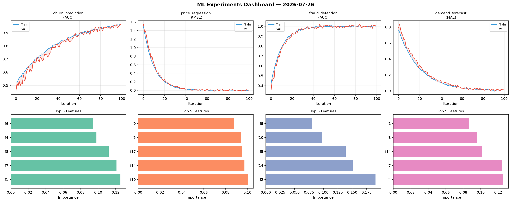
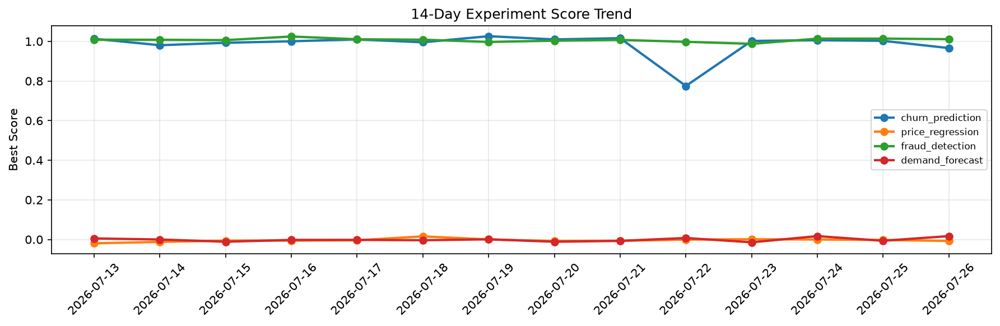

# ML Experiments Report — 2026-07-26

**Run ID:** `1f408d640a` | **Experiments:** 4 | **Trials:** 18

## Delta vs Yesterday

| Experiment | Today | Yesterday | Change |
|-----------|-------|-----------|--------|
| churn_prediction | 0.9663 | 1.0029 | 📉 -3.6% |
| price_regression | -0.0074 | -0.0024 | 📉 -208.3% |
| fraud_detection | 1.0112 | 1.014 | 📉 -0.3% |
| demand_forecast | 0.017 | -0.0066 | 📈 357.6% |

## churn_prediction (AUC)

**Best Score:** 0.9663 (Trial 1)

| Trial | Score | Overfit Gap | Time | LR | Trees | Leaves |
|-------|-------|-------------|------|-----|-------|--------|
| 1 ⭐ | 0.9663 | 0.0064 | 25.53s | 0.05 | 200 | 15 |
| 2 | 0.9579 | 0.0115 | 130.15s | 0.05 | 1000 | 63 |
| 3 | 0.9651 | 0.0074 | 46.29s | 0.05 | 500 | 31 |
| 4 | 0.9522 | 0.0104 | 55.48s | 0.05 | 200 | 63 |

## price_regression (RMSE)

**Best Score:** -0.0074 (Trial 3)

| Trial | Score | Overfit Gap | Time | LR | Trees | Leaves |
|-------|-------|-------------|------|-----|-------|--------|
| 1 | 0.7616 | 0.1132 | 132.29s | 0.01 | 1000 | 63 |
| 2 | 0.0136 | 0.0151 | 47.46s | 0.2 | 200 | 63 |
| 3 ⭐ | -0.0074 | 0.0074 | 118.91s | 0.2 | 1000 | 63 |
| 4 | 0.1111 | 0.0012 | 28.96s | 0.05 | 100 | 63 |
| 5 | 0.1599 | 0.0029 | 49.65s | 0.05 | 200 | 31 |

## fraud_detection (AUC)

**Best Score:** 1.0112 (Trial 4)

| Trial | Score | Overfit Gap | Time | LR | Trees | Leaves |
|-------|-------|-------------|------|-----|-------|--------|
| 1 | 0.9573 | 0.0005 | 24.65s | 0.05 | 100 | 63 |
| 2 | 0.9946 | 0.0226 | 11.09s | 0.05 | 200 | 63 |
| 3 | 0.9933 | 0.0019 | 57.15s | 0.1 | 500 | 127 |
| 4 ⭐ | 1.0112 | 0.0104 | 46.66s | 0.2 | 200 | 15 |
| 5 | 0.9554 | 0.0093 | 99.07s | 0.05 | 500 | 15 |

## demand_forecast (MAE)

**Best Score:** 0.017 (Trial 4)

| Trial | Score | Overfit Gap | Time | LR | Trees | Leaves |
|-------|-------|-------------|------|-----|-------|--------|
| 1 | 0.4837 | 0.0476 | 73.32s | 0.01 | 500 | 127 |
| 2 | 0.0185 | 0.0093 | 56.83s | 0.1 | 200 | 31 |
| 3 | 0.7364 | 0.0038 | 94.53s | 0.01 | 1000 | 127 |
| 4 ⭐ | 0.017 | 0.0061 | 21.64s | 0.1 | 500 | 63 |
