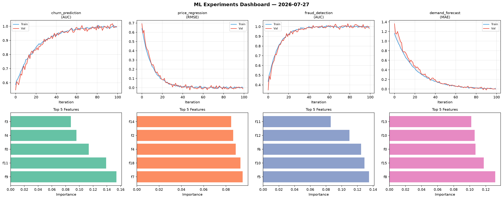
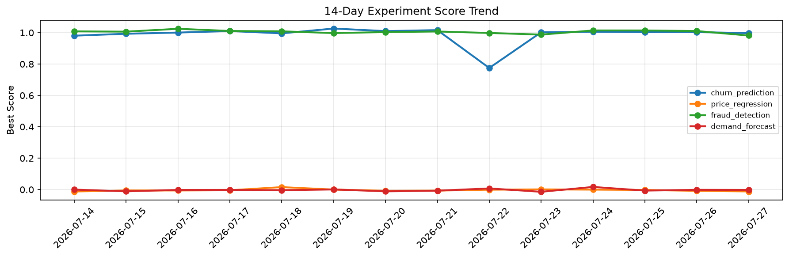

# ML Experiments Report — 2026-07-27

**Run ID:** `1f38fac5c1` | **Experiments:** 4 | **Trials:** 17

## Delta vs Yesterday

| Experiment | Today | Yesterday | Change |
|-----------|-------|-----------|--------|
| churn_prediction | 0.997 | 1.0036 | 📉 -0.7% |
| price_regression | -0.0119 | -0.0082 | 📉 -45.1% |
| fraud_detection | 0.9817 | 1.0104 | 📉 -2.8% |
| demand_forecast | -0.0022 | -0.0015 | 📉 -46.7% |

## churn_prediction (AUC)

**Best Score:** 0.997 (Trial 2)

| Trial | Score | Overfit Gap | Time | LR | Trees | Leaves |
|-------|-------|-------------|------|-----|-------|--------|
| 1 | 0.975 | 0.0193 | 68.15s | 0.1 | 500 | 127 |
| 2 ⭐ | 0.997 | 0.0025 | 132.38s | 0.1 | 500 | 31 |
| 3 | 0.6323 | 0.0204 | 8.06s | 0.01 | 500 | 15 |
| 4 | 0.5949 | 0.053 | 293.77s | 0.01 | 1000 | 15 |

## price_regression (RMSE)

**Best Score:** -0.0119 (Trial 3)

| Trial | Score | Overfit Gap | Time | LR | Trees | Leaves |
|-------|-------|-------------|------|-----|-------|--------|
| 1 | 0.8343 | 0.0174 | 27.74s | 0.01 | 100 | 31 |
| 2 | 0.009 | 0.0006 | 10.44s | 0.2 | 100 | 63 |
| 3 ⭐ | -0.0119 | 0.0138 | 121.95s | 0.2 | 500 | 63 |
| 4 | 0.0119 | 0.0069 | 48.75s | 0.1 | 500 | 15 |
| 5 | -0.0011 | 0.0135 | 4.56s | 0.1 | 100 | 63 |

## fraud_detection (AUC)

**Best Score:** 0.9817 (Trial 1)

| Trial | Score | Overfit Gap | Time | LR | Trees | Leaves |
|-------|-------|-------------|------|-----|-------|--------|
| 1 ⭐ | 0.9817 | 0.0185 | 37.91s | 0.2 | 1000 | 63 |
| 2 | 0.9513 | 0.0133 | 15.18s | 0.05 | 100 | 127 |
| 3 | 0.9359 | 0.0249 | 112.84s | 0.05 | 500 | 31 |

## demand_forecast (MAE)

**Best Score:** -0.0022 (Trial 1)

| Trial | Score | Overfit Gap | Time | LR | Trees | Leaves |
|-------|-------|-------------|------|-----|-------|--------|
| 1 ⭐ | -0.0022 | 0.0182 | 39.89s | 0.1 | 500 | 15 |
| 2 | 0.022 | 0.029 | 22.21s | 0.2 | 100 | 31 |
| 3 | 0.5799 | 0.0358 | 203.18s | 0.01 | 1000 | 31 |
| 4 | 0.0032 | 0.0019 | 25.05s | 0.1 | 100 | 127 |
| 5 | 0.0194 | 0.0123 | 33.66s | 0.1 | 200 | 31 |
