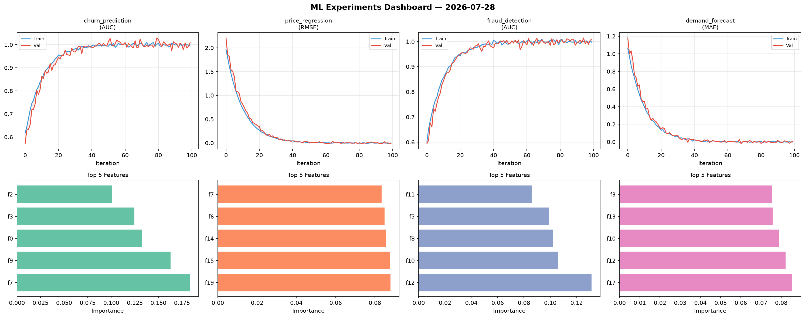
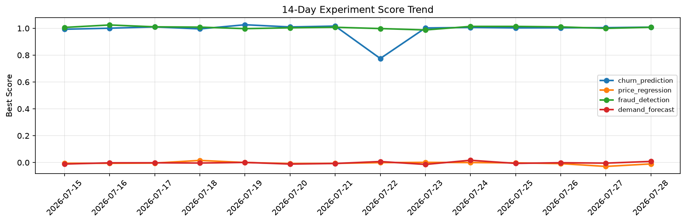

# ML Experiments Report — 2026-07-28

**Run ID:** `6d0d1d51af` | **Experiments:** 4 | **Trials:** 18

## Delta vs Yesterday

| Experiment | Today | Yesterday | Change |
|-----------|-------|-----------|--------|
| churn_prediction | 1.0085 | 1.0047 | 📈 0.4% |
| price_regression | -0.0103 | -0.0291 | 📈 64.6% |
| fraud_detection | 1.0075 | 0.9994 | 📈 0.8% |
| demand_forecast | 0.0081 | -0.0045 | 📈 280.0% |

## churn_prediction (AUC)

**Best Score:** 1.0085 (Trial 4)

| Trial | Score | Overfit Gap | Time | LR | Trees | Leaves |
|-------|-------|-------------|------|-----|-------|--------|
| 1 | 0.7521 | 0.0417 | 26.28s | 0.01 | 100 | 127 |
| 2 | 0.68 | 0.0067 | 12.75s | 0.01 | 200 | 63 |
| 3 | 0.9913 | 0.0126 | 53.9s | 0.1 | 200 | 127 |
| 4 ⭐ | 1.0085 | 0.0141 | 10.64s | 0.2 | 200 | 63 |
| 5 | 0.9866 | 0.0046 | 17.9s | 0.1 | 100 | 63 |
| 6 | 0.9458 | 0.0032 | 16.5s | 0.05 | 100 | 31 |

## price_regression (RMSE)

**Best Score:** -0.0103 (Trial 2)

| Trial | Score | Overfit Gap | Time | LR | Trees | Leaves |
|-------|-------|-------------|------|-----|-------|--------|
| 1 | 0.0031 | 0.0067 | 75.95s | 0.2 | 500 | 127 |
| 2 ⭐ | -0.0103 | 0.0087 | 8.29s | 0.2 | 100 | 127 |
| 3 | 0.3516 | 0.0006 | 41.38s | 0.01 | 200 | 15 |
| 4 | 0.1679 | 0.0192 | 51.38s | 0.05 | 1000 | 31 |
| 5 | 0.0068 | 0.0139 | 59.42s | 0.2 | 200 | 15 |

## fraud_detection (AUC)

**Best Score:** 1.0075 (Trial 2)

| Trial | Score | Overfit Gap | Time | LR | Trees | Leaves |
|-------|-------|-------------|------|-----|-------|--------|
| 1 | 0.9507 | 0.0147 | 22.58s | 0.05 | 100 | 15 |
| 2 ⭐ | 1.0075 | 0.0107 | 52.12s | 0.2 | 200 | 63 |
| 3 | 0.9995 | 0.0024 | 32.93s | 0.1 | 1000 | 127 |

## demand_forecast (MAE)

**Best Score:** 0.0081 (Trial 2)

| Trial | Score | Overfit Gap | Time | LR | Trees | Leaves |
|-------|-------|-------------|------|-----|-------|--------|
| 1 | 0.02 | 0.0125 | 108.74s | 0.1 | 1000 | 31 |
| 2 ⭐ | 0.0081 | 0.009 | 129.22s | 0.2 | 500 | 15 |
| 3 | 0.0941 | 0.0041 | 99.24s | 0.05 | 500 | 63 |
| 4 | 0.06 | 0.0018 | 114.12s | 0.05 | 500 | 63 |
