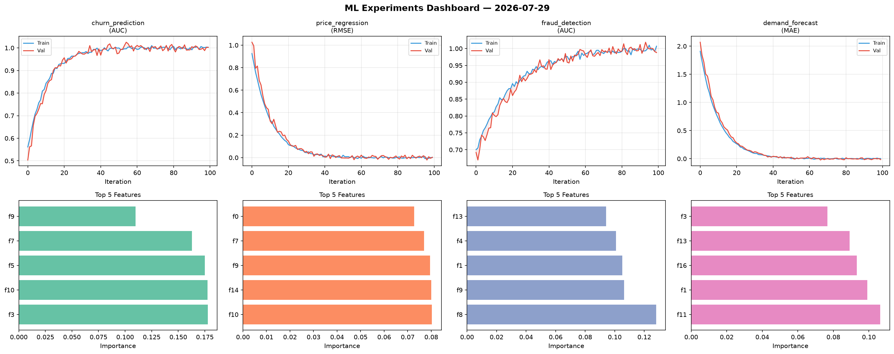
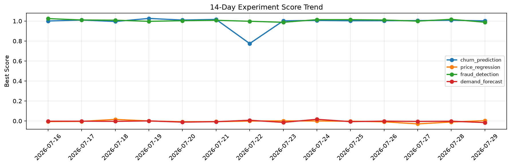

# ML Experiments Report — 2026-07-29

**Run ID:** `7a7b925a12` | **Experiments:** 4 | **Trials:** 19

## Delta vs Yesterday

| Experiment | Today | Yesterday | Change |
|-----------|-------|-----------|--------|
| churn_prediction | 1.0021 | 1.0079 | 📉 -0.6% |
| price_regression | 0.0035 | -0.0105 | 📈 133.3% |
| fraud_detection | 0.988 | 1.0172 | 📉 -2.9% |
| demand_forecast | -0.016 | -0.0022 | 📉 -627.3% |

## churn_prediction (AUC)

**Best Score:** 1.0021 (Trial 3)

| Trial | Score | Overfit Gap | Time | LR | Trees | Leaves |
|-------|-------|-------------|------|-----|-------|--------|
| 1 | 0.9935 | 0.0058 | 50.37s | 0.1 | 500 | 127 |
| 2 | 0.9426 | 0.0057 | 55.2s | 0.05 | 200 | 127 |
| 3 ⭐ | 1.0021 | 0.0009 | 15.85s | 0.2 | 1000 | 63 |
| 4 | 0.9999 | 0.0011 | 11.02s | 0.1 | 100 | 63 |

## price_regression (RMSE)

**Best Score:** 0.0035 (Trial 2)

| Trial | Score | Overfit Gap | Time | LR | Trees | Leaves |
|-------|-------|-------------|------|-----|-------|--------|
| 1 | 0.1014 | 0.0121 | 15.42s | 0.05 | 100 | 15 |
| 2 ⭐ | 0.0035 | 0.003 | 49.71s | 0.2 | 500 | 63 |
| 3 | 0.1152 | 0.0232 | 19.52s | 0.05 | 100 | 127 |
| 4 | 0.095 | 0.0229 | 49.11s | 0.05 | 500 | 15 |
| 5 | 1.1523 | 0.1003 | 168.42s | 0.01 | 1000 | 127 |
| 6 | 0.0666 | 0.005 | 288.41s | 0.05 | 1000 | 15 |

## fraud_detection (AUC)

**Best Score:** 0.988 (Trial 5)

| Trial | Score | Overfit Gap | Time | LR | Trees | Leaves |
|-------|-------|-------------|------|-----|-------|--------|
| 1 | 0.9843 | 0.0159 | 140.55s | 0.1 | 500 | 15 |
| 2 | 0.9868 | 0.0133 | 18.94s | 0.2 | 100 | 31 |
| 3 | 0.9757 | 0.005 | 246.88s | 0.05 | 1000 | 15 |
| 4 | 0.9872 | 0.0131 | 57.72s | 0.2 | 200 | 127 |
| 5 ⭐ | 0.988 | 0.019 | 1.25s | 0.1 | 100 | 127 |

## demand_forecast (MAE)

**Best Score:** -0.016 (Trial 4)

| Trial | Score | Overfit Gap | Time | LR | Trees | Leaves |
|-------|-------|-------------|------|-----|-------|--------|
| 1 | 0.0531 | 0.0057 | 52.06s | 0.05 | 200 | 63 |
| 2 | 0.0003 | 0.0008 | 13.33s | 0.1 | 100 | 15 |
| 3 | -0.0113 | 0.0149 | 167.57s | 0.2 | 1000 | 63 |
| 4 ⭐ | -0.016 | 0.0193 | 250.71s | 0.2 | 1000 | 15 |
