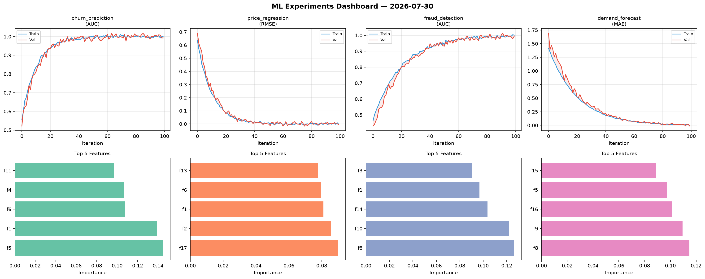
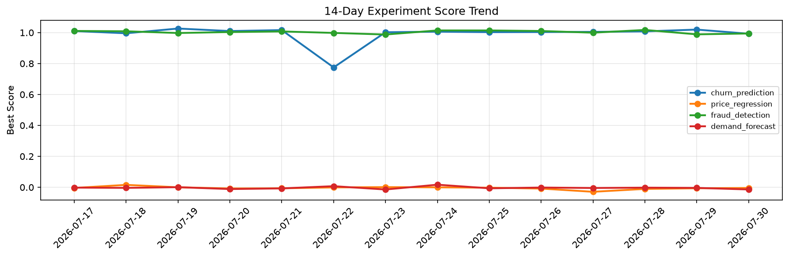

# ML Experiments Report — 2026-07-30

**Run ID:** `75b4dd0bfd` | **Experiments:** 4 | **Trials:** 20

## Delta vs Yesterday

| Experiment | Today | Yesterday | Change |
|-----------|-------|-----------|--------|
| churn_prediction | 0.9927 | 1.0195 | 📉 -2.6% |
| price_regression | -0.0046 | -0.0062 | 📈 25.8% |
| fraud_detection | 0.9943 | 0.9887 | 📈 0.6% |
| demand_forecast | -0.014 | -0.0038 | 📉 -268.4% |

## churn_prediction (AUC)

**Best Score:** 0.9927 (Trial 4)

| Trial | Score | Overfit Gap | Time | LR | Trees | Leaves |
|-------|-------|-------------|------|-----|-------|--------|
| 1 | 0.9921 | 0.0037 | 112.63s | 0.1 | 500 | 63 |
| 2 | 0.6416 | 0.0355 | 32.56s | 0.01 | 200 | 63 |
| 3 | 0.9919 | 0.0055 | 105.13s | 0.1 | 500 | 15 |
| 4 ⭐ | 0.9927 | 0.008 | 38.94s | 0.2 | 500 | 31 |

## price_regression (RMSE)

**Best Score:** -0.0046 (Trial 6)

| Trial | Score | Overfit Gap | Time | LR | Trees | Leaves |
|-------|-------|-------------|------|-----|-------|--------|
| 1 | 0.462 | 0.0561 | 13.41s | 0.01 | 100 | 15 |
| 2 | 0.0042 | 0.002 | 49.81s | 0.1 | 200 | 63 |
| 3 | 0.0754 | 0.0081 | 14.28s | 0.05 | 100 | 15 |
| 4 | 1.229 | 0.0168 | 136.1s | 0.01 | 1000 | 15 |
| 5 | 0.017 | 0.001 | 104.91s | 0.1 | 500 | 31 |
| 6 ⭐ | -0.0046 | 0.0027 | 124.79s | 0.2 | 500 | 31 |

## fraud_detection (AUC)

**Best Score:** 0.9943 (Trial 2)

| Trial | Score | Overfit Gap | Time | LR | Trees | Leaves |
|-------|-------|-------------|------|-----|-------|--------|
| 1 | 0.9564 | 0.0012 | 237.08s | 0.05 | 1000 | 127 |
| 2 ⭐ | 0.9943 | 0.0067 | 20.31s | 0.1 | 100 | 31 |
| 3 | 0.9829 | 0.0055 | 43.15s | 0.1 | 500 | 31 |
| 4 | 0.5784 | 0.0557 | 28.86s | 0.01 | 100 | 15 |
| 5 | 0.5941 | 0.0575 | 15.94s | 0.01 | 100 | 127 |

## demand_forecast (MAE)

**Best Score:** -0.014 (Trial 4)

| Trial | Score | Overfit Gap | Time | LR | Trees | Leaves |
|-------|-------|-------------|------|-----|-------|--------|
| 1 | 0.1406 | 0.0161 | 32.91s | 0.05 | 200 | 15 |
| 2 | 0.0257 | 0.0193 | 19.04s | 0.1 | 500 | 63 |
| 3 | 1.0864 | 0.0121 | 13.21s | 0.01 | 200 | 15 |
| 4 ⭐ | -0.014 | 0.0147 | 130.11s | 0.1 | 500 | 31 |
| 5 | 1.0898 | 0.1701 | 171.75s | 0.01 | 1000 | 31 |
