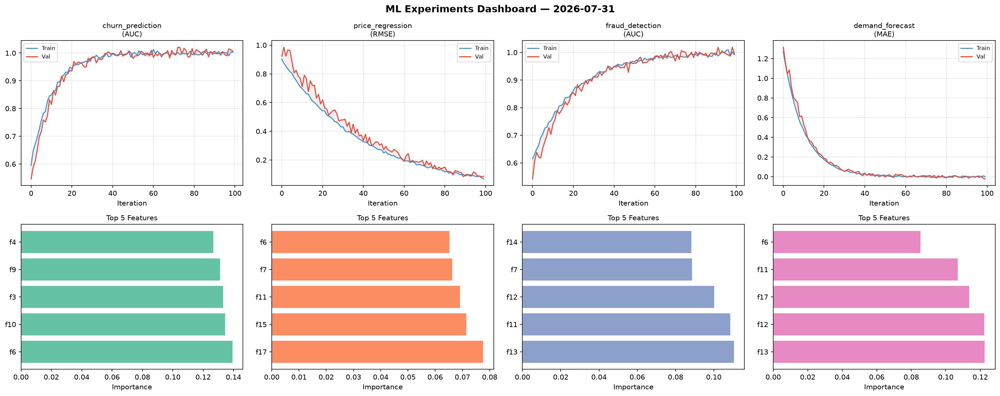
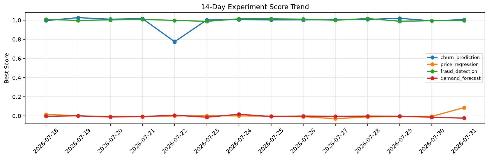

# ML Experiments Report — 2026-07-31

**Run ID:** `b570724a85` | **Experiments:** 4 | **Trials:** 16

## Delta vs Yesterday

| Experiment | Today | Yesterday | Change |
|-----------|-------|-----------|--------|
| churn_prediction | 1.006 | 0.9927 | 📈 1.3% |
| price_regression | 0.0862 | -0.0046 | 📈 1973.9% |
| fraud_detection | 0.9959 | 0.9943 | 📈 0.2% |
| demand_forecast | -0.0235 | -0.014 | 📉 -67.9% |

## churn_prediction (AUC)

**Best Score:** 1.006 (Trial 2)

| Trial | Score | Overfit Gap | Time | LR | Trees | Leaves |
|-------|-------|-------------|------|-----|-------|--------|
| 1 | 0.7103 | 0.0194 | 54.75s | 0.01 | 1000 | 31 |
| 2 ⭐ | 1.006 | 0.0025 | 29.25s | 0.2 | 100 | 15 |
| 3 | 0.9805 | 0.0124 | 24.45s | 0.1 | 100 | 15 |
| 4 | 0.8086 | 0.0018 | 49.66s | 0.01 | 500 | 31 |

## price_regression (RMSE)

**Best Score:** 0.0862 (Trial 1)

| Trial | Score | Overfit Gap | Time | LR | Trees | Leaves |
|-------|-------|-------------|------|-----|-------|--------|
| 1 ⭐ | 0.0862 | 0.0187 | 33.06s | 0.05 | 200 | 31 |
| 2 | 0.2037 | 0.039 | 60.29s | 0.05 | 500 | 127 |
| 3 | 0.1668 | 0.0192 | 26.74s | 0.05 | 200 | 63 |

## fraud_detection (AUC)

**Best Score:** 0.9959 (Trial 2)

| Trial | Score | Overfit Gap | Time | LR | Trees | Leaves |
|-------|-------|-------------|------|-----|-------|--------|
| 1 | 0.7722 | 0.0341 | 246.5s | 0.01 | 1000 | 127 |
| 2 ⭐ | 0.9959 | 0.0041 | 33.48s | 0.1 | 200 | 15 |
| 3 | 0.962 | 0.0054 | 17.58s | 0.05 | 100 | 127 |
| 4 | 0.9662 | 0.0136 | 15.73s | 0.05 | 100 | 31 |

## demand_forecast (MAE)

**Best Score:** -0.0235 (Trial 5)

| Trial | Score | Overfit Gap | Time | LR | Trees | Leaves |
|-------|-------|-------------|------|-----|-------|--------|
| 1 | 0.0091 | 0.005 | 6.12s | 0.2 | 200 | 63 |
| 2 | 1.1977 | 0.1018 | 9.32s | 0.01 | 100 | 15 |
| 3 | 0.0856 | 0.0007 | 245.35s | 0.05 | 1000 | 31 |
| 4 | 0.0633 | 0.0052 | 1.27s | 0.05 | 100 | 15 |
| 5 ⭐ | -0.0235 | 0.0254 | 72.09s | 0.2 | 1000 | 31 |
