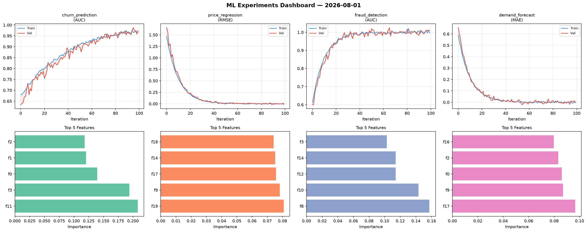
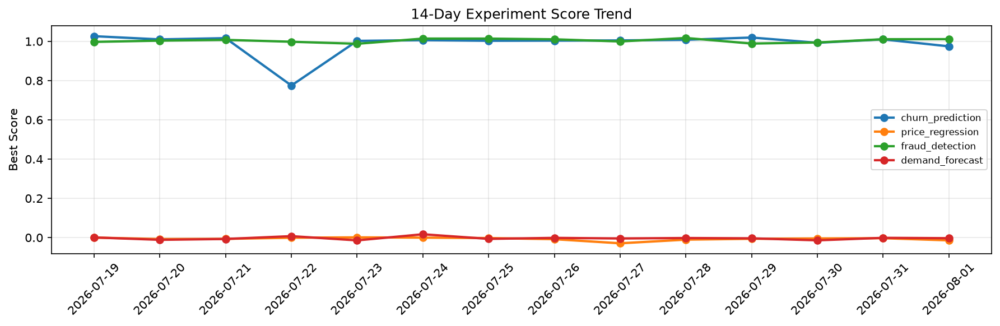

# ML Experiments Report — 2026-08-01

**Run ID:** `7539cc72ba` | **Experiments:** 4 | **Trials:** 19

## Delta vs Yesterday

| Experiment | Today | Yesterday | Change |
|-----------|-------|-----------|--------|
| churn_prediction | 0.9746 | 1.0101 | 📉 -3.5% |
| price_regression | -0.0142 | -0.0031 | 📉 -358.1% |
| fraud_detection | 1.0112 | 1.0108 | 📉 0.0% |
| demand_forecast | -0.0031 | -0.0013 | 📉 -138.5% |

## churn_prediction (AUC)

**Best Score:** 0.9746 (Trial 1)

| Trial | Score | Overfit Gap | Time | LR | Trees | Leaves |
|-------|-------|-------------|------|-----|-------|--------|
| 1 ⭐ | 0.9746 | 0.0084 | 200.31s | 0.05 | 1000 | 31 |
| 2 | 0.9684 | 0.0019 | 140.58s | 0.05 | 500 | 63 |
| 3 | 0.9391 | 0.0254 | 97.82s | 0.05 | 500 | 31 |
| 4 | 0.6779 | 0.0235 | 30.74s | 0.01 | 200 | 63 |
| 5 | 0.7534 | 0.0457 | 16.42s | 0.01 | 100 | 15 |

## price_regression (RMSE)

**Best Score:** -0.0142 (Trial 1)

| Trial | Score | Overfit Gap | Time | LR | Trees | Leaves |
|-------|-------|-------------|------|-----|-------|--------|
| 1 ⭐ | -0.0142 | 0.0228 | 7.78s | 0.2 | 100 | 127 |
| 2 | 0.9747 | 0.0177 | 50.43s | 0.01 | 200 | 127 |
| 3 | 0.1988 | 0.0504 | 13.36s | 0.05 | 200 | 31 |
| 4 | -0.0063 | 0.012 | 76.32s | 0.2 | 1000 | 15 |

## fraud_detection (AUC)

**Best Score:** 1.0112 (Trial 2)

| Trial | Score | Overfit Gap | Time | LR | Trees | Leaves |
|-------|-------|-------------|------|-----|-------|--------|
| 1 | 0.945 | 0.0246 | 40.07s | 0.05 | 200 | 127 |
| 2 ⭐ | 1.0112 | 0.015 | 23.54s | 0.2 | 200 | 31 |
| 3 | 0.7638 | 0.0155 | 8.15s | 0.01 | 100 | 127 |
| 4 | 1.0084 | 0.0098 | 56.53s | 0.1 | 200 | 63 |
| 5 | 0.99 | 0.0067 | 26.95s | 0.1 | 100 | 31 |

## demand_forecast (MAE)

**Best Score:** -0.0031 (Trial 3)

| Trial | Score | Overfit Gap | Time | LR | Trees | Leaves |
|-------|-------|-------------|------|-----|-------|--------|
| 1 | 0.0255 | 0.025 | 95.57s | 0.1 | 1000 | 127 |
| 2 | 0.4905 | 0.0405 | 15.88s | 0.01 | 100 | 127 |
| 3 ⭐ | -0.0031 | 0.0008 | 54.42s | 0.2 | 500 | 127 |
| 4 | 0.1516 | 0.0071 | 118.3s | 0.05 | 500 | 127 |
| 5 | 0.9552 | 0.1058 | 20.17s | 0.01 | 200 | 31 |
